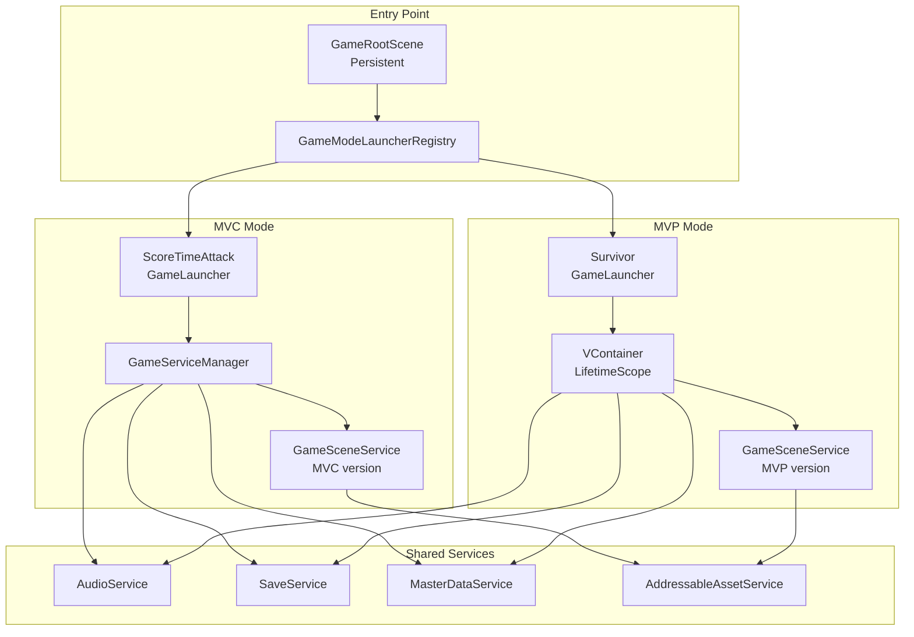
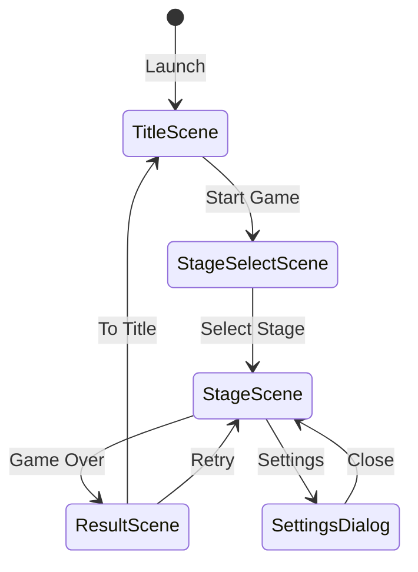
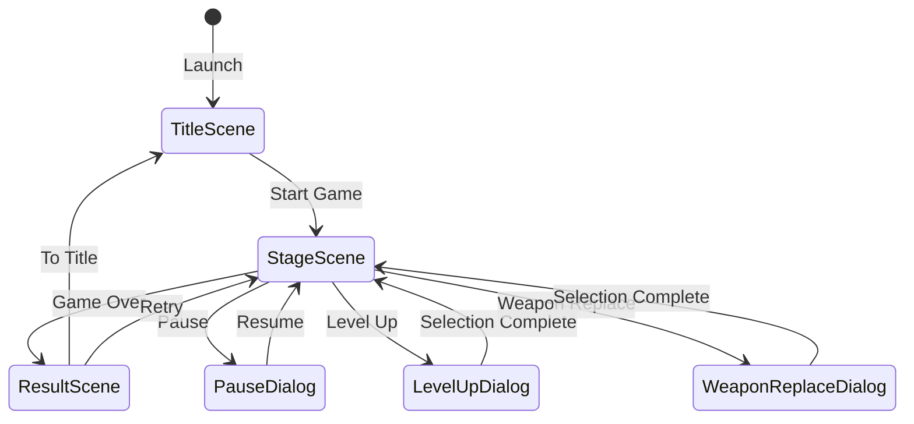

# Unity6Portfolio Architecture Design Document

[日本語版はこちら](ARCHITECTURE.md)

**Version**: 1.7
**Last Updated**: February 15, 2026

---

## Table of Contents

1. [Design Philosophy](#1-design-philosophy)
2. [System Overview](#2-system-overview)
3. [Monorepo Structure](#3-monorepo-structure)
4. [Assembly Structure](#4-assembly-structure)
5. [MVC vs MVP Comparison](#5-mvc-vs-mvp-comparison)
6. [Scene Transition Design](#6-scene-transition-design)
7. [Data Flow](#7-data-flow)
8. [Class Design (UML)](#8-class-design-uml)
9. [Sequence Diagrams](#9-sequence-diagrams)
10. [CI/CD and Quality Management](#10-cicd-and-quality-management)
11. [Architecture Decision Records](#11-architecture-decision-records)

---

## 1. Design Philosophy

### 1.1 Background of Architecture Selection

This project intentionally adopts **two different architecture patterns** (MVC/MVP).

| Pattern | Game Mode | Purpose |
|---------|-----------|---------|
| **MVC** | ScoreTimeAttack | Demonstrating adaptability to legacy environments (uGUI-centric) |
| **MVP** | Survivor | Demonstrating adaptability to modern environments (VContainer + UIToolkit) |

### 1.2 Design Principles

```
┌─────────────────────────────────────────────────────────────┐
│  Application of SOLID Principles                            │
├─────────────────────────────────────────────────────────────┤
│  S: Single Responsibility - Clear role separation of        │
│     Service/Scene/Component                                 │
│  O: Open-Closed - Extensibility through interfaces          │
│  L: Liskov Substitution - Substitutability within the       │
│     GameScene inheritance hierarchy                         │
│  I: Interface Segregation - Fine-grained service interfaces │
│  D: Dependency Inversion - Dependency control via           │
│     DI containers                                           │
└─────────────────────────────────────────────────────────────┘
```

---

## 2. System Overview

### 2.1 Layered Architecture

```
┌─────────────────────────────────────────────────────────────────────┐
│                        Application Layer                            │
│  ┌──────────────────────┐    ┌──────────────────────┐              │
│  │   GameRootScene      │    │  GameModeLauncher    │              │
│  │   (Persistent Scene) │───▶│  Registry            │              │
│  └──────────────────────┘    └──────────────────────┘              │
│              │                         │                            │
│              ▼                         ▼                            │
│  ┌──────────────────────┐    ┌──────────────────────┐              │
│  │  MVC GameLauncher    │    │  MVP GameLauncher    │              │
│  │  (ScoreTimeAttack)   │    │  (Survivor)          │              │
│  └──────────────────────┘    └──────────────────────┘              │
├─────────────────────────────────────────────────────────────────────┤
│                         Scene Layer                                 │
│  ┌──────────────────────┐    ┌──────────────────────┐              │
│  │  GameSceneService    │    │  GameSceneService    │              │
│  │  (MVC version)       │    │  (MVP/VContainer)    │              │
│  └──────────────────────┘    └──────────────────────┘              │
│              │                         │                            │
│              ▼                         ▼                            │
│  ┌──────────────────────┐    ┌──────────────────────┐              │
│  │  GameScene           │    │  GameScene           │              │
│  │  (Prefab/Unity)      │    │  (Prefab + DI)       │              │
│  └──────────────────────┘    └──────────────────────┘              │
├─────────────────────────────────────────────────────────────────────┤
│                        Service Layer                                │
│  ┌────────────┐ ┌────────────┐ ┌────────────┐ ┌────────────┐       │
│  │ AudioSvc   │ │ SaveSvc    │ │ MasterData │ │ LockOnSvc  │       │
│  └────────────┘ └────────────┘ └────────────┘ └────────────┘       │
├─────────────────────────────────────────────────────────────────────┤
│                      Infrastructure Layer                           │
│  ┌────────────┐ ┌────────────┐ ┌────────────┐ ┌────────────┐       │
│  │Addressables│ │MasterMemory│ │ MemoryPack │ │ MessagePipe│       │
│  └────────────┘ └────────────┘ └────────────┘ └────────────┘       │
└─────────────────────────────────────────────────────────────────────┘
```

### 2.2 Component Relationship Diagram



---

## 3. Monorepo Structure

### 3.1 Project Structure

This project adopts a monorepo structure, managing the client, server, and shared libraries in a single repository.

```
Unity6Portfolio/
├── src/
│   ├── Game.Client/        # Unity client (Unity 6)
│   │   ├── Assets/
│   │   │   └── Programs/   # Game code
│   │   └── Packages/
│   │
│   ├── Game.Server/        # Game server (ASP.NET Core 9)
│   │   ├── Controllers/
│   │   ├── Services/
│   │   └── Program.cs
│   │
│   └── Game.Shared/        # Shared library (.NET + Unity Package)
│       ├── Runtime/
│       │   └── Shared/
│       │       ├── Enums/        # AudioCategory, etc.
│       │       └── MasterData/   # Master data definitions
│       ├── Game.Shared.csproj    # .NET project
│       └── package.json          # Unity package definition
│
├── test/
│   └── Game.Server.Tests/  # Server tests
│
├── docs/                   # Documentation
├── docker/
│   ├── unity-accelerator/  # Unity Accelerator cache server
│   ├── unity-ci/           # Unity CI Runner (Docker + GitHub Actions)
│   ├── game-server/        # Game.Server (ASP.NET Core + PostgreSQL)
│   └── migrate/            # DB Migration Runner (FluentMigrator)
├── scripts/                # Build and format scripts
└── .github/
    └── workflows/          # GitHub Actions
```

### 3.2 Role of Game.Shared

Master data definitions are separated into a shared library, achieving the following benefits:

| Benefit | Description |
|---------|-------------|
| Client-server sharing | Same DTOs can be shared between Unity and ASP.NET Core |
| Clear dependency hierarchy | Placed at the lowest layer to prevent circular references |
| Build time reduction | Separates infrequently changed code |
| Version management | Enables versioning at the package level |

### 3.3 Inter-Project Dependencies

```
┌─────────────────────────────────────────────────────────────┐
│                     Unity6Portfolio                          │
│                       (Monorepo)                            │
└─────────────────────────────────────────────────────────────┘
        ↓                    ↓                    ↓
┌─────────────────┐  ┌─────────────────┐  ┌─────────────────┐
│   Game.Client   │  │   Game.Server   │  │   Game.Shared   │
│  (Unity 6)      │  │ (ASP.NET Core)  │  │ (.NET + Unity)  │
└─────────────────┘  └─────────────────┘  └─────────────────┘
        ↘                    ↓                    ↙
                    ┌─────────────────┐
                    │ Shared DTO/IF   │
                    │  (Game.Shared)  │
                    └─────────────────┘
```

---

## 4. Assembly Structure

### 4.1 Assembly Dependency Diagram

```
                    ┌──────────────────┐
                    │     Game.App     │
                    │  (Startup Ctrl)  │
                    └────────┬─────────┘
                             │
            ┌────────────────┼────────────────┐
            │                │                │
            ▼                ▼                │
┌───────────────────┐ ┌───────────────┐       │
│Game.MVC.ScoreTime │ │ Game.MVP.Core │       │
│      Attack       │ │  (VContainer) │       │
└─────────┬─────────┘ └───────┬───────┘       │
          │                   │               │
          ▼                   │               │
┌───────────────────┐         │   ┌───────────────────┐
│  Game.MVC.Core    │         │   │ Game.MVP.Survivor │
│  (MessagePipe)    │         │   │   (Game Impl)     │
└─────────┬─────────┘         │   └─────────┬─────────┘
          │                   │             ▲│
          │                   │   depends on││
          │                   │   ┌─────────┘│
          │                   │   │          │
          │                   │ ┌─┴────────────────────┐
          │                   │ │Game.MVP.Survivor.ECS │
          │                   │ │  (DOTS: Burst/Jobs)  │
          │                   │ └──────────┬───────────┘
          │                   │            │
          └─────────┬─────────┴────────────┘
                    │
                    ▼
          ┌─────────────────────┐
          │     Game.Shared     │
          │   (Common Found.)   │
          └──────────┬──────────┘
                     │
                     ▼
          ┌─────────────────────┐
          │  Game.Library.Shared │
          │  (MasterMemory etc)  │
          └─────────────────────┘
```

### 4.2 Assembly Details

#### Runtime Assemblies

| Assembly | Role | Key Dependencies |
|----------|------|-----------------|
| **Game.Library.Shared** | Shared library (Unity/server) | MasterMemory, MessagePack |
| **Game.Shared** | Common foundation and interface definitions | Game.Library.Shared, UniTask, R3, MessagePipe, Addressables |
| **Game.MVC.Core** | MVC pattern foundation | Game.Shared, MessagePipe.Unity |
| **Game.MVC.ScoreTimeAttack** | Score attack game implementation | Game.MVC.Core, Game.Client.MasterData, UnityChan, InputSystem, Cinemachine |
| **Game.MVP.Core** | MVP pattern foundation | Game.Shared, VContainer, MessagePipe.VContainer |
| **Game.MVP.Survivor** | Survivor game implementation | Game.MVP.Core, VContainer, AI.Navigation, Cinemachine |
| **Game.MVP.Survivor.ECS** | ECS enemy system (DOTS parallel processing) | Game.MVP.Survivor, Unity.Entities, Unity.Burst, Unity.Collections |
| **Game.App** | Application startup control | Game.Shared, Game.MVC.Core, Game.MVC.ScoreTimeAttack, Game.MVP.Core |

#### Test Assemblies

| Assembly | Role | Test Count |
|----------|------|------------|
| **Game.Tests.Shared** | Shared layer unit tests | 351 |
| **Game.Tests.MVC** | MVC layer unit tests | 160 |
| **Game.Tests.MVP** | MVP layer unit tests | 166 |
| **Game.Tests.MVP.ECS** | ECS system functional and performance tests | 33 |
| **Game.Tests.PlayMode** | Integration and PlayMode tests | 63 |

**Total Test Count**: 773 tests (EditMode 710 + PlayMode 63)

#### Server and Tools Assemblies (.NET 9)

| Project | Role | Key Dependencies |
|---------|------|-----------------|
| **Game.Server** | REST API server | ASP.NET Core 9, Dapper, Npgsql, FluentMigrator, StackExchange.Redis |
| **Game.Tools** | CLI tools (master data management, etc.) | ConsoleAppFramework, Google.Protobuf, MasterMemory |
| **Game.Client.Linked** | Client MemoryTable reference bridge | MasterMemory, MessagePack |
| **Game.Shared** | Shared library (.NET version) | MasterMemory, MessagePack |

#### Server Endpoint Structure

| Controller | Endpoint | Role |
|------------|----------|------|
| **AuthController** | POST /api/auth/* | Guest login, email linking, transfer |
| **UsersController** | GET/PUT /api/users/* | User info retrieval and update |
| **SurvivorScoresController** | POST /api/survivor/scores | Score submission |
| **RankingsController** | GET /api/survivor/rankings/* | Ranking retrieval, own rank |
| **HealthController** | GET /api/health | Health check |

### 4.3 Circular Reference Prevention Design

```
[Design Rules]
1. Shared -> References to other assemblies are prohibited
2. Core -> References to same-level Core are prohibited (MVC.Core <-> MVP.Core)
3. Game implementations -> References to other game implementations are prohibited
4. App -> Exceptionally allowed to reference all assemblies as the integration point
```

---

## 5. MVC vs MVP Comparison

### 5.1 Architecture Comparison Table

| Aspect | MVC (ScoreTimeAttack) | MVP (Survivor) |
|--------|----------------------|----------------|
| **DI Method** | GameServiceManager (manual) | VContainer (automatic) |
| **UI Technology** | uGUI + TextMeshPro | UIToolkit + TextMeshPro |
| **State Management** | StateMachine | StateMachine + R3 Reactive |
| **Messaging** | MessagePipe (direct reference) | MessagePipe (DI injection) |
| **Scene Loading** | Direct Addressables calls | Via IAddressableAssetService |
| **Collision Events** | IPlayerCollisionHandler (direct call) | Via MessagePipe |
| **Testability** | Medium (service locator dependency) | High (full DI) |

### 5.2 Differences in DI Approach

#### MVC: GameServiceManager (Service Locator Pattern)

```csharp
// Service registration
GameServiceManager.Add<AudioService>();

// Service retrieval
var audioService = GameServiceManager.Get<AudioService>();
```

#### MVP: VContainer (Dependency Injection Pattern)

```csharp
// Registration in LifetimeScope
public class SurvivorLifetimeScope : LifetimeScope
{
    protected override void Configure(IContainerBuilder builder)
    {
        builder.Register<IAudioService, AudioService>(Lifetime.Singleton);
    }
}

// Constructor injection
public class SurvivorStagePresenter
{
    private readonly IAudioService _audioService;

    [Inject]
    public SurvivorStagePresenter(IAudioService audioService)
    {
        _audioService = audioService;
    }
}
```

### 5.3 Differences in Scene Management

```
[MVC] GamePrefabScene
┌─────────────────────────────────────────────┐
│ 1. AssetService.LoadAssetAsync<GameObject>  │
│ 2. Object.Instantiate(_asset)               │
│ 3. Retrieved via GetSceneComponent()        │
│ * No DI, direct references                  │
└─────────────────────────────────────────────┘

[MVP] GamePrefabScene
┌─────────────────────────────────────────────┐
│ 1. AssetService.LoadAssetAsync<GameObject>  │
│ 2. Object.Instantiate(_asset)               │
│ 3. Resolver.InjectGameObject(_instance)     │  <- DI injection
│ 4. GetSceneComponent() + Resolver.Inject()  │  <- Component injection
└─────────────────────────────────────────────┘
```

---

## 6. Scene Transition Design

### 6.1 Scene Lifecycle

```
┌─────────────────────────────────────────────────────────────┐
│                    GameScene Lifecycle                      │
├─────────────────────────────────────────────────────────────┤
│                                                             │
│   PreInitialize()  ->  Server communication, model init    │
│         │                                                   │
│         ▼                                                   │
│   LoadAsset()      ->  Load Prefab/UnityScene              │
│         │                                                   │
│         ▼                                                   │
│   Startup()        ->  View initialization, event binding  │
│         │                                                   │
│         ▼                                                   │
│   Ready()          ->  Opening effects, game start         │
│         │                                                   │
│    ┌────┴────┐                                              │
│    ▼         ▼                                              │
│  Sleep()   Restart()  ->  When displaying dialogs, etc.    │
│    │         │                                              │
│    └────┬────┘                                              │
│         ▼                                                   │
│   Terminate()      ->  Resource release, scene disposal    │
│                                                             │
└─────────────────────────────────────────────────────────────┘
```

### 6.2 Scene Transition Flow Diagrams

#### MVC: ScoreTimeAttack



#### MVP: Survivor



### 6.3 Scene Inheritance Hierarchy

```
IGameScene (interface)
    │
    ├── GameScene (abstract)
    │       │
    │       ├── GameScene<TScene, TComponent>
    │       │       │
    │       │       ├── GamePrefabScene<TScene, TComponent>
    │       │       │       └── ScoreTimeAttackTitleScene
    │       │       │       └── ScoreTimeAttackStageScene
    │       │       │       └── SurvivorTitleScene
    │       │       │       └── SurvivorStageScene
    │       │       │
    │       │       ├── GameUnityScene<TScene, TComponent>
    │       │       │       └── (For stage backgrounds)
    │       │       │
    │       │       └── GameDialogScene<TScene, TComponent, TResult>
    │       │               └── SettingsDialog
    │       │               └── PauseDialog
    │       │               └── LevelUpDialog
    │       │
    │       └── GameUnityScene (no component)
    │               └── (For environment scenes)
```

---

## 7. Data Flow

### 7.1 Master Data Flow

This project adopts a Protobuf schema-driven master data management system that shares data definitions between client and server while achieving field filtering based on deploy targets.

#### 7.1.1 Overall Architecture

```
┌─────────────────────────────────────────────────────────────────────────┐
│                    Master Data Update Flow                               │
├─────────────────────────────────────────────────────────────────────────┤
│                                                                         │
│  (1) Schema Definition                                                  │
│  ┌──────────────────────┐                                               │
│  │ masterdata/proto/    │  <- .proto files (schema definitions)         │
│  │  ├── options/        │     Deploy target specification               │
│  │  ├── audio/          │     PRIMARY/SECONDARY key specification       │
│  │  ├── score_time_attack/                                              │
│  │  └── survivor/       │                                               │
│  └──────────┬───────────┘                                               │
│             │                                                           │
│             ▼                                                           │
│  (2) Code Generation (Game.Tools CLI)                                   │
│  ┌──────────────────────┐                                               │
│  │ masterdata codegen   │  protoc -> FileDescriptorSet -> C# generation │
│  └──────────┬───────────┘                                               │
│             │                                                           │
│     ┌───────┴───────┐                                                   │
│     ▼               ▼                                                   │
│  ┌────────────┐  ┌────────────┐                                         │
│  │ Client     │  │ Server     │  <- MemoryTable C# classes              │
│  │*.Generated │  │*.Generated │    (field filtering applied)            │
│  └────────────┘  └────────────┘                                         │
│                                                                         │
│  (3) TSV Data Editing                                                   │
│  ┌──────────────────────┐                                               │
│  │ masterdata/raw/*.tsv │  <- Spreadsheet-compatible format             │
│  └──────────┬───────────┘                                               │
│             │                                                           │
│             ▼                                                           │
│  (4) Binary Build                                                       │
│  ┌─────────────────────────────────────────────────────────────┐       │
│  │   ┌─────────────────┐        ┌─────────────────────┐        │       │
│  │   │ Unity Editor   │        │ Game.Tools CLI      │        │       │
│  │   │ MasterDataWindow│        │ masterdata build    │        │       │
│  │   └────────┬────────┘        └──────────┬──────────┘        │       │
│  │            ▼                            ▼                   │       │
│  │   ┌─────────────────┐        ┌─────────────────────┐        │       │
│  │   │MasterDataBinary │        │ masterdata.bytes    │        │       │
│  │   │.bytes (Client)  │        │ (Server)            │        │       │
│  │   └─────────────────┘        └─────────────────────┘        │       │
│  └─────────────────────────────────────────────────────────────┘       │
│                                                                         │
│  (5) Runtime Loading                                                    │
│  ┌─────────────────────┐        ┌─────────────────────┐                │
│  │ Client (Unity)      │        │ Server (ASP.NET)    │                │
│  │ Via Addressables    │        │ Via FileSystem      │                │
│  │ -> MemoryDatabase   │        │ -> MemoryDatabase   │                │
│  └─────────────────────┘        └─────────────────────┘                │
│                                                                         │
└─────────────────────────────────────────────────────────────────────────┘
```

#### 7.1.2 Deploy Target System

Field filtering via bitmask generates different binaries from the same schema:

| Target | Bit | Value | Purpose |
|--------|-----|------:|---------|
| ALL | - | 0 | Common to all targets (basic fields such as Id, Name) |
| CLIENT | 0 | 1 | Unity client only (asset names, UI data) |
| SERVER | 1 | 2 | REST API server only (reward multipliers, internal balance values) |
| REALTIME | 2 | 4 | MagicOnion realtime server only |

**Proto file specification example:**
```protobuf
message SurvivorEnemyMaster {
  option (masterdata.options.table_target) = DEPLOY_TARGET_ALL;

  int32 id = 1 [(masterdata.options.index_type) = INDEX_PRIMARY];
  string name = 2;

  // Client only (UI icon)
  string icon_asset_name = 3
    [(masterdata.options.field_target) = DEPLOY_TARGET_CLIENT];

  // Server only (internal balance coefficient)
  int32 difficulty_multiplier = 4
    [(masterdata.options.field_target) = DEPLOY_TARGET_SERVER];
}
```

#### 7.1.3 CLI Tools (Game.Tools)

| Command | Purpose |
|---------|---------|
| `masterdata codegen` | Proto -> C# MemoryTable class generation |
| `masterdata build` | TSV -> MessagePack binary conversion |
| `masterdata validate` | TSV schema validation |
| `masterdata scaffold` | C# class -> Proto reverse generation |
| `masterdata export` | Binary -> JSON/TSV output |
| `masterdata diff` | Compare two binaries |

**Build command examples:**
```bash
# C# class generation
dotnet run --project src/Game.Tools -- masterdata codegen \
  --proto-dir masterdata/proto/ \
  --out-client src/Game.Client/Assets/Programs/Runtime/Shared/MasterData/ \
  --out-server src/Game.Server/MasterData/

# Server binary build
dotnet run --project src/Game.Tools -- masterdata build \
  --tsv-dir masterdata/raw/ \
  --proto-dir masterdata/proto/ \
  --out-server src/Game.Server/MasterData/masterdata.bytes
```

#### 7.1.4 Client-Side Load Flow

```csharp
// MasterDataServiceBase.cs
public async UniTask LoadMasterDataAsync()
{
    // Load binary via Addressables
    var asset = await _assetService.LoadAssetAsync<TextAsset>("MasterDataBinary");

    // MessagePack resolver configuration
    var resolver = CompositeResolver.Create(
        MasterMemoryResolver.Instance,
        StandardResolver.Instance
    );

    // Build MemoryDatabase
    MemoryDatabase = new MemoryDatabase(asset.bytes, maxDegreeOfParallelism: Environment.ProcessorCount);
}

// Usage example
var enemy = _masterDataService.MemoryDatabase.SurvivorEnemyMasterTable.FindById(enemyId);
```

#### 7.1.5 Server-Side Load Flow

```csharp
// MasterDataService.cs (Game.Server)
public class MasterDataService : IMasterDataService
{
    public MemoryDatabase MemoryDatabase { get; }

    public MasterDataService(IOptions<MasterDataSettings> settings)
    {
        var binaryPath = settings.Value.BinaryPath; // "MasterData/masterdata.bytes"
        var bytes = File.ReadAllBytes(binaryPath);

        MemoryDatabase = new MemoryDatabase(bytes, maxDegreeOfParallelism: Environment.ProcessorCount);
        _logger.LogInformation("MasterData loaded: {Path}", binaryPath);
    }
}

// Registration in Program.cs
builder.Services.Configure<MasterDataSettings>(builder.Configuration.GetSection("MasterData"));
builder.Services.AddSingleton<IMasterDataService, MasterDataService>();
```

#### 7.1.6 Role of Game.Client.Linked

A bridge project that allows the CLI tools to access the client-side MemoryTable type information:

```xml
<!-- Game.Client.Linked.csproj -->
<ItemGroup>
  <!-- Link reference to client generated files -->
  <Compile Include="..\Game.Client\Assets\...\MasterData\*.Generated.cs" LinkBase="Generated" />
</ItemGroup>
```

**Dependencies:**
```
Game.Tools
    ├── Game.Server (server MemoryTable)
    └── Game.Client.Linked (client MemoryTable reference)
            └── Links to Game.Client/*.Generated.cs
```

#### 7.1.7 File Layout

| Type | Path |
|------|------|
| Proto schemas | `masterdata/proto/**/*.proto` |
| TSV data | `masterdata/raw/*.tsv` |
| Client generated code | `src/Game.Client/.../Shared/MasterData/*.Generated.cs` |
| Client binary | `src/Game.Client/Assets/MasterData/MasterDataBinary.bytes` |
| Server generated code | `src/Game.Server/MasterData/*.Generated.cs` |
| Server binary | `src/Game.Server/MasterData/masterdata.bytes` |

### 7.2 Asset Delivery Flow

Asset delivery sources are switched via Addressables based on the GameEnvironment setting:

```
┌─────────────────────────────────────────────────────────────────┐
│                    Asset Delivery Flow                           │
├─────────────────────────────────────────────────────────────────┤
│                                                                 │
│  GameEnvironment                                                │
│  ┌──────────────────┐                                           │
│  │ Local            │──▶ Local Assets (StreamingAssets)         │
│  │ Develop/Staging  │──▶ Remote Assets (Dev/Staging Server)     │
│  │ Release          │──▶ Remote Assets (CDN)                    │
│  └──────────────────┘                                           │
│                                                                 │
│  ┌──────────────────┐    ┌──────────────────┐                   │
│  │  Addressables    │    │  Environment     │                   │
│  │  Settings        │◀───│  Switcher        │                   │
│  └────────┬─────────┘    └──────────────────┘                   │
│           │                      ▲                              │
│           │              ┌───────┴────────┐                     │
│           │              │ GAME_ENVIRONMENT│                    │
│           │              │ Env Variable or │                    │
│           │              │ Editor Menu     │                    │
│           │              └────────────────┘                     │
│           ▼                                                     │
│  ┌──────────────────┐                                           │
│  │ Profile Variable │                                           │
│  │ - Local.BuildPath│                                           │
│  │ - Remote.LoadPath│                                           │
│  └────────┬─────────┘                                           │
│           │                                                     │
│           ▼                                                     │
│  ┌──────────────────┐    ┌──────────────────┐                   │
│  │ Local            │ or │ Remote           │                   │
│  │ StreamingAssets  │    │ CDN/Cloud Storage│                   │
│  └──────────────────┘    └──────────────────┘                   │
│                                                                 │
└─────────────────────────────────────────────────────────────────┘
```

**Supported Environments:**
| GameEnvironment | Asset Source | Purpose |
|-----------------|-------------|---------|
| Local | Local (StreamingAssets) | Development and debugging |
| Develop | Remote (development server) | Development environment testing |
| Staging | Remote (staging) | Pre-release verification |
| Release | Remote (CDN) | Production delivery |

**Switching Methods:**
- **CI/CD**: Automatic configuration from the `GAME_ENVIRONMENT` environment variable
- **Editor**: Menu `Build > Addressables > Switch Profile`

**CI/CD Support:**
- Library cache sharing via Unity Accelerator
- Asset cache optimization in GitHub Actions
- Automatic profile switching via environment variables

### 7.2.1 Addressables Editor Sync System

A system that enables using Addressables assets built in CI with Unity Editor's `UseExistingBuild` mode for team development:

```
┌─────────────────────────────────────────────────────────────────┐
│                  Addressables Sync Flow                           │
├─────────────────────────────────────────────────────────────────┤
│                                                                 │
│  CI Build (GitHub Actions)                                      │
│  ┌──────────────────────┐                                       │
│  │AddressablesR2Uploader│                                       │
│  │  BuildAddressablesCI │─────▶ ServerData/{Platform}/          │
│  └──────────────────────┘       ├── catalog_*.bin               │
│         │                       ├── catalog_*.hash              │
│         │                       └── *.bundle (remote only)      │
│         │                                                       │
│         └─────▶ Collect entire Library/com.unity.addressables/  │
│                                         │                       │
│  ┌──────────────────────────────────────┼───────────────────┐   │
│  │ index.json generation (CI side)     │                   │   │
│  │ {                                    │                   │   │
│  │   "catalogHash": "5c0d5ca2...",      │                   │   │
│  │   "files": [                         │                   │   │
│  │     "aa/Windows/catalog.bin",        │                   │   │
│  │     "aa/Windows/settings.json",      │                   │   │
│  │     "aa/Windows/StandaloneWindows64/*.bundle"           │   │
│  │   ]                                  │                   │   │
│  │ }                                    │                   │   │
│  └──────────────────────────────────────┼───────────────────┘   │
│                                         │ rclone sync           │
│                                         ▼                       │
│  Cloudflare R2                                                  │
│  ┌──────────────────────────────────────────────────────────┐  │
│  │ https://{env}.assets.rei-unity6-portfolio.com/{Platform}/ │  │
│  │   ├── catalog_*.bin, *.bundle (remote)                    │  │
│  │   └── LocalBundles/                                       │  │
│  │       ├── index.json                                      │  │
│  │       └── aa/{Platform}/*.bundle (local)                  │  │
│  └──────────────────────────────────────────────────────────┘  │
│                                         │                       │
│                                         │ EditorAddressablesSync│
│                                         ▼                       │
│  Unity Editor (other developers)                                │
│  ┌────────────────────────────────────────────────────────┐    │
│  │ (1) Pre-Play check (HasLocalCatalog)                   │    │
│  │    -> If catalog absent: show dialog -> prompt download │    │
│  │ (2) ShouldAutoSync() = GameEnvironment != Local        │    │
│  │    + UseExistingBuild mode                             │    │
│  │ (3) Fetch index.json -> compare catalogHash -> DL diff │    │
│  └──────────┬─────────────────────────────────────────────┘    │
│             ▼                                                   │
│  Library/com.unity.addressables/                                │
│  ├── aa/{Platform}/catalog.bin, catalog.hash, settings.json    │
│  └── aa/{Platform}/{BuildTarget}/*.bundle                      │
│                                                                 │
└─────────────────────────────────────────────────────────────────┘
```

**Sync Method: index.json**

CI generates and uploads a file list as `index.json`:

```json
{
  "catalogHash": "5c0d5ca2f2358201106e893041d3d98f",
  "files": [
    "AddressablesBuildTEP.json",
    "aa/Windows/catalog.bin",
    "aa/Windows/catalog.hash",
    "aa/Windows/settings.json",
    "aa/Windows/StandaloneWindows64/defaultlocalgroup_*.bundle"
  ]
}
```

**Benefits:**
- Sync necessity determined by catalogHash comparison alone (lightweight)
- No code changes needed when files are added
- Auto-generated via `find` command on CI side

**Related Classes:**

| Class | Role |
|-------|------|
| `AddressablesR2Uploader` | CI build, R2 upload |
| `EditorAddressablesSync` | Editor sync (index.json method, automatic pre-Play check) |
| `AddressablesBundleUtils` | Common utility for local bundle detection (runtime use) |

**Pre-Play Check Feature:**
- Automatic check when entering Play in `UseExistingBuild` + non-Local environment
- `HasLocalCatalog()` checks existence of `Library/com.unity.addressables/aa/{Platform}/catalog.bin`
- If catalog absent: cancel Play and display download dialog

**Editor UI (GameEnvironmentSettingsWindow):**
- Version check button: compare remote and local catalogHash
- Download button: force sync execution
- Cache clear buttons:
  - Library Cache: delete `Library/com.unity.addressables/`
  - Catalog Cache: delete `persistentDataPath/com.unity.addressables/`
  - Downloaded Assets: delete `persistentDataPath/{env}/DownloadedAssets/`

**Local Bundle Detection Patterns:**
- `defaultlocalgroup` - Default Local Group bundles
- `local_` / `_local_` - Local-only prefix/infix
- `monoscripts` - MonoScript bundles
- `unitybuiltinassets` - Unity Built-in Assets bundles

### 7.3 Save Data Flow

```
┌─────────────────────────────────────────────────────────────────┐
│                    Save Data Flow                               │
├─────────────────────────────────────────────────────────────────┤
│                                                                 │
│  ┌──────────────┐                                               │
│  │  Game State  │  <-- Score, Settings, Progress                │
│  └──────┬───────┘                                               │
│         │                                                       │
│         ▼                                                       │
│  ┌──────────────┐                                               │
│  │ SaveService  │                                               │
│  │   Base       │                                               │
│  └──────┬───────┘                                               │
│         │                                                       │
│         ▼                                                       │
│  ┌──────────────┐    ┌──────────────┐                          │
│  │  MemoryPack  │───▶│  Binary Data │                          │
│  │ Serializer   │    │  (Fast)      │                          │
│  └──────────────┘    └──────┬───────┘                          │
│                             │                                   │
│                             ▼                                   │
│                    ┌──────────────┐                             │
│                    │PlayerPrefs/  │                             │
│                    │ File System  │                             │
│                    └──────────────┘                             │
│                                                                 │
└─────────────────────────────────────────────────────────────────┘
```

### 7.4 Authentication and Session Management Flow

User authentication and session management via server integration:

```
┌─────────────────────────────────────────────────────────────────┐
│                 Authentication Flow                              │
├─────────────────────────────────────────────────────────────────┤
│                                                                 │
│  (1) App Startup                                                │
│  ┌──────────────┐    ┌──────────────┐    ┌──────────────┐      │
│  │AuthSession-  │───▶│Load Local    │───▶│Token Restore │      │
│  │Service       │    │Saved Data    │    │Auth Recovery  │      │
│  └──────────────┘    └──────────────┘    └──────────────┘      │
│                                                                 │
│  (2) New User (Guest Login)                                     │
│  ┌──────────────┐    ┌──────────────┐    ┌──────────────┐      │
│  │Device        │───▶│AuthApiService│───▶│User ID       │      │
│  │Fingerprint   │    │GuestLogin    │    │Token Issue    │      │
│  │Generation    │    └──────────────┘    └──────────────┘      │
│  └──────────────┘                                               │
│                                                                 │
│  (3) Account Linking                                            │
│  ┌──────────────┐    ┌──────────────┐    ┌──────────────┐      │
│  │Email/PW      │───▶│AuthApiService│───▶│Link Complete  │      │
│  │Account Link  │    │LinkEmail     │    │authType Update│      │
│  │Dialog        │    └──────────────┘    └──────────────┘      │
│  └──────────────┘                                               │
│                                                                 │
│  (4) Transfer Password                                          │
│  ┌──────────────┐    ┌──────────────┐    ┌──────────────┐      │
│  │Issue Password│───▶│12-Digit PW   │───▶│Save Locally   │      │
│  │IssueTransfer │    │Server Gen    │    │Display & Copy │      │
│  │Password      │    └──────────────┘    └──────────────┘      │
│  └──────────────┘                                               │
│                                                                 │
│  (5) Data Migration (Different Device)                          │
│  ┌──────────────┐    ┌──────────────┐    ┌──────────────┐      │
│  │User ID       │───▶│AuthApiService│───▶│Session        │      │
│  │Transfer PW   │    │UserIdLogin   │    │Restore &      │      │
│  │Input         │    └──────────────┘    │Continue       │      │
│  └──────────────┘                        └──────────────┘      │
│                                                                 │
└─────────────────────────────────────────────────────────────────┘
```

#### Authentication Types

| Type | Description | Linking Method |
|------|-------------|----------------|
| guest | Guest user (initial state) | Auto-generated device fingerprint |
| email | Email linked | Login via email/password |
| transfer | Transfer capable | User ID + transfer password |

#### Related Classes

| Class | Role |
|-------|------|
| `IAuthApiService` | Authentication API endpoint communication |
| `AuthApiService` | Authentication API implementation (REST communication) |
| `IAuthSessionService` | Session state management interface |
| `AuthSessionService` | Token save/restore/clear implementation |
| `SessionSaveData` | Session persistence data |
| `AuthDto` | Authentication request/response DTOs |

### 7.5 Ranking System Flow

A ranking system utilizing server-side Valkey cache:

```
┌─────────────────────────────────────────────────────────────────┐
│                    Ranking System Architecture                    │
├─────────────────────────────────────────────────────────────────┤
│                                                                 │
│  ┌─────────────────────────────────────────────────────────┐   │
│  │                     Unity Client                         │   │
│  │  ┌──────────────────┐  ┌──────────────────────────────┐ │   │
│  │  │ SurvivorResult   │  │ ISurvivorScoreApiService     │ │   │
│  │  │ Scene            │──│ - SubmitScoreAsync()         │ │   │
│  │  │ (Score Submit)   │  │ - GetRankingAsync()          │ │   │
│  │  └──────────────────┘  │ - GetMyRankAsync()           │ │   │
│  │                        └─────────────┬────────────────┘ │   │
│  └──────────────────────────────────────│──────────────────┘   │
│                                         │ HTTPS                 │
│                                         ▼                       │
│  ┌─────────────────────────────────────────────────────────┐   │
│  │                   Game.Server (Cloud Run)                │   │
│  │                                                         │   │
│  │  ┌──────────────────────┐  ┌──────────────────────┐    │   │
│  │  │ SurvivorScores       │  │ Rankings             │    │   │
│  │  │ Controller           │  │ Controller           │    │   │
│  │  │ POST /api/survivor/  │  │ GET /api/survivor/   │    │   │
│  │  │      scores          │  │     rankings/{id}    │    │   │
│  │  └──────────┬───────────┘  └──────────┬───────────┘    │   │
│  │             │                         │                 │   │
│  │             ▼                         ▼                 │   │
│  │  ┌─────────────────────────────────────────────────┐   │   │
│  │  │              RankingService                      │   │   │
│  │  │  - SaveScoreAsync()                              │   │   │
│  │  │  - GetRankingAsync()                             │   │   │
│  │  │  - GetPlayerRankAsync()                          │   │   │
│  │  └──────────────────────┬──────────────────────────┘   │   │
│  │                         │                               │   │
│  │         ┌───────────────┼───────────────┐               │   │
│  │         ▼               ▼               ▼               │   │
│  │  ┌────────────┐  ┌────────────┐  ┌────────────┐        │   │
│  │  │ Valkey     │  │ PostgreSQL │  │ Cache      │        │   │
│  │  │ Cache      │  │ (Persist)  │  │ Strategy   │        │   │
│  │  │ (5min TTL) │  │            │  │            │        │   │
│  │  └────────────┘  └────────────┘  └────────────┘        │   │
│  │                                                         │   │
│  └─────────────────────────────────────────────────────────┘   │
│                                                                 │
│  ┌─────────────────────────────────────────────────────────┐   │
│  │                Memorystore for Valkey                    │   │
│  │  ┌──────────────────────────────────────────────────┐   │   │
│  │  │              Sorted Set Structure                 │   │   │
│  │  │  Key: ranking:survivor:{stageId}                  │   │   │
│  │  │  Score: Game score (descending sort)              │   │   │
│  │  │  Member: userId                                   │   │   │
│  │  │  TTL: 5 minutes                                   │   │   │
│  │  └──────────────────────────────────────────────────┘   │   │
│  └─────────────────────────────────────────────────────────┘   │
│                                                                 │
└─────────────────────────────────────────────────────────────────┘
```

#### Cache Strategy

| Operation | Cache Behavior |
|-----------|---------------|
| Ranking retrieval | Cache-first -> DB fetch on miss -> Store in cache |
| Score submission | Save to DB -> Invalidate cache (rebuilt on next retrieval) |
| Own rank | O(log N) retrieval via Sorted Set ZRANK operation |

#### Server-Side Classes

| Class | Role |
|-------|------|
| `SurvivorScoresController` | Score submission endpoint |
| `RankingsController` | Ranking retrieval endpoint |
| `IRankingService` | Ranking service interface |
| `RankingService` | Ranking business logic |
| `ISurvivorRankingCacheService` | Cache service interface |
| `ValkeySurvivorRankingCacheService` | Valkey Sorted Set cache implementation |

#### Production Infrastructure

```
Google Cloud Platform
├── Cloud Run (game-server)
│   └── ASP.NET Core 9 container
├── Cloud SQL (PostgreSQL)
│   └── User data and score persistence
├── Memorystore for Valkey
│   └── Ranking cache
└── VPC Connector
    └── Cloud Run -> Memorystore connection
```

### 7.6 Network Layer Architecture

The client-side network communication is designed with clear separation of responsibilities:

```
┌─────────────────────────────────────────────────────────────────┐
│                 Network Layer Architecture                       │
├─────────────────────────────────────────────────────────────────┤
│                                                                 │
│  ┌─────────────────────────────────────────────────────────┐   │
│  │              INetworkService (Gateway)                    │   │
│  │  ├── IsConnected: Connection state monitoring            │   │
│  │  ├── CanExecute: Circuit breaker state                   │   │
│  │  ├── OnConnectivityChanged: Connection change notify     │   │
│  │  ├── OnCircuitStateChanged: Circuit breaker notify       │   │
│  │  ├── RecordSuccess() / RecordFailure(): State update     │   │
│  │  └── ResetCircuitBreaker(): Manual reset                 │   │
│  │                                                           │   │
│  │  * Does not perform API calls (IApiClient's responsibility)│  │
│  └─────────────────────────────────────────────────────────┘   │
│                              ▲                                  │
│                              │ Injection                        │
│  ┌─────────────────────────────────────────────────────────┐   │
│  │                  IApiClient (UnityApiClient)              │   │
│  │  ├── INetworkService: Connection validation, circuit      │   │
│  │  │                    breaker notification                │   │
│  │  ├── IResponseCache: Response caching                    │   │
│  │  │                                                       │   │
│  │  │ Pre-request: Verify IsConnected && CanExecute         │   │
│  │  │ Post-request: Call RecordSuccess() / RecordFailure()  │   │
│  │  │ GET: Cache support based on RequestOptions            │   │
│  │  │ Offline: Return from cache via FallbackToCache        │   │
│  │  └── HTTP communication, retry processing                │   │
│  └─────────────────────────────────────────────────────────┘   │
│                              ▲                                  │
│                              │ Injection                        │
│  ┌─────────────────────────────────────────────────────────┐   │
│  │                    API Service Layer                      │   │
│  │  AuthApiService, SurvivorScoreApiService, etc.           │   │
│  │  -> Uses IApiClient only (INetworkService not required)  │   │
│  └─────────────────────────────────────────────────────────┘   │
│                                                                 │
└─────────────────────────────────────────────────────────────────┘

* UI layer (SurvivorTitleScene, etc.) directly uses INetworkService for connection status display
```

#### Circuit Breaker States

| State | Description | CanExecute |
|-------|-------------|------------|
| Closed | Normal state, requests allowed | true |
| Open | Failure detected, requests blocked | false |
| HalfOpen | Recovery verification, trial requests allowed | true |

#### Related Classes

| Class | Role |
|-------|------|
| `INetworkService` | Network connection state + circuit breaker management |
| `NetworkService` | INetworkService implementation (IConnectivityChecker + CircuitBreakerPolicy) |
| `IApiClient` | HTTP communication interface |
| `UnityApiClient` | HTTP communication implementation (INetworkService + IResponseCache injection) |
| `CircuitBreakerPolicy` | Circuit breaker policy (threshold, Open duration) |
| `IConnectivityChecker` | Connection state monitoring interface |

### 7.7 Event Flow (MessagePipe)

```
┌─────────────────────────────────────────────────────────────────┐
│                 Event Flow (MessagePipe)                        │
├─────────────────────────────────────────────────────────────────┤
│                                                                 │
│  Publisher                    Broker                Subscriber  │
│  ─────────                    ──────                ──────────  │
│                                                                 │
│  ┌─────────┐                ┌──────────┐         ┌───────────┐ │
│  │ Player  │──OnDamage────▶│MessagePipe│────────▶│ HUD       │ │
│  │Controller│               │ Service  │         │ (HP Disp) │ │
│  └─────────┘                └──────────┘         └───────────┘ │
│                                  │                              │
│  ┌─────────┐                     │               ┌───────────┐ │
│  │ Enemy   │──OnDeath─────▶     │    ────────▶│ Score     │ │
│  │ Manager │                     │               │ Manager   │ │
│  └─────────┘                     │               └───────────┘ │
│                                  │                              │
│  ┌─────────┐                     │               ┌───────────┐ │
│  │ Item    │──OnPickup────▶     │    ────────▶│ Inventory │ │
│  │ System  │                     │               │ System    │ │
│  └─────────┘                     ▼               └───────────┘ │
│                                                                 │
│  [MVC-side improvement] High-frequency events from             │
│  OnTriggerEnter/OnCollisionEnter have been changed to          │
│  direct calls via IPlayerCollisionHandler                      │
│                                                                 │
└─────────────────────────────────────────────────────────────────┘
```

---

## 8. Class Design (UML)

### 8.1 Service Layer Class Diagram

```
┌─────────────────────────────────────────────────────────────────┐
│                     Service Layer UML                           │
├─────────────────────────────────────────────────────────────────┤
│                                                                 │
│  <<interface>>              <<interface>>                       │
│  ┌───────────────┐          ┌───────────────────┐              │
│  │IGameService   │          │IGameSceneService   │              │
│  ├───────────────┤          ├───────────────────┤              │
│  │+Startup()     │          │+TransitionAsync() │              │
│  │+Shutdown()    │          │+TransitionPrevAsync()│           │
│  └───────┬───────┘          │+TerminateAsync()  │              │
│          │                  └─────────┬─────────┘              │
│          │                            │                         │
│          ▼                            ▼                         │
│  ┌───────────────┐          ┌───────────────────┐              │
│  │AudioService   │          │GameSceneService   │              │
│  ├───────────────┤          ├───────────────────┤              │
│  │-_bgmSource    │          │-_currentScenes    │              │
│  │-_sfxSources[] │          │-_history          │              │
│  ├───────────────┤          ├───────────────────┤              │
│  │+PlayBgmAsync()│          │+TransitionAsync() │              │
│  │+PlaySfxAsync()│          │+IsProcessing()    │              │
│  │+SetVolume()   │          │+TerminateAsync()  │              │
│  └───────────────┘          └───────────────────┘              │
│                                                                 │
│  <<interface>>              <<abstract>>                        │
│  ┌───────────────────┐      ┌───────────────────┐              │
│  │IMasterDataService │      │SaveServiceBase    │              │
│  ├───────────────────┤      ├───────────────────┤              │
│  │+MemoryDatabase    │      │#_storage          │              │
│  │+LoadMasterData()  │      │#_autoSaveInterval │              │
│  └───────────────────┘      ├───────────────────┤              │
│                             │+LoadAsync()       │              │
│                             │+SaveAsync()       │              │
│                             │#Serialize()       │              │
│                             │#Deserialize()     │              │
│                             └───────────────────┘              │
│                                                                 │
└─────────────────────────────────────────────────────────────────┘
```

### 8.2 Weapon System Class Diagram (MVP Survivor)

```
┌─────────────────────────────────────────────────────────────────┐
│                    Weapon System UML                            │
├─────────────────────────────────────────────────────────────────┤
│                                                                 │
│  ┌─────────────────────┐                                        │
│  │ SurvivorWeaponManager│ ◆────────────────┐                   │
│  ├─────────────────────┤                   │                    │
│  │-_weapons: List      │                   │ 1..*               │
│  │-_factory            │                   ▼                    │
│  ├─────────────────────┤       ┌─────────────────────┐         │
│  │+AddWeapon()         │       │<<abstract>>         │         │
│  │+RemoveWeapon()      │       │SurvivorWeaponBase   │         │
│  │+UpdateWeapons()     │       ├─────────────────────┤         │
│  └─────────────────────┘       │#_weaponMaster       │         │
│           │                    │#_levelMasters       │         │
│           │                    │#_damage, _cooldown  │         │
│           ▼                    ├─────────────────────┤         │
│  ┌─────────────────────┐       │+InitializeAsync()   │         │
│  │SurvivorWeaponFactory│       │+UpdateWeapon()      │         │
│  ├─────────────────────┤       │+LevelUp()           │         │
│  │-_resolver           │       │#TryAttack()*       │         │
│  ├─────────────────────┤       └──────────┬──────────┘         │
│  │+Create(masterId)    │                  │                    │
│  └─────────────────────┘                  │                    │
│                               ┌───────────┴───────────┐        │
│                               ▼                       ▼        │
│                   ┌─────────────────┐     ┌─────────────────┐  │
│                   │SurvivorAutoFire │     │SurvivorGround   │  │
│                   │    Weapon       │     │    Weapon       │  │
│                   ├─────────────────┤     ├─────────────────┤  │
│                   │-_pool           │     │-_pool           │  │
│                   │-_projectilePrefab│    │-_effectPrefab   │  │
│                   ├─────────────────┤     ├─────────────────┤  │
│                   │#TryAttack()     │     │#TryAttack()     │  │
│                   │-SpawnProjectile()│    │-SpawnEffect()   │  │
│                   └─────────────────┘     └─────────────────┘  │
│                           │                       │            │
│                           ▼                       ▼            │
│                   ┌─────────────────────────────────┐          │
│                   │     WeaponObjectPool<T>         │          │
│                   ├─────────────────────────────────┤          │
│                   │-_pool: Stack<T>                 │          │
│                   │-_activeCount                    │          │
│                   ├─────────────────────────────────┤          │
│                   │+Get(): T                        │          │
│                   │+Return(item: T)                 │          │
│                   └─────────────────────────────────┘          │
│                                                                 │
└─────────────────────────────────────────────────────────────────┘
```

### 8.3 StateMachine Class Diagram

```
┌─────────────────────────────────────────────────────────────────┐
│                   StateMachine UML                              │
├─────────────────────────────────────────────────────────────────┤
│                                                                 │
│  <<interface>>                                                  │
│  ┌─────────────────────┐                                        │
│  │IStateMachineContext │                                        │
│  │    <TContext>       │                                        │
│  ├─────────────────────┤                                        │
│  │+Context: TContext   │                                        │
│  └─────────────────────┘                                        │
│            △                                                    │
│            │                                                    │
│  ┌─────────┴───────────────────────────────────────────┐       │
│  │                                                     │       │
│  │  ┌───────────────────────────────┐                  │       │
│  │  │StateMachine<TContext, TEvent> │                  │       │
│  │  ├───────────────────────────────┤                  │       │
│  │  │-_states: Dictionary           │                  │       │
│  │  │-_transitionTable: Dictionary  │  O(1) transition │       │
│  │  │-_currentState: IState         │                  │       │
│  │  │-_nextState: IState            │                  │       │
│  │  ├───────────────────────────────┤                  │       │
│  │  │+AddTransition<TFrom,TTo>()    │                  │       │
│  │  │+SetInitState<T>()             │                  │       │
│  │  │+Transition(event): Result     │                  │       │
│  │  │+Update()                      │                  │       │
│  │  │+IsCurrentState<T>(): bool     │                  │       │
│  │  └───────────────────────────────┘                  │       │
│  │                 ◆                                   │       │
│  │                 │ 1..*                              │       │
│  │                 ▼                                   │       │
│  │  ┌───────────────────────────────┐                  │       │
│  │  │<<abstract>>                   │                  │       │
│  │  │State<TContext, TEvent>        │                  │       │
│  │  ├───────────────────────────────┤                  │       │
│  │  │#StateMachine                  │                  │       │
│  │  │+Context: TContext             │                  │       │
│  │  ├───────────────────────────────┤                  │       │
│  │  │+Enter()                       │                  │       │
│  │  │+Update()                      │                  │       │
│  │  │+FixedUpdate()                 │                  │       │
│  │  │+LateUpdate()                  │                  │       │
│  │  │+Exit()                        │                  │       │
│  │  └───────────────────────────────┘                  │       │
│  │                                                     │       │
│  └─────────────────────────────────────────────────────┘       │
│                                                                 │
│  [Features]                                                     │
│  - O(1) state transitions via transition table                 │
│  - Type-safe context sharing via generics                      │
│  - Clear lifecycle with Enter/Exit/Update separation           │
│                                                                 │
└─────────────────────────────────────────────────────────────────┘
```

### 8.4 Combat System Interfaces

```
┌─────────────────────────────────────────────────────────────────┐
│                Combat System Interfaces                         │
├─────────────────────────────────────────────────────────────────┤
│                                                                 │
│  <<interface>>           <<interface>>                          │
│  ┌───────────────┐       ┌─────────────────┐                   │
│  │ ITargetable   │       │ ICombatTarget   │                   │
│  ├───────────────┤       ├─────────────────┤                   │
│  │+TargetPoint   │       │+IsAlive         │                   │
│  │+IsTargetable  │       │+CurrentHealth   │                   │
│  │+TargetPriority│       │+MaxHealth       │                   │
│  └───────┬───────┘       │+Team            │                   │
│          │               └────────┬────────┘                   │
│          │                        │                             │
│          └────────┬───────────────┘                             │
│                   │                                             │
│                   ▼                                             │
│          <<interface>>                                          │
│          ┌─────────────────┐                                    │
│          │  IDamageable    │                                    │
│          ├─────────────────┤                                    │
│          │+TakeDamage()    │                                    │
│          │+OnDeath         │                                    │
│          └────────┬────────┘                                    │
│                   │                                             │
│                   ▼                                             │
│          <<interface>>                                          │
│          ┌─────────────────┐                                    │
│          │ IKnockbackable  │                                    │
│          ├─────────────────┤                                    │
│          │+ApplyKnockback()│                                    │
│          │+KnockbackResist │                                    │
│          └─────────────────┘                                    │
│                                                                 │
│  [Implementation Examples]                                      │
│  Enemy : MonoBehaviour, IDamageable, IKnockbackable             │
│  Player : MonoBehaviour, IDamageable, ICombatTarget             │
│                                                                 │
└─────────────────────────────────────────────────────────────────┘
```

### 8.5 MVP ViewModel / Model Pattern

On the MVP pattern side, ViewModel (presentation logic) and Model (domain state and business logic) are separated to prevent Presenter bloat.

```
┌─────────────────────────────────────────────────────────────────┐
│                  MVP ViewModel / Model                          │
├─────────────────────────────────────────────────────────────────┤
│                                                                 │
│  ┌──────────────────────┐                                       │
│  │     Presenter         │                                       │
│  │  (Scene control)      │                                       │
│  └──────┬──────┬─────────┘                                       │
│         │      │                                                 │
│         ▼      ▼                                                 │
│  ┌────────────┐  ┌────────────────────┐                         │
│  │  ViewModel │  │      Model         │                         │
│  │ (Display   │  │  (Domain state)    │                         │
│  │  logic)    │  │                    │                         │
│  ├────────────┤  ├────────────────────┤                         │
│  │Stateless   │  │DI injectable      │                         │
│  │Pure funcs  │  │State + biz logic  │                         │
│  └────────────┘  └────────────────────┘                         │
│                                                                 │
│  [ViewModel Examples]                                           │
│  StageSelectSceneViewModel  - Stage select UI computation      │
│  TotalResultSceneViewModel  - Result screen display logic      │
│  AccountLinkDialogViewModel - Account link dialog display      │
│                                                                 │
│  [Model Examples]                                               │
│  SurvivorStageModel - Stage progress (exp, level, score)       │
│                                                                 │
└─────────────────────────────────────────────────────────────────┘
```

---

## 9. Sequence Diagrams

### 9.1 Game Startup Sequence

```
┌─────────────────────────────────────────────────────────────────┐
│                  Game Startup Sequence                          │
├─────────────────────────────────────────────────────────────────┤
│                                                                 │
│  User    GameRoot   Registry   Launcher   Services   Scene      │
│   │         │          │          │          │         │        │
│   │ Start   │          │          │          │         │        │
│   │────────▶│          │          │          │         │        │
│   │         │ GetMode  │          │          │         │        │
│   │         │─────────▶│          │          │         │        │
│   │         │          │ Create   │          │         │        │
│   │         │          │─────────▶│          │         │        │
│   │         │          │          │ Startup  │         │        │
│   │         │          │          │─────────▶│         │        │
│   │         │          │          │          │         │        │
│   │         │          │          │    ┌─────┴─────┐   │        │
│   │         │          │          │    │Initialize │   │        │
│   │         │          │          │    │ Services  │   │        │
│   │         │          │          │    └─────┬─────┘   │        │
│   │         │          │          │          │         │        │
│   │         │          │          │ LoadMasterData     │        │
│   │         │          │          │─────────▶│         │        │
│   │         │          │          │          │         │        │
│   │         │          │          │ Transition│        │        │
│   │         │          │          │──────────────────▶│        │
│   │         │          │          │          │         │        │
│   │         │          │          │          │  ┌──────┴──────┐ │
│   │         │          │          │          │  │PreInit      │ │
│   │         │          │          │          │  │LoadAsset    │ │
│   │         │          │          │          │  │Startup      │ │
│   │         │          │          │          │  │Ready        │ │
│   │         │          │          │          │  └──────┬──────┘ │
│   │         │          │          │          │         │        │
│   │◀────────────────────────────────────────────────────│        │
│   │         │          │          │          │         │        │
│                                                                 │
└─────────────────────────────────────────────────────────────────┘
```

### 9.2 Scene Transition Sequence

```
┌─────────────────────────────────────────────────────────────────┐
│               Scene Transition Sequence                         │
├─────────────────────────────────────────────────────────────────┤
│                                                                 │
│  Caller   SceneService   CurrentScene   NewScene   AssetService │
│    │          │              │             │            │       │
│    │Transition│              │             │            │       │
│    │─────────▶│              │             │            │       │
│    │          │              │             │            │       │
│    │          │ Terminate    │             │            │       │
│    │          │─────────────▶│             │            │       │
│    │          │              │             │            │       │
│    │          │   ┌──────────┴──────────┐  │            │       │
│    │          │   │ Cleanup Resources   │  │            │       │
│    │          │   │ Unload Assets       │  │            │       │
│    │          │   └──────────┬──────────┘  │            │       │
│    │          │              │             │            │       │
│    │          │ new()        │             │            │       │
│    │          │─────────────────────────▶│            │       │
│    │          │              │             │            │       │
│    │          │ PreInitialize│             │            │       │
│    │          │─────────────────────────▶│            │       │
│    │          │              │             │            │       │
│    │          │ LoadAsset    │             │            │       │
│    │          │─────────────────────────▶│            │       │
│    │          │              │             │ LoadAsync  │       │
│    │          │              │             │───────────▶│       │
│    │          │              │             │◀───────────│       │
│    │          │              │             │            │       │
│    │          │ Startup      │             │            │       │
│    │          │─────────────────────────▶│            │       │
│    │          │              │             │            │       │
│    │          │ Ready        │             │            │       │
│    │          │─────────────────────────▶│            │       │
│    │          │              │             │            │       │
│    │◀─────────│              │             │            │       │
│    │          │              │             │            │       │
│                                                                 │
└─────────────────────────────────────────────────────────────────┘
```

### 9.3 Damage Processing Sequence (Survivor)

```
┌─────────────────────────────────────────────────────────────────┐
│                  Damage Processing Sequence                     │
├─────────────────────────────────────────────────────────────────┤
│                                                                 │
│  Weapon   Projectile   Enemy    VFXSpawner   HUD   StageModel   │
│    │          │          │          │         │         │       │
│    │ Spawn    │          │          │         │         │       │
│    │─────────▶│          │          │         │         │       │
│    │          │          │          │         │         │       │
│    │          │OnTrigger │          │         │         │       │
│    │          │─────────▶│          │         │         │       │
│    │          │          │          │         │         │       │
│    │          │          │ ┌────────┴────────┐│         │       │
│    │          │          │ │TakeDamage()     ││         │       │
│    │          │          │ │- Calculate      ││         │       │
│    │          │          │ │- Apply Knockback││         │       │
│    │          │          │ └────────┬────────┘│         │       │
│    │          │          │          │         │         │       │
│    │          │          │ SpawnHitEffect    │         │       │
│    │          │          │─────────▶│         │         │       │
│    │          │          │          │         │         │       │
│    │          │          │ ShowDamageNumber  │         │       │
│    │          │          │─────────────────▶│         │       │
│    │          │          │          │         │         │       │
│    │          │          │          │         │         │       │
│    │          │          │ [if Dead]│         │         │       │
│    │          │          │──────────────────────────────▶│       │
│    │          │          │          │         │AddScore │       │
│    │          │          │          │         │AddExp   │       │
│    │          │          │          │         │         │       │
│    │          │ Return   │          │         │         │       │
│    │◀─────────│          │          │         │         │       │
│    │          │          │          │         │         │       │
│                                                                 │
└─────────────────────────────────────────────────────────────────┘
```

---

## 10. CI/CD and Quality Management

### 10.1 CI/CD Pipeline

An automated pipeline is built using GitHub Actions.

```
┌─────────────────────────────────────────────────────────────────┐
│                     CI/CD Pipeline                               │
├─────────────────────────────────────────────────────────────────┤
│                                                                  │
│  Push/PR                                                         │
│    │                                                             │
│    ▼                                                             │
│  ┌──────────────┐    ┌──────────────┐    ┌──────────────┐       │
│  │ Code Quality │───▶│  Unit Tests  │───▶│ Integration  │       │
│  │    Check     │    │  (EditMode)  │    │   Tests      │       │
│  └──────────────┘    └──────────────┘    │ (PlayMode)   │       │
│    - .editorconfig      - 710 tests      └──────────────┘       │
│    - Roslyn Analyzer                       - 63 tests           │
│    - Format Check                                                │
│                                                                  │
│  ┌──────────────────────────────────────────────────────────┐   │
│  │                    Execution Environment                  │   │
│  │  - Docker container (game-ci/unity-editor)               │   │
│  │  - Self-hosted Runner (Windows/Linux)                    │   │
│  │  - GitHub App authentication                             │   │
│  │  - Unity Accelerator (library cache)                     │   │
│  └──────────────────────────────────────────────────────────┘   │
│                                                                  │
│  ┌──────────────────────────────────────────────────────────┐   │
│  │                  Cache Optimization                       │   │
│  │  - Unity Accelerator: Library folder cache               │   │
│  │  - GitHub Actions: Addressables asset cache              │   │
│  │  - Docker: Image layer cache                             │   │
│  └──────────────────────────────────────────────────────────┘   │
│                                                                  │
└─────────────────────────────────────────────────────────────────┘
```

### 10.2 Workflow Configuration

| Workflow | Trigger | Content |
|----------|---------|---------|
| `unity-ci-docker.yml` | push/PR | Main CI (Docker/Linux) |
| `unity-test.yml` | PR | PR testing |
| `code-quality.yml` | push/PR (*.cs) | Format and static analysis |
| `pr-review.yml` | PR | Automated review comments |
| `server-test.yml` | push/PR, manual | Server tests (unit + integration + coverage) |
| `addressables-deploy.yml` | manual | Addressables build & Cloudflare R2 deploy (multi-platform) |
| `unity-build.yml` | manual | Multi-platform build (WebGL GitHub Pages deploy support) |

### 10.3 Code Quality Management

#### .editorconfig Hierarchy

```
Unity6Portfolio/
├── .editorconfig              # Root (common settings)
└── src/Game.Client/
    └── .editorconfig          # Unity-specific settings (UNT* rules)
```

#### Roslyn Analyzer

| Analyzer | Purpose |
|----------|---------|
| Microsoft.Unity.Analyzers | Unity-specific issue detection (UNT*) |
| StyleCop.Analyzers | Coding style (optional) |

### 10.4 Test Coverage

| Category | Test Count | Content |
|----------|-----------|---------|
| EditMode | 710 | Unit tests (Service, Model, Extension, ECS) |
| PlayMode | 63 | Integration tests (Scene, Input, UI) |
| **Client Total** | **773** | |
| Server unit tests | 46 | Service, Repository tests |
| Server integration tests | 10 | API integration tests (Testcontainers + PostgreSQL) |
| **Server Total** | **56** | |
| **Grand Total** | **829** | |

---

## 11. Architecture Decision Records

### 11.1 ADR (Architecture Decision Records)

#### ADR-001: Adoption of Both MVC/MVP

| Item | Details |
|------|---------|
| **Decision** | Implement both MVC and MVP architectures within a single project |
| **Context** | As a career portfolio, it was necessary to demonstrate adaptability to different development environments |
| **Alternatives** | A) MVC only B) MVP only C) Both |
| **Rationale** | Many workplaces still use uGUI/legacy setups, while modern development skills are also in demand |
| **Impact** | Increased codebase complexity, higher learning cost |
| **Status** | Adopted |

#### ADR-002: VContainer Selection

| Item | Details |
|------|---------|
| **Decision** | Adopt VContainer as the DI container for the MVP side |
| **Context** | A lightweight DI container for Unity was needed |
| **Alternatives** | A) Zenject B) VContainer C) Manual DI |
| **Rationale** | Lighter than Zenject, source generator support, active Japanese community |
| **Impact** | Good IL2CPP compatibility, reduced startup time |
| **Status** | Adopted |

#### ADR-003: Custom StateMachine Implementation

| Item | Details |
|------|---------|
| **Decision** | Custom implementation of a generic StateMachine |
| **Context** | A lightweight and type-safe state machine was needed |
| **Alternatives** | A) Unity standard Animator B) External library C) Custom implementation |
| **Rationale** | O(1) transitions, generic support, elimination of Animator dependency |
| **Impact** | Increased flexibility, learning curve exists |
| **Status** | Adopted |

#### ADR-004: MessagePipe Selection

| Item | Details |
|------|---------|
| **Decision** | Adopt MessagePipe for Pub/Sub messaging |
| **Context** | Loosely coupled communication between components was needed |
| **Alternatives** | A) UniRx MessageBroker B) MessagePipe C) Direct event registration |
| **Rationale** | VContainer integration, type safety, filtering capabilities |
| **Impact** | High-frequency events (collisions, etc.) have been changed to direct calls |
| **Status** | Adopted and improvement completed |

#### ADR-005: ECS Enemy System (Hybrid DOTS)

| Item | Details |
|------|---------|
| **Decision** | Parallelize enemy spawn, movement, AI, and damage processing with ECS + Jobs + Burst |
| **Context** | Needed to demonstrate Unity 6 generation DOTS expertise and adaptability to large-scale titles |
| **Alternatives** | A) Full ECS conversion B) Hybrid ECS (logic in ECS + rendering in GameObject) C) MonoBehaviour only |
| **Rationale** | Animator and VFX depend on GameObjects. Hybrid approach is the industry-standard practical method |
| **Impact** | Up to 20.3x speedup in spawn position calculation. A/B comparison via Inspector toggle |
| **Status** | Adopted |

### 11.2 Known Technical Debt

| Item | Details | Priority | Status |
|------|---------|----------|--------|
| ~~Excessive MessageBroker usage~~ | ~~Publish in OnTriggerEnter, etc.~~ | ~~Medium~~ | Resolved |
| ~~Test coverage~~ | ~~Currently about 20%~~ | ~~High~~ | 773 tests achieved |
| ~~XML documentation~~ | ~~Partially missing~~ | ~~Low~~ | Major interfaces completed |
| ~~Asset delivery~~ | ~~Local only~~ | ~~Medium~~ | Local/remote auto-switching |
| ~~Network features~~ | ~~Server communication not implemented~~ | ~~High~~ | Ranking and auth completed |
| P3 feature additions | Localization, in-app purchase system, etc. | Low | Not started (optional) |

**Resolved Items**:
- MessageBroker: Changed to direct calls via IPlayerCollisionHandler
- Tests: EditMode 710 + PlayMode 63 = 773 tests
- XML documentation: Added to major interfaces and extension methods
- Profiler markers: 27 markers added
- Custom exceptions: 7 classes added
- Asset delivery: Addressables local/remote auto-switching (2026/02)
- CI/CD: Unity Accelerator cache, asset cache optimization (2026/02)
- Ranking system: Valkey cache, Cloud Run production deployment (2026/02)
- Addressables sync: Editor auto-sync system for team development (2026/02)
- ECS enemy system: DOTS (Entities + Jobs + Burst) hybrid implementation, up to 20.3x speedup in spawn calculation (2026/02)

---

## Appendices

### A. Glossary

| Term | Description |
|------|-------------|
| **GameScene** | Logical scene unit (Prefab/UnityScene) |
| **SceneComponent** | MonoBehaviour associated with a GameScene |
| **LifetimeScope** | VContainer DI container scope |
| **MasterData** | Read-only game configuration data |

### B. Related Documents

**Project Overview**:
- [README.md](./README.md) - Project overview
- [ARCHITECTURE.md (Japanese)](./ARCHITECTURE.md)

---

*This document records the project's design and is updated as the implementation changes.*
