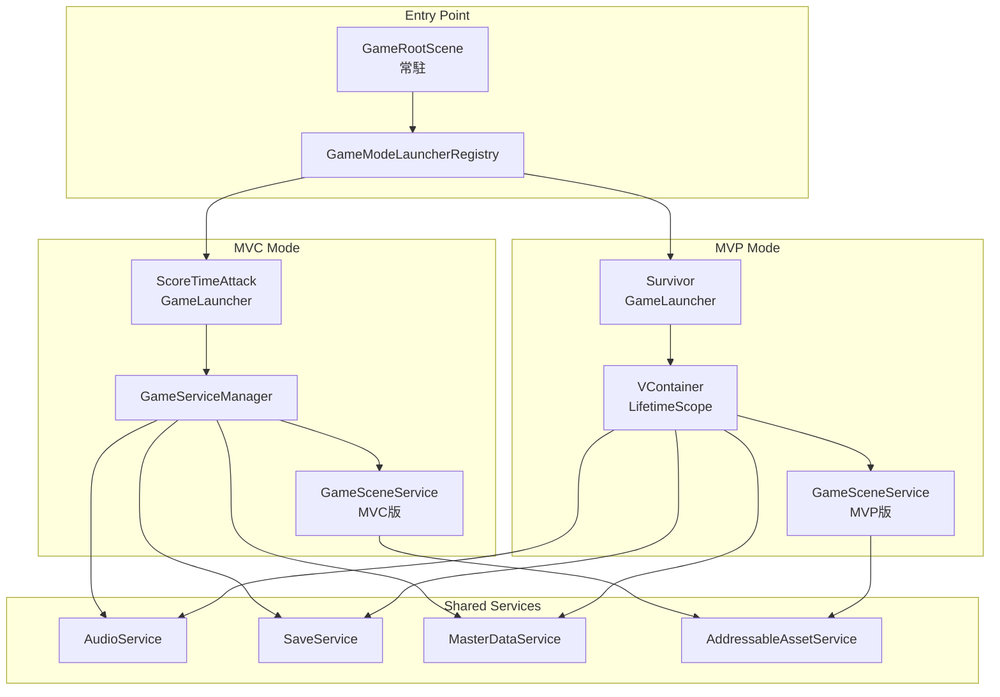
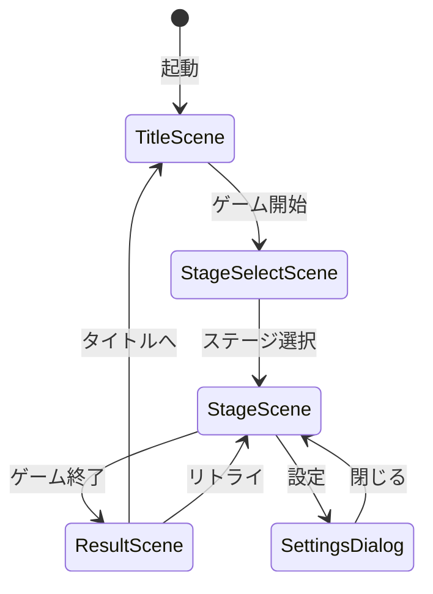

# Unity6Portfolio アーキテクチャ設計書

[English version is here](ARCHITECTURE.en.md)

**バージョン**: 1.9
**最終更新**: 2026年3月22日

---

## 目次

1. [設計思想](#1-設計思想)
2. [システム全体図](#2-システム全体図)
3. [モノレポ構成](#3-モノレポ構成)
4. [アセンブリ構成](#4-アセンブリ構成)
5. [MVC vs MVP 比較](#5-mvc-vs-mvp-比較)
6. [シーン遷移設計](#6-シーン遷移設計)
7. [データフロー](#7-データフロー)
8. [クラス設計（UML）](#8-クラス設計uml)
9. [シーケンス図](#9-シーケンス図)
10. [CI/CD・品質管理](#10-cicd品質管理)
11. [設計判断の記録](#11-設計判断の記録)

---

## 1. 設計思想

### 1.1 アーキテクチャ選定の背景

本プロジェクトは**2つの異なるアーキテクチャパターン**（MVC/MVP）を意図的に採用しています。

| パターン | ゲームモード | 目的 |
|---------|-------------|------|
| **MVC** | ScoreTimeAttack | レガシー環境（uGUI中心）への適応スキル提示 |
| **MVP** | Survivor | モダン環境（VContainer + UIToolkit）への適応スキル提示 |

### 1.2 設計原則

```
┌─────────────────────────────────────────────────────────────┐
│  SOLID原則の適用                                            │
├─────────────────────────────────────────────────────────────┤
│  S: 単一責任 - Service/Scene/Componentの明確な役割分離      │
│  O: 開放閉鎖 - インターフェースによる拡張性確保             │
│  L: リスコフ - GameScene継承階層の置換可能性                │
│  I: インターフェース分離 - 細粒度のサービスインターフェース  │
│  D: 依存性逆転 - DIコンテナによる依存関係の制御             │
└─────────────────────────────────────────────────────────────┘
```

---

## 2. システム全体図

### 2.1 レイヤードアーキテクチャ

```
┌─────────────────────────────────────────────────────────────────────┐
│                        Application Layer                            │
│  ┌──────────────────────┐    ┌──────────────────────┐              │
│  │   GameRootScene      │    │  GameModeLauncher    │              │
│  │   (常駐シーン)        │───▶│  Registry            │              │
│  └──────────────────────┘    └──────────────────────┘              │
│              │                         │                            │
│              ▼                         ▼                            │
│  ┌──────────────────────┐    ┌──────────────────────┐              │
│  │  MVC GameLauncher    │    │  MVP GameLauncher    │              │
│  │  (ScoreTimeAttack)   │    │  (Survivor)          │              │
│  └──────────────────────┘    └──────────────────────┘              │
├─────────────────────────────────────────────────────────────────────┤
│                         Scene Layer                                 │
│  ┌──────────────────────┐    ┌──────────────────────┐              │
│  │  GameSceneService    │    │  GameSceneService    │              │
│  │  (MVC版)             │    │  (MVP版/VContainer)  │              │
│  └──────────────────────┘    └──────────────────────┘              │
│              │                         │                            │
│              ▼                         ▼                            │
│  ┌──────────────────────┐    ┌──────────────────────┐              │
│  │  GameScene           │    │  GameScene           │              │
│  │  (Prefab/Unity)      │    │  (Prefab + DI)       │              │
│  └──────────────────────┘    └──────────────────────┘              │
├─────────────────────────────────────────────────────────────────────┤
│                        Service Layer                                │
│  ┌────────────┐ ┌────────────┐ ┌────────────┐ ┌────────────┐       │
│  │ AudioSvc   │ │ SaveSvc    │ │ MasterData │ │ LockOnSvc  │       │
│  └────────────┘ └────────────┘ └────────────┘ └────────────┘       │
├─────────────────────────────────────────────────────────────────────┤
│                      Infrastructure Layer                           │
│  ┌────────────┐ ┌────────────┐ ┌────────────┐ ┌────────────┐       │
│  │Addressables│ │MasterMemory│ │ MemoryPack │ │ MessagePipe│       │
│  └────────────┘ └────────────┘ └────────────┘ └────────────┘       │
└─────────────────────────────────────────────────────────────────────┘
```

### 2.2 コンポーネント関係図


```mermaid
graph TB
    subgraph "Entry Point"
        GRS[GameRootScene<br/>常駐]
        GML[GameModeLauncherRegistry]
    end

    subgraph "MVC Mode"
        MVCL[ScoreTimeAttack<br/>GameLauncher]
        GSM[GameServiceManager]
        MVCS[GameSceneService<br/>MVC版]
    end

    subgraph "MVP Mode"
        MVPL[Survivor<br/>GameLauncher]
        VC[VContainer<br/>LifetimeScope]
        MVPS[GameSceneService<br/>MVP版]
    end

    subgraph "Shared Services"
        AS[AudioService]
        SS[SaveService]
        MDS[MasterDataService]
        AAS[AddressableAssetService]
    end

    GRS --> GML
    GML --> MVCL
    GML --> MVPL

    MVCL --> GSM
    GSM --> MVCS
    GSM --> AS
    GSM --> SS
    GSM --> MDS

    MVPL --> VC
    VC --> MVPS
    VC --> AS
    VC --> SS
    VC --> MDS

    MVCS --> AAS
    MVPS --> AAS
```

### 2.3 サーバーアーキテクチャ

```
┌─────────────────────────────────────────────────────────────────────┐
│                       Game.Client (Unity 6)                          │
│  ┌──────────────┐  ┌──────────────┐  ┌──────────────┐              │
│  │  IApiClient   │  │ ILobbyClient │  │ IChatClient  │              │
│  │  (REST/HTTP)  │  │ (gRPC/Hub)   │  │ (SignalR)    │              │
│  └──────┬───────┘  └──────┬───────┘  └──────┬───────┘              │
└─────────┼──────────────────┼──────────────────┼─────────────────────┘
          │ HTTP/1.1         │ HTTP/2 (gRPC)    │ WebSocket
          ▼                  ▼                  ▼
┌─────────────────┐  ┌─────────────────┐  ┌─────────────────┐
│   Game.Server   │  │  Game.Realtime  │  │   Game.Server   │
│   (REST API)    │  │  (MagicOnion)   │  │   (SignalR Hub) │
│   Port: 5000    │  │   Port: 5001    │  │   Port: 5000    │
├─────────────────┤  ├─────────────────┤  ├─────────────────┤
│  Controllers/   │  │  LobbyHub       │  │  ChatHub        │
│  Auth, Users,   │  │  MatchmakingHub │  │                 │
│  Scores, Ranks  │  │                 │  │                 │
└────────┬────────┘  └────────┬────────┘  └────────┬────────┘
         │                    │                     │
         ▼                    ▼                     ▼
┌─────────────────────────────────────────────────────────────┐
│                    Infrastructure Layer                       │
│  ┌──────────┐  ┌──────────┐  ┌──────────────────────────┐   │
│  │PostgreSQL│  │  Valkey   │  │  Game.Server.Shared      │   │
│  │ (Users,  │  │ (Lobby,  │  │  (JWT, Health, Extensions)│   │
│  │  Scores) │  │  Queue,  │  │                           │   │
│  │          │  │  Cache)  │  │                           │   │
│  └──────────┘  └──────────┘  └──────────────────────────┘   │
└─────────────────────────────────────────────────────────────┘
```

**通信プロトコル:**

| プロトコル | サーバー | 用途 | 特徴 |
|-----------|---------|------|------|
| REST (HTTP/1.1) | Game.Server | 認証, ユーザー管理, スコア, ランキング | リクエスト/レスポンス型 |
| gRPC (HTTP/2) | Game.Realtime | ロビー操作（Unary RPC） | 高効率バイナリ通信 |
| StreamingHub | Game.Realtime | リアルタイムイベント（ロビー, マッチメイキング） | サーバープッシュ, 双方向 |
| SignalR (WebSocket) | Game.Server | チャットメッセージング | リアルタイム, ルームベース |

---

## 3. モノレポ構成

### 3.1 プロジェクト構成

本プロジェクトはモノレポ構成を採用し、クライアント・サーバー・共有ライブラリを1つのリポジトリで管理しています。

```
Unity6Portfolio/
├── src/
│   ├── Game.Client/          # Unity クライアント (Unity 6)
│   │   ├── Assets/
│   │   │   └── Programs/     # ゲームコード
│   │   └── Packages/
│   │
│   ├── Game.Server/          # REST API サーバー (ASP.NET Core 9)
│   │   ├── Controllers/
│   │   ├── Services/
│   │   └── Program.cs
│   │
│   ├── Game.Realtime/        # リアルタイムサーバー (MagicOnion gRPC)
│   │   ├── Hubs/             # StreamingHub (LobbyHub, MatchmakingHub)
│   │   ├── Services/         # Unary RPC (LobbyService)
│   │   └── Program.cs
│   │
│   ├── Game.Server.Shared/   # サーバー共通ライブラリ
│   │   ├── Extensions/       # JWT認証、ヘルスチェック
│   │   └── Configuration/    # 共通設定
│   │
│   └── Game.Shared/          # 共有ライブラリ (.NET + Unity Package)
│       ├── Runtime/
│       │   └── Shared/
│       │       ├── Dto/           # 通信DTO (LobbyInfo等)
│       │       ├── Enums/         # AudioCategory等
│       │       ├── MasterData/    # マスターデータ定義
│       │       └── Realtime/      # Hub/Service インターフェース
│       ├── Game.Shared.csproj     # .NET プロジェクト
│       └── package.json           # Unity パッケージ定義
│
├── test/
│   ├── Game.Server.Tests/    # サーバーテスト
│   └── Game.Realtime.Tests/  # リアルタイムサーバーテスト
│
├── docs/                     # ドキュメント
├── docker/
│   ├── unity-accelerator/    # Unity Accelerator キャッシュサーバー
│   ├── unity-ci/             # Unity CI Runner (Docker + GitHub Actions)
│   ├── game-server/          # Game.Server + Game.Realtime (Docker Compose)
│   └── migrate/              # DBマイグレーション Runner (FluentMigrator)
├── scripts/                  # ビルド・フォーマットスクリプト
└── .github/
    └── workflows/            # GitHub Actions
```

### 3.2 Game.Shared の役割

マスターデータ定義・通信DTO・リアルタイムインターフェースを共有ライブラリとして分離し、以下のメリットを実現:

| メリット | 説明 |
|---------|------|
| クライアント・サーバー共有 | 同じDTO・Hub/Serviceインターフェースを Unity/ASP.NET Core/MagicOnion で共有 |
| 依存関係の明確化 | 最下層に配置することで循環参照を防止 |
| ビルド時間短縮 | 変更頻度の低いコードを分離 |
| バージョン管理 | パッケージ単位でバージョン管理が可能 |

### 3.3 Game.Server.Shared の役割

REST APIサーバー（Game.Server）とリアルタイムサーバー（Game.Realtime）が共有する基盤ライブラリ:

| 機能 | 説明 |
|-----|------|
| JWT認証 | 共通の認証ミドルウェア設定（トークン検証、userId抽出） |
| ヘルスチェック | `/health` エンドポイント共通実装 |
| 設定クラス | GameServerConfiguration 等の共通設定 |
| 拡張メソッド | ClaimsPrincipal からの userId 取得など |

### 3.4 プロジェクト間依存関係

```
┌─────────────────────────────────────────────────────────────┐
│                     Unity6Portfolio                          │
│                      (モノレポ)                               │
└─────────────────────────────────────────────────────────────┘
     ↓            ↓              ↓              ↓
┌──────────┐ ┌──────────┐ ┌────────────┐ ┌──────────────────┐
│  Game.   │ │  Game.   │ │   Game.    │ │  Game.Server.    │
│  Client  │ │  Server  │ │  Realtime  │ │  Shared          │
│(Unity 6) │ │(REST API)│ │(MagicOnion)│ │(共通基盤)        │
└────┬─────┘ └────┬─────┘ └─────┬──────┘ └────────┬─────────┘
     │            │             │                  │
     │            ├─────────────┤                  │
     │            │ 共通参照     │                  │
     │            ▼             ▼                  │
     │       ┌──────────────────────┐              │
     │       │   Game.Server.Shared │◀─────────────┘
     │       │   (JWT, Health等)    │
     │       └──────────┬───────────┘
     │                  │
     └────────┬─────────┘
              ▼
     ┌─────────────────┐
     │   Game.Shared   │
     │ (DTO, IF, マスタ) │
     └─────────────────┘
```

---

## 4. アセンブリ構成

### 4.1 アセンブリ依存関係図

```
                    ┌──────────────────┐
                    │     Game.App     │
                    │    (起動制御)     │
                    └────────┬─────────┘
                             │
            ┌────────────────┼────────────────┐
            │                │                │
            ▼                ▼                │
┌───────────────────┐ ┌───────────────┐       │
│Game.MVC.ScoreTime │ │ Game.MVP.Core │       │
│      Attack       │ │  (VContainer) │       │
└─────────┬─────────┘ └───────┬───────┘       │
          │                   │               │
          ▼                   │               │
┌───────────────────┐         │   ┌───────────────────┐
│  Game.MVC.Core    │         │   │ Game.MVP.Survivor │
│  (MessagePipe)    │         │   │    (ゲーム実装)    │
└─────────┬─────────┘         │   └─────────┬─────────┘
          │                   │             ▲│
          │                   │        依存 ││
          │                   │   ┌─────────┘│
          │                   │   │          │
          │                   │ ┌─┴────────────────────┐
          │                   │ │Game.MVP.Survivor.ECS │
          │                   │ │  (DOTS: Burst/Jobs)  │
          │                   │ └──────────┬───────────┘
          │                   │            │
          └─────────┬─────────┴────────────┘
                    │
                    ▼
          ┌─────────────────────┐
          │     Game.Shared     │
          │     (共通基盤)       │
          └──────────┬──────────┘
                     │
                     ▼
          ┌─────────────────────┐
          │  Game.Library.Shared │
          │   (MasterMemory等)   │
          └─────────────────────┘
```

### 4.2 アセンブリ詳細

#### ランタイムアセンブリ

| アセンブリ | 役割 | 主要な依存 |
|-----------|------|-----------|
| **Game.Library.Shared** | 共有ライブラリ（Unity/サーバー共用） | MasterMemory, MessagePack |
| **Game.Shared** | 共通基盤・インターフェース定義 | Game.Library.Shared, UniTask, R3, MessagePipe, Addressables |
| **Game.MVC.Core** | MVCパターン基盤 | Game.Shared, MessagePipe.Unity |
| **Game.MVC.ScoreTimeAttack** | スコアアタックゲーム実装 | Game.MVC.Core, Game.Client.MasterData, UnityChan, InputSystem, Cinemachine |
| **Game.MVP.Core** | MVPパターン基盤 | Game.Shared, VContainer, MessagePipe.VContainer |
| **Game.MVP.Survivor** | サバイバーゲーム実装 | Game.MVP.Core, VContainer, AI.Navigation, Cinemachine |
| **Game.MVP.Survivor.ECS** | ECS敵システム（DOTS並列処理） | Game.MVP.Survivor, Unity.Entities, Unity.Burst, Unity.Collections |
| **Game.App** | アプリケーション起動制御 | Game.Shared, Game.MVC.Core, Game.MVC.ScoreTimeAttack, Game.MVP.Core |

#### テストアセンブリ

| アセンブリ | 役割 | テスト数 |
|-----------|------|---------|
| **Game.Tests.Shared** | Shared層ユニットテスト | 351 |
| **Game.Tests.MVC** | MVC層ユニットテスト | 160 |
| **Game.Tests.MVP** | MVP層ユニットテスト | 166 |
| **Game.Tests.MVP.ECS** | ECSシステム機能・性能テスト | 33 |
| **Game.Tests.PlayMode** | 統合・PlayModeテスト | 63 |

**合計テスト数**: 773テスト（EditMode 710 + PlayMode 63）

#### サーバー・ツールアセンブリ（.NET 9）

| プロジェクト | 役割 | 主要な依存 |
|-------------|------|-----------|
| **Game.Server** | REST API サーバー | ASP.NET Core 9, Dapper, Npgsql, FluentMigrator, StackExchange.Redis, SignalR |
| **Game.Realtime** | リアルタイム gRPC サーバー | MagicOnion.Server, StackExchange.Redis, Game.Server.Shared |
| **Game.Server.Shared** | サーバー共通基盤 | ASP.NET Core 9, JWT認証, ヘルスチェック |
| **Game.Tools** | CLIツール（マスターデータ管理等） | ConsoleAppFramework, Google.Protobuf, MasterMemory |
| **Game.Client.Linked** | クライアントMemoryTable参照ブリッジ | MasterMemory, MessagePack |
| **Game.Shared** | 共有ライブラリ（.NET版） | MasterMemory, MessagePack, MagicOnion.Abstractions |

#### サーバーエンドポイント構成

**Game.Server (REST API — Port 5000):**

| コントローラ | エンドポイント | 役割 |
|-------------|-------------|------|
| **AuthController** | POST /api/auth/* | ゲストログイン、メール連携、引き継ぎ |
| **UsersController** | GET/PUT /api/users/* | ユーザー情報取得・更新 |
| **SurvivorScoresController** | POST /api/survivor/scores | スコア送信 |
| **RankingsController** | GET /api/survivor/rankings/* | ランキング取得・自分の順位 |
| **ChatHub** | /hubs/chat (SignalR) | リアルタイムチャット |
| **HealthController** | GET /api/health | ヘルスチェック |

**Game.Realtime (gRPC — Port 5001):**

| サービス/Hub | プロトコル | 役割 |
|-------------|----------|------|
| **LobbyService** | Unary RPC | ロビー作成・参加・退出・検索 |
| **LobbyHub** | StreamingHub | ロビーリアルタイムイベント（チャット、レディ、ゲーム開始） |
| **MatchmakingHub** | StreamingHub | マッチメイキングキュー管理、マッチ成立通知 |

### 4.3 循環参照防止設計

```
【設計ルール】
1. Shared → 他アセンブリへの参照禁止
2. Core → 同レベルCoreへの参照禁止（MVC.Core ⇔ MVP.Core）
3. ゲーム実装 → 他ゲーム実装への参照禁止
4. App → 全体の結合点として例外的に全参照許可
```

---

## 5. MVC vs MVP 比較

### 5.1 アーキテクチャ比較表

| 観点 | MVC (ScoreTimeAttack) | MVP (Survivor) |
|-----|----------------------|----------------|
| **DI方式** | GameServiceManager（手動） | VContainer（自動） |
| **UI技術** | uGUI + TextMeshPro | UIToolkit + TextMeshPro |
| **状態管理** | StateMachine | StateMachine + R3 Reactive |
| **メッセージング** | MessagePipe（直接参照） | MessagePipe（DI注入） |
| **シーン読み込み** | Addressables直接呼び出し | IAddressableAssetService経由 |
| **衝突イベント** | IPlayerCollisionHandler（直接呼出） | MessagePipe経由 |
| **テスト容易性** | 中（サービスロケータ依存） | 高（完全DI） |

### 5.2 DI方式の違い

#### MVC: GameServiceManager（サービスロケータパターン）

```csharp
// サービス登録
GameServiceManager.Add<AudioService>();

// サービス取得
var audioService = GameServiceManager.Get<AudioService>();
```

#### MVP: VContainer（依存性注入パターン）

```csharp
// LifetimeScopeで登録
public class SurvivorLifetimeScope : LifetimeScope
{
    protected override void Configure(IContainerBuilder builder)
    {
        builder.Register<IAudioService, AudioService>(Lifetime.Singleton);
    }
}

// コンストラクタ注入
public class SurvivorStagePresenter
{
    private readonly IAudioService _audioService;

    [Inject]
    public SurvivorStagePresenter(IAudioService audioService)
    {
        _audioService = audioService;
    }
}
```

### 5.3 シーン管理の違い

```
【MVC】GamePrefabScene
┌─────────────────────────────────────────────┐
│ 1. AssetService.LoadAssetAsync<GameObject>  │
│ 2. Object.Instantiate(_asset)               │
│ 3. GetSceneComponent() で取得               │
│ ※ DIなし、直接参照                          │
└─────────────────────────────────────────────┘

【MVP】GamePrefabScene
┌─────────────────────────────────────────────┐
│ 1. AssetService.LoadAssetAsync<GameObject>  │
│ 2. Object.Instantiate(_asset)               │
│ 3. Resolver.InjectGameObject(_instance)     │  ← DI注入
│ 4. GetSceneComponent() + Resolver.Inject()  │  ← Component注入
└─────────────────────────────────────────────┘
```

---

## 6. シーン遷移設計

### 6.1 シーンライフサイクル

```
┌─────────────────────────────────────────────────────────────┐
│                    GameScene Lifecycle                      │
├─────────────────────────────────────────────────────────────┤
│                                                             │
│   PreInitialize()  ─▶  サーバー通信、モデル初期化          │
│         │                                                   │
│         ▼                                                   │
│   LoadAsset()      ─▶  Prefab/UnityScene読み込み           │
│         │                                                   │
│         ▼                                                   │
│   Startup()        ─▶  View初期化、イベント登録            │
│         │                                                   │
│         ▼                                                   │
│   Ready()          ─▶  開始演出、ゲーム開始                │
│         │                                                   │
│    ┌────┴────┐                                              │
│    ▼         ▼                                              │
│  Sleep()   Restart()  ─▶  ダイアログ表示時など             │
│    │         │                                              │
│    └────┬────┘                                              │
│         ▼                                                   │
│   Terminate()      ─▶  リソース解放、シーン破棄            │
│                                                             │
└─────────────────────────────────────────────────────────────┘
```

### 6.2 シーン遷移フロー図

#### MVC: ScoreTimeAttack


```mermaid
stateDiagram-v2
    [*] --> TitleScene: 起動
    TitleScene --> StageSelectScene: ゲーム開始
    StageSelectScene --> StageScene: ステージ選択
    StageScene --> ResultScene: ゲーム終了
    ResultScene --> TitleScene: タイトルへ
    ResultScene --> StageScene: リトライ

    StageScene --> SettingsDialog: 設定
    SettingsDialog --> StageScene: 閉じる
```

#### MVP: Survivor

```mermaid
stateDiagram-v2
    [*] --> TitleScene: 起動

    state "ソロプレイ" as Solo {
        TitleScene --> StageScene: SOLO
    }

    state "マルチプレイ" as Multi {
        TitleScene --> LobbyScene: MULTI
        TitleScene --> LobbyRoomScene: MULTI (自動復帰)
        LobbyScene --> LobbyRoomScene: ロビー参加/作成
        LobbyRoomScene --> MatchmakingScene: 全員Ready
        MatchmakingScene --> StageScene: マッチ成立
    }

    StageScene --> ResultScene: ゲーム終了
    StageScene --> PauseDialog: ポーズ
    PauseDialog --> StageScene: 再開

    StageScene --> LevelUpDialog: レベルアップ
    LevelUpDialog --> StageScene: 選択完了

    StageScene --> WeaponReplaceDialog: 武器入替
    WeaponReplaceDialog --> StageScene: 選択完了

    ResultScene --> TitleScene: タイトルへ
    ResultScene --> StageScene: リトライ
    LobbyRoomScene --> LobbyScene: 退出
```

### 6.3 シーン継承階層

```
IGameScene (interface)
    │
    ├── GameScene (abstract)
    │       │
    │       ├── GameScene<TScene, TComponent>
    │       │       │
    │       │       ├── GamePrefabScene<TScene, TComponent>
    │       │       │       └── ScoreTimeAttackTitleScene
    │       │       │       └── ScoreTimeAttackStageScene
    │       │       │       └── SurvivorTitleScene
    │       │       │       └── SurvivorStageScene
    │       │       │
    │       │       ├── GameUnityScene<TScene, TComponent>
    │       │       │       └── (ステージ背景用)
    │       │       │
    │       │       └── GameDialogScene<TScene, TComponent, TResult>
    │       │               └── SettingsDialog
    │       │               └── PauseDialog
    │       │               └── LevelUpDialog
    │       │
    │       └── GameUnityScene (コンポーネントなし)
    │               └── (環境シーン用)
```

---

## 7. データフロー

### 7.1 マスターデータフロー

本プロジェクトはProtobufスキーマ駆動のマスターデータ管理システムを採用し、クライアント・サーバー間でデータ定義を共有しながら、デプロイターゲットに応じたフィールドフィルタリングを実現しています。

#### 7.1.1 全体アーキテクチャ

```
┌─────────────────────────────────────────────────────────────────────────┐
│                    Master Data Update Flow                               │
├─────────────────────────────────────────────────────────────────────────┤
│                                                                         │
│  ① Schema定義                                                           │
│  ┌──────────────────────┐                                               │
│  │ masterdata/proto/    │  ← .proto ファイル（スキーマ定義）             │
│  │  ├── options/        │     デプロイターゲット指定                     │
│  │  ├── audio/          │     PRIMARY/SECONDARY キー指定                │
│  │  ├── score_time_attack/                                              │
│  │  └── survivor/       │                                               │
│  └──────────┬───────────┘                                               │
│             │                                                           │
│             ▼                                                           │
│  ② コード生成 (Game.Tools CLI)                                          │
│  ┌──────────────────────┐                                               │
│  │ masterdata codegen   │  protoc → FileDescriptorSet → C#生成          │
│  └──────────┬───────────┘                                               │
│             │                                                           │
│     ┌───────┴───────┐                                                   │
│     ▼               ▼                                                   │
│  ┌────────────┐  ┌────────────┐                                         │
│  │ Client     │  │ Server     │  ← MemoryTable C#クラス                 │
│  │*.Generated │  │*.Generated │    (フィールドフィルタリング適用)        │
│  └────────────┘  └────────────┘                                         │
│                                                                         │
│  ③ TSVデータ編集                                                        │
│  ┌──────────────────────┐                                               │
│  │ masterdata/raw/*.tsv │  ← スプレッドシート互換フォーマット            │
│  └──────────┬───────────┘                                               │
│             │                                                           │
│             ▼                                                           │
│  ④ バイナリビルド                                                       │
│  ┌─────────────────────────────────────────────────────────────┐       │
│  │   ┌─────────────────┐        ┌─────────────────────┐        │       │
│  │   │ Unity Editor   │        │ Game.Tools CLI      │        │       │
│  │   │ MasterDataWindow│        │ masterdata build    │        │       │
│  │   └────────┬────────┘        └──────────┬──────────┘        │       │
│  │            ▼                            ▼                   │       │
│  │   ┌─────────────────┐        ┌─────────────────────┐        │       │
│  │   │MasterDataBinary │        │ masterdata.bytes    │        │       │
│  │   │.bytes (Client)  │        │ (Server)            │        │       │
│  │   └─────────────────┘        └─────────────────────┘        │       │
│  └─────────────────────────────────────────────────────────────┘       │
│                                                                         │
│  ⑤ ランタイムロード                                                     │
│  ┌─────────────────────┐        ┌─────────────────────┐                │
│  │ Client (Unity)      │        │ Server (ASP.NET)    │                │
│  │ Addressables経由    │        │ FileSystem経由      │                │
│  │ → MemoryDatabase    │        │ → MemoryDatabase    │                │
│  └─────────────────────┘        └─────────────────────┘                │
│                                                                         │
└─────────────────────────────────────────────────────────────────────────┘
```

#### 7.1.2 デプロイターゲットシステム

ビットマスクによるフィールドフィルタリングで、同一スキーマから異なるバイナリを生成:

| ターゲット | ビット | 値 | 用途 |
|-----------|-------|---:|------|
| ALL | - | 0 | 全ターゲット共通（Id, Name等の基本フィールド） |
| CLIENT | 0 | 1 | Unityクライアントのみ（アセット名、UI用データ） |
| SERVER | 1 | 2 | REST APIサーバーのみ（報酬倍率、内部バランス値） |
| REALTIME | 2 | 4 | MagicOnionリアルタイムサーバーのみ |

**Protoファイルでの指定例:**
```protobuf
message SurvivorEnemyMaster {
  option (masterdata.options.table_target) = DEPLOY_TARGET_ALL;

  int32 id = 1 [(masterdata.options.index_type) = INDEX_PRIMARY];
  string name = 2;

  // クライアントのみ（UIアイコン）
  string icon_asset_name = 3
    [(masterdata.options.field_target) = DEPLOY_TARGET_CLIENT];

  // サーバーのみ（内部バランス係数）
  int32 difficulty_multiplier = 4
    [(masterdata.options.field_target) = DEPLOY_TARGET_SERVER];
}
```

#### 7.1.3 CLIツール（Game.Tools）

| コマンド | 用途 |
|---------|------|
| `masterdata codegen` | Proto → C# MemoryTableクラス生成 |
| `masterdata build` | TSV → MessagePackバイナリ変換 |
| `masterdata validate` | TSVスキーマ検証 |
| `masterdata scaffold` | C#クラス → Proto逆生成 |
| `masterdata export` | バイナリ → JSON/TSV出力 |
| `masterdata diff` | 2つのバイナリ比較 |

**ビルドコマンド例:**
```bash
# C#クラス生成
dotnet run --project src/Game.Tools -- masterdata codegen \
  --proto-dir masterdata/proto/ \
  --out-client src/Game.Client/Assets/Programs/Runtime/Shared/MasterData/ \
  --out-server src/Game.Server/MasterData/

# サーバー用バイナリビルド
dotnet run --project src/Game.Tools -- masterdata build \
  --tsv-dir masterdata/raw/ \
  --proto-dir masterdata/proto/ \
  --out-server src/Game.Server/MasterData/masterdata.bytes
```

#### 7.1.4 クライアント側ロードフロー

```csharp
// MasterDataServiceBase.cs
public async UniTask LoadMasterDataAsync()
{
    // Addressables経由でバイナリ読み込み
    var asset = await _assetService.LoadAssetAsync<TextAsset>("MasterDataBinary");

    // MessagePackリゾルバ設定
    var resolver = CompositeResolver.Create(
        MasterMemoryResolver.Instance,
        StandardResolver.Instance
    );

    // MemoryDatabase構築
    MemoryDatabase = new MemoryDatabase(asset.bytes, maxDegreeOfParallelism: Environment.ProcessorCount);
}

// 使用例
var enemy = _masterDataService.MemoryDatabase.SurvivorEnemyMasterTable.FindById(enemyId);
```

#### 7.1.5 サーバー側ロードフロー

```csharp
// MasterDataService.cs (Game.Server)
public class MasterDataService : IMasterDataService
{
    public MemoryDatabase MemoryDatabase { get; }

    public MasterDataService(IOptions<MasterDataSettings> settings)
    {
        var binaryPath = settings.Value.BinaryPath; // "MasterData/masterdata.bytes"
        var bytes = File.ReadAllBytes(binaryPath);

        MemoryDatabase = new MemoryDatabase(bytes, maxDegreeOfParallelism: Environment.ProcessorCount);
        _logger.LogInformation("MasterData loaded: {Path}", binaryPath);
    }
}

// Program.cs での登録
builder.Services.Configure<MasterDataSettings>(builder.Configuration.GetSection("MasterData"));
builder.Services.AddSingleton<IMasterDataService, MasterDataService>();
```

#### 7.1.6 Game.Client.Linked の役割

CLIツールがクライアント用MemoryTableの型情報にアクセスするためのブリッジプロジェクト:

```xml
<!-- Game.Client.Linked.csproj -->
<ItemGroup>
  <!-- クライアント生成ファイルをリンク参照 -->
  <Compile Include="..\Game.Client\Assets\...\MasterData\*.Generated.cs" LinkBase="Generated" />
</ItemGroup>
```

**依存関係:**
```
Game.Tools
    ├── Game.Server (サーバー用MemoryTable)
    └── Game.Client.Linked (クライアント用MemoryTable参照)
            └── Game.Client/*.Generated.cs をリンク
```

#### 7.1.7 ファイル配置

| 種類 | パス |
|-----|------|
| Protoスキーマ | `masterdata/proto/**/*.proto` |
| TSVデータ | `masterdata/raw/*.tsv` |
| Client生成コード | `src/Game.Client/.../Shared/MasterData/*.Generated.cs` |
| Clientバイナリ | `src/Game.Client/Assets/MasterData/MasterDataBinary.bytes` |
| Server生成コード | `src/Game.Server/MasterData/*.Generated.cs` |
| Serverバイナリ | `src/Game.Server/MasterData/masterdata.bytes` |

### 7.2 アセット配信フロー

GameEnvironment設定に応じてAddressablesのアセット配信元を切り替え:

```
┌─────────────────────────────────────────────────────────────────┐
│                    Asset Delivery Flow                           │
├─────────────────────────────────────────────────────────────────┤
│                                                                 │
│  GameEnvironment                                                │
│  ┌──────────────────┐                                           │
│  │ Local            │──▶ Local Assets (StreamingAssets)         │
│  │ Develop/Staging  │──▶ Remote Assets (Dev/Staging Server)     │
│  │ Release          │──▶ Remote Assets (CDN)                    │
│  └──────────────────┘                                           │
│                                                                 │
│  ┌──────────────────┐    ┌──────────────────┐                   │
│  │  Addressables    │    │  Environment     │                   │
│  │  Settings        │◀───│  Switcher        │                   │
│  └────────┬─────────┘    └──────────────────┘                   │
│           │                      ▲                              │
│           │              ┌───────┴────────┐                     │
│           │              │ GAME_ENVIRONMENT│                    │
│           │              │ 環境変数 or     │                    │
│           │              │ Editor メニュー │                    │
│           │              └────────────────┘                     │
│           ▼                                                     │
│  ┌──────────────────┐                                           │
│  │ Profile Variable │                                           │
│  │ - Local.BuildPath│                                           │
│  │ - Remote.LoadPath│                                           │
│  └────────┬─────────┘                                           │
│           │                                                     │
│           ▼                                                     │
│  ┌──────────────────┐    ┌──────────────────┐                   │
│  │ Local            │ or │ Remote           │                   │
│  │ StreamingAssets  │    │ CDN/Cloud Storage│                   │
│  └──────────────────┘    └──────────────────┘                   │
│                                                                 │
└─────────────────────────────────────────────────────────────────┘
```

**対応環境:**
| GameEnvironment | アセット配信元 | 用途 |
|-----------------|--------------|------|
| Local | Local (StreamingAssets) | 開発・デバッグ |
| Develop | Remote (開発サーバー) | 開発環境テスト |
| Staging | Remote (ステージング) | リリース前検証 |
| Release | Remote (CDN) | 本番配信 |

**切り替え方法:**
- **CI/CD**: 環境変数 `GAME_ENVIRONMENT` から自動設定
- **エディター**: メニュー `Build > Addressables > Switch Profile`

**CI/CD対応:**
- Unity Accelerator によるライブラリキャッシュ共有
- GitHub Actions でのアセットキャッシュ最適化
- 環境変数による自動プロファイル切り替え

### 7.2.1 Addressables エディタ同期システム

チーム開発において、CIでビルドされたAddressablesアセットをUnityエディタの`UseExistingBuild`モードで利用可能にするシステム:

```
┌─────────────────────────────────────────────────────────────────┐
│                  Addressables Sync Flow                           │
├─────────────────────────────────────────────────────────────────┤
│                                                                 │
│  CI Build (GitHub Actions)                                      │
│  ┌──────────────────────┐                                       │
│  │AddressablesR2Uploader│                                       │
│  │  BuildAddressablesCI │─────▶ ServerData/{Platform}/          │
│  └──────────────────────┘       ├── catalog_*.bin               │
│         │                       ├── catalog_*.hash              │
│         │                       └── *.bundle (リモートのみ)     │
│         │                                                       │
│         └─────▶ Library/com.unity.addressables/ 全体を収集      │
│                                         │                       │
│  ┌──────────────────────────────────────┼───────────────────┐   │
│  │ index.json 生成 (CI側)               │                   │   │
│  │ {                                    │                   │   │
│  │   "catalogHash": "5c0d5ca2...",      │                   │   │
│  │   "files": [                         │                   │   │
│  │     "aa/Windows/catalog.bin",        │                   │   │
│  │     "aa/Windows/settings.json",      │                   │   │
│  │     "aa/Windows/StandaloneWindows64/*.bundle"           │   │
│  │   ]                                  │                   │   │
│  │ }                                    │                   │   │
│  └──────────────────────────────────────┼───────────────────┘   │
│                                         │ rclone sync           │
│                                         ▼                       │
│  Cloudflare R2                                                  │
│  ┌──────────────────────────────────────────────────────────┐  │
│  │ https://{env}.assets.rei-unity6-portfolio.com/{Platform}/ │  │
│  │   ├── catalog_*.bin, *.bundle (リモート)                  │  │
│  │   └── LocalBundles/                                       │  │
│  │       ├── index.json                                      │  │
│  │       └── aa/{Platform}/*.bundle (ローカル)               │  │
│  └──────────────────────────────────────────────────────────┘  │
│                                         │                       │
│                                         │ EditorAddressablesSync│
│                                         ▼                       │
│  Unity Editor (他の開発者)                                       │
│  ┌────────────────────────────────────────────────────────┐    │
│  │ ① Play開始前チェック (HasLocalCatalog)                  │    │
│  │    → カタログ不在時: ダイアログ表示 → ダウンロード促進   │    │
│  │ ② ShouldAutoSync() = GameEnvironment != Local           │    │
│  │    + UseExistingBuild モード                            │    │
│  │ ③ index.json取得 → catalogHash比較 → 差分あり時DL      │    │
│  └──────────┬─────────────────────────────────────────────┘    │
│             ▼                                                   │
│  Library/com.unity.addressables/                                │
│  ├── aa/{Platform}/catalog.bin, catalog.hash, settings.json    │
│  └── aa/{Platform}/{BuildTarget}/*.bundle                      │
│                                                                 │
└─────────────────────────────────────────────────────────────────┘
```

**同期方式: index.json**

CIがファイル一覧を `index.json` として生成・アップロード:

```json
{
  "catalogHash": "5c0d5ca2f2358201106e893041d3d98f",
  "files": [
    "AddressablesBuildTEP.json",
    "aa/Windows/catalog.bin",
    "aa/Windows/catalog.hash",
    "aa/Windows/settings.json",
    "aa/Windows/StandaloneWindows64/defaultlocalgroup_*.bundle"
  ]
}
```

**利点:**
- catalogHashの比較のみで同期要否判断（軽量）
- ファイル追加時にコード変更不要
- CI側で `find` コマンドで自動生成

**関連クラス:**

| クラス | 役割 |
|-------|------|
| `AddressablesR2Uploader` | CIビルド、R2アップロード |
| `EditorAddressablesSync` | エディタ同期（index.json方式、Play開始前自動チェック） |
| `AddressablesBundleUtils` | ローカルバンドル判定の共通ユーティリティ（ランタイム用） |

**Play前チェック機能:**
- `UseExistingBuild` + 非Local環境でPlay開始時に自動チェック
- `HasLocalCatalog()` で `Library/com.unity.addressables/aa/{Platform}/catalog.bin` の存在確認
- カタログ不在時: Playを中止し、ダウンロードダイアログを表示

**エディタUI（GameEnvironmentSettingsWindow）:**
- バージョン確認ボタン: リモートとローカルのcatalogHash比較
- ダウンロードボタン: 強制同期実行
- キャッシュクリアボタン:
  - Library Cache: `Library/com.unity.addressables/` 削除
  - Catalog Cache: `persistentDataPath/com.unity.addressables/` 削除
  - Downloaded Assets: `persistentDataPath/{env}/DownloadedAssets/` 削除

**ローカルバンドル判定パターン:**
- `defaultlocalgroup` - Default Local Groupのバンドル
- `local_` / `_local_` - ローカル専用プレフィックス/インフィックス
- `monoscripts` - MonoScriptバンドル
- `unitybuiltinassets` - Unity Built-in Assetsバンドル

### 7.3 セーブデータフロー

```
┌─────────────────────────────────────────────────────────────────┐
│                    Save Data Flow                               │
├─────────────────────────────────────────────────────────────────┤
│                                                                 │
│  ┌──────────────┐                                               │
│  │  Game State  │  ←─ Score, Settings, Progress                │
│  └──────┬───────┘                                               │
│         │                                                       │
│         ▼                                                       │
│  ┌──────────────┐                                               │
│  │ SaveService  │                                               │
│  │   Base       │                                               │
│  └──────┬───────┘                                               │
│         │                                                       │
│         ▼                                                       │
│  ┌──────────────┐    ┌──────────────┐                          │
│  │  MemoryPack  │───▶│  Binary Data │                          │
│  │ Serializer   │    │  (高速)      │                          │
│  └──────────────┘    └──────┬───────┘                          │
│                             │                                   │
│                             ▼                                   │
│                    ┌──────────────┐                             │
│                    │PlayerPrefs/  │                             │
│                    │ File System  │                             │
│                    └──────────────┘                             │
│                                                                 │
└─────────────────────────────────────────────────────────────────┘
```

### 7.4 認証・セッション管理フロー

サーバー連携によるユーザー認証とセッション管理:

```
┌─────────────────────────────────────────────────────────────────┐
│                 Authentication Flow                              │
├─────────────────────────────────────────────────────────────────┤
│                                                                 │
│  ① アプリ起動時                                                  │
│  ┌──────────────┐    ┌──────────────┐    ┌──────────────┐      │
│  │AuthSession-  │───▶│ローカル保存  │───▶│トークン復元  │      │
│  │Service       │    │データ読み込み│    │認証状態復帰  │      │
│  └──────────────┘    └──────────────┘    └──────────────┘      │
│                                                                 │
│  ② 新規ユーザー（ゲストログイン）                                 │
│  ┌──────────────┐    ┌──────────────┐    ┌──────────────┐      │
│  │デバイス      │───▶│AuthApiService│───▶│ユーザーID    │      │
│  │フィンガー    │    │GuestLogin    │    │トークン発行  │      │
│  │プリント生成  │    └──────────────┘    └──────────────┘      │
│  └──────────────┘                                               │
│                                                                 │
│  ③ アカウント連携                                                │
│  ┌──────────────┐    ┌──────────────┐    ┌──────────────┐      │
│  │メール/PW入力 │───▶│AuthApiService│───▶│連携完了      │      │
│  │Account Link  │    │LinkEmail     │    │authType更新  │      │
│  │Dialog        │    └──────────────┘    └──────────────┘      │
│  └──────────────┘                                               │
│                                                                 │
│  ④ 引き継ぎパスワード                                            │
│  ┌──────────────┐    ┌──────────────┐    ┌──────────────┐      │
│  │パスワード発行│───▶│12桁パスワード│───▶│ローカル保存  │      │
│  │IssueTransfer │    │サーバー生成  │    │表示・コピー  │      │
│  │Password      │    └──────────────┘    └──────────────┘      │
│  └──────────────┘                                               │
│                                                                 │
│  ⑤ データ移行（別端末）                                          │
│  ┌──────────────┐    ┌──────────────┐    ┌──────────────┐      │
│  │ユーザーID    │───▶│AuthApiService│───▶│セッション    │      │
│  │引き継ぎPW    │    │UserIdLogin   │    │復元・継続    │      │
│  │入力          │    └──────────────┘    └──────────────┘      │
│  └──────────────┘                                               │
│                                                                 │
└─────────────────────────────────────────────────────────────────┘
```

#### 認証タイプ

| タイプ | 説明 | 連携方法 |
|-------|------|---------|
| guest | ゲストユーザー（初期状態） | デバイスフィンガープリント自動生成 |
| email | メール連携済み | メール/パスワードでログイン可能 |
| transfer | 引き継ぎ対応 | ユーザーID + 引き継ぎパスワード |

#### 関連クラス

| クラス | 役割 |
|-------|------|
| `IAuthApiService` | 認証APIエンドポイント通信 |
| `AuthApiService` | 認証API実装（REST通信） |
| `IAuthSessionService` | セッション状態管理インターフェース |
| `AuthSessionService` | トークン保存/復元/クリア実装 |
| `SessionSaveData` | セッション永続化データ |
| `AuthDto` | 認証リクエスト/レスポンスDTO |

#### 7.4.1 サーバーセキュリティアーキテクチャ

```
┌─────────────────────────────────────────────────────────────────┐
│                  Server Security Architecture                    │
├─────────────────────────────────────────────────────────────────┤
│                                                                 │
│  Game.Client (Unity 6)                                          │
│  ┌────────────────────────────────────────────────────────┐     │
│  │ JWT Bearer Token (Authorization header)                 │     │
│  │ HMAC-SHA256 署名 + タイムスタンプ + Nonce (REST のみ)   │     │
│  └─────────────┬─────────────────────────┬────────────────┘     │
│                │                         │                       │
│      REST (HTTP/1.1)              gRPC (HTTP/2)                 │
│                │                         │                       │
│                ▼                         ▼                       │
│  ┌──────────────────────┐  ┌──────────────────────────────┐    │
│  │   Game.Server        │  │      Game.Realtime           │    │
│  │                      │  │                              │    │
│  │  RequestSigning      │  │  JwtAuthentication           │    │
│  │  Middleware           │  │  Filter (Unary)              │    │
│  │  ├ HMAC-SHA256検証   │  │  JwtAuthentication           │    │
│  │  ├ タイムスタンプ検証 │  │  HubFilter (StreamingHub)   │    │
│  │  └ Nonceリプレイ防止 │  │  ├ ASP.NET Core Auth連携    │    │
│  │                      │  │  └ gRPCステータスコード応答  │    │
│  │  ASP.NET Core Auth   │  │                              │    │
│  │  ├ JWT Bearer検証    │  │  ValidationException         │    │
│  │  └ Claims抽出        │  │  Filter / HubFilter          │    │
│  │                      │  │  ├ Unary: gRPCエラー変換    │    │
│  │  AccountLockout      │  │  └ Hub: 例外飲込み(切断防止) │    │
│  │  ├ 5回失敗→15分ロック│  │                              │    │
│  │  └ DB追跡            │  │  MatchSessionToken           │    │
│  │                      │  │  ├ CSPRNG 256bit生成        │    │
│  │  PasswordValidator   │  │  ├ Valkey保存 (5分TTL)      │    │
│  │  ├ 8文字以上         │  │  └ 明示的失効対応           │    │
│  │  ├ 大小英字+数字+記号│  │                              │    │
│  └──────────────────────┘  └──────────────────────────────┘    │
│                │                         │                       │
│                ▼                         ▼                       │
│  ┌──────────────────────────────────────────────────────────┐  │
│  │                    共通基盤                                │  │
│  │  ┌─────────────────┐  ┌──────────────────────────────┐   │  │
│  │  │ JWT設定共有      │  │ 分散ロック                    │   │  │
│  │  │ (Game.Server.   │  │ (Medallion.Threading +       │   │  │
│  │  │  Shared)        │  │  Redis)                      │   │  │
│  │  │ Secret ≥32文字   │  │ 10秒Expiry + 3秒自動更新     │   │  │
│  │  │ Issuer/Audience │  │ ロビー参加・チャット排他制御  │   │  │
│  │  └─────────────────┘  └──────────────────────────────┘   │  │
│  └──────────────────────────────────────────────────────────┘  │
│                                                                 │
└─────────────────────────────────────────────────────────────────┘
```

**セキュリティレイヤー一覧:**

| レイヤー | 機構 | 技術 | 特徴 |
|---------|------|------|------|
| gRPC/MagicOnion認証 | JWT Bearer | ASP.NET Core Auth | グローバルフィルター、HTTP/2専用、gRPCエラーコード応答 |
| REST認証 | JWT Bearer + リクエスト署名 | HMAC-SHA256 Middleware | ユーザー派生キー、タイムスタンプ + Nonce検証 |
| セッショントークン | ステートフルトークン | CSPRNG + Valkey | 5分TTL、Base64URL、失効可能 |
| 入力バリデーション | 構造化エラーコード | カスタムバリデータ | 文字数制限、必須チェック、範囲検証 |
| 排他制御 | 分散ロック | Redis Medallion | 10秒Expiry + 3秒自動更新 |
| アカウント保護 | ロックアウト | DB追跡 | 5回失敗→15分ロック |
| パスワードポリシー | 複雑性ルール | Regex検証 | 8文字以上、大小英字+数字+記号 |
| 権限モデル | ビットフラグ | Claims-based | チャットルーム単位の権限チェック |

**gRPC認証 vs REST認証の違い:**

| 項目 | Game.Server (REST) | Game.Realtime (gRPC) |
|-----|-------------------|---------------------|
| 認証方式 | JWT + HMAC署名 | JWT のみ |
| 適用方法 | ASP.NET Middleware | MagicOnion グローバルフィルター |
| Nonce検証 | あり（リプレイ防止） | なし（gRPCの双方向接続で不要） |
| エラー形式 | HTTP 401/403 | gRPC StatusCode.Unauthenticated |
| バリデーション | Controller属性 | カスタムフィルター + ErrorException |

**バリデーションフィルター設計:**

StreamingHub では例外をスローすると**クライアントが切断される**ため、Unary と Hub で異なる処理戦略を採用:

| フィルター | 対象 | ErrorException処理 |
|-----------|------|-------------------|
| `ValidationExceptionFilter` | Unary RPC | `ReturnStatusException(InvalidArgument)` に変換して再スロー |
| `ValidationExceptionHubFilter` | StreamingHub | ログ記録のみ、例外を飲み込み切断を防止 |

**入力バリデーションルール:**

| バリデータ | フィールド | ルール |
|-----------|----------|-------|
| `LobbyValidator` | lobbyId | 必須、64文字以内 |
| | playerName | 必須、50文字以内 |
| | lobbyName | 必須、50文字以内 |
| | gameMode | 必須、30文字以内 |
| | maxPlayers | 2〜16 |
| | message | 必須、200文字以内 |
| `MatchmakingValidator` | gameMode | 必須、30文字以内 |
| `ChatInputValidator` | roomId | 必須、64文字以内 |
| | playerName | 必須、50文字以内 |
| | message | 必須、500文字以内 |
| `PasswordValidator` | password | 8文字以上、大小英字+数字+記号 |

**リクエスト署名フロー（REST API）:**

```
Client                          Server Middleware               Valkey
  │                                 │                            │
  │ HMAC-SHA256(                    │                            │
  │   key=HMAC(secret,userId),     │                            │
  │   data=method+path+body+ts)    │                            │
  │                                 │                            │
  │ Headers:                        │                            │
  │   X-Signature: {hmac}          │                            │
  │   X-Timestamp: {unix_sec}      │                            │
  │   X-Nonce: {uuid}              │                            │
  │─────────────────────────────▶│                            │
  │                                 │                            │
  │                                 │ 1. タイムスタンプ検証      │
  │                                 │    (許容範囲内か)          │
  │                                 │                            │
  │                                 │ 2. Nonce重複チェック       │
  │                                 │───────────────────────────▶│
  │                                 │    SETNX nonce:{uuid}     │
  │                                 │    TTL 300秒              │
  │                                 │◀───────────────────────────│
  │                                 │                            │
  │                                 │ 3. HMAC-SHA256署名再計算   │
  │                                 │    ユーザー派生キーで検証  │
  │                                 │                            │
  │                  200 OK         │                            │
  │◀─────────────────────────────│                            │
```

### 7.5 ランキングシステムフロー

サーバー側Valkeyキャッシュを活用したランキングシステム:

```
┌─────────────────────────────────────────────────────────────────┐
│                    Ranking System Architecture                    │
├─────────────────────────────────────────────────────────────────┤
│                                                                 │
│  ┌─────────────────────────────────────────────────────────┐   │
│  │                     Unity Client                         │   │
│  │  ┌──────────────────┐  ┌──────────────────────────────┐ │   │
│  │  │ SurvivorResult   │  │ ISurvivorScoreApiService     │ │   │
│  │  │ Scene            │──│ - SubmitScoreAsync()         │ │   │
│  │  │ (スコア送信)      │  │ - GetRankingAsync()          │ │   │
│  │  └──────────────────┘  │ - GetMyRankAsync()           │ │   │
│  │                        └─────────────┬────────────────┘ │   │
│  └──────────────────────────────────────│──────────────────┘   │
│                                         │ HTTPS                 │
│                                         ▼                       │
│  ┌─────────────────────────────────────────────────────────┐   │
│  │                   Game.Server (Cloud Run)                │   │
│  │                                                         │   │
│  │  ┌──────────────────────┐  ┌──────────────────────┐    │   │
│  │  │ SurvivorScores       │  │ Rankings             │    │   │
│  │  │ Controller           │  │ Controller           │    │   │
│  │  │ POST /api/survivor/  │  │ GET /api/survivor/   │    │   │
│  │  │      scores          │  │     rankings/{id}    │    │   │
│  │  └──────────┬───────────┘  └──────────┬───────────┘    │   │
│  │             │                         │                 │   │
│  │             ▼                         ▼                 │   │
│  │  ┌─────────────────────────────────────────────────┐   │   │
│  │  │              RankingService                      │   │   │
│  │  │  - SaveScoreAsync()                              │   │   │
│  │  │  - GetRankingAsync()                             │   │   │
│  │  │  - GetPlayerRankAsync()                          │   │   │
│  │  └──────────────────────┬──────────────────────────┘   │   │
│  │                         │                               │   │
│  │         ┌───────────────┼───────────────┐               │   │
│  │         ▼               ▼               ▼               │   │
│  │  ┌────────────┐  ┌────────────┐  ┌────────────┐        │   │
│  │  │ Valkey     │  │ PostgreSQL │  │ キャッシュ  │        │   │
│  │  │ Cache      │  │ (永続化)   │  │ 戦略       │        │   │
│  │  │ (5分TTL)   │  │            │  │            │        │   │
│  │  └────────────┘  └────────────┘  └────────────┘        │   │
│  │                                                         │   │
│  └─────────────────────────────────────────────────────────┘   │
│                                                                 │
│  ┌─────────────────────────────────────────────────────────┐   │
│  │                Memorystore for Valkey                    │   │
│  │  ┌──────────────────────────────────────────────────┐   │   │
│  │  │              Sorted Set Structure                 │   │   │
│  │  │  Key: ranking:survivor:{stageId}                  │   │   │
│  │  │  Score: ゲームスコア（降順ソート）                  │   │   │
│  │  │  Member: userId                                   │   │   │
│  │  │  TTL: 5分                                         │   │   │
│  │  └──────────────────────────────────────────────────┘   │   │
│  └─────────────────────────────────────────────────────────┘   │
│                                                                 │
└─────────────────────────────────────────────────────────────────┘
```

#### キャッシュ戦略

| 操作 | キャッシュ動作 |
|-----|--------------|
| ランキング取得 | キャッシュ優先 → ミス時DB取得 → キャッシュ保存 |
| スコア送信 | DB保存 → キャッシュ無効化（次回取得時に再構築） |
| 自分の順位 | Sorted SetのZRANK操作でO(log N)取得 |

#### サーバー側クラス

| クラス | 役割 |
|-------|------|
| `SurvivorScoresController` | スコア送信エンドポイント |
| `RankingsController` | ランキング取得エンドポイント |
| `IRankingService` | ランキングサービスインターフェース |
| `RankingService` | ランキングビジネスロジック |
| `ISurvivorRankingCacheService` | キャッシュサービスインターフェース |
| `ValkeySurvivorRankingCacheService` | Valkey Sorted Set キャッシュ実装 |

#### 本番インフラ構成

```
Google Cloud Platform
├── Cloud Run (game-server)
│   └── ASP.NET Core 9 コンテナ
├── Cloud SQL (PostgreSQL)
│   └── ユーザーデータ・スコア永続化
├── Memorystore for Valkey
│   └── ランキングキャッシュ
└── VPC Connector
    └── Cloud Run → Memorystore 接続
```

### 7.6 ネットワーク層アーキテクチャ

クライアント側のネットワーク通信は責務を明確に分離した設計:

```
┌─────────────────────────────────────────────────────────────────┐
│                 Network Layer Architecture                       │
├─────────────────────────────────────────────────────────────────┤
│                                                                 │
│  ┌─────────────────────────────────────────────────────────┐   │
│  │              INetworkService（ゲートウェイ）               │   │
│  │  ├── IsConnected: 接続状態監視                           │   │
│  │  ├── CanExecute: サーキットブレーカー状態                 │   │
│  │  ├── OnConnectivityChanged: 接続変更通知                 │   │
│  │  ├── OnCircuitStateChanged: サーキットブレーカー通知      │   │
│  │  ├── RecordSuccess() / RecordFailure(): 状態更新         │   │
│  │  └── ResetCircuitBreaker(): 手動リセット                  │   │
│  │                                                           │   │
│  │  ※ API通信は行わない（IApiClientの責務）                   │   │
│  └─────────────────────────────────────────────────────────┘   │
│                              ▲                                  │
│                              │ 注入                             │
│  ┌─────────────────────────────────────────────────────────┐   │
│  │                  IApiClient (UnityApiClient)              │   │
│  │  ├── INetworkService: 接続検証、サーキットブレーカー通知   │   │
│  │  ├── IResponseCache: レスポンスキャッシュ                 │   │
│  │  │                                                       │   │
│  │  │ 通信前: IsConnected && CanExecute を検証              │   │
│  │  │ 通信後: RecordSuccess() / RecordFailure() を呼び出し  │   │
│  │  │ GET: RequestOptionsに応じてキャッシュ対応              │   │
│  │  │ オフライン: FallbackToCacheでキャッシュから返却        │   │
│  │  └── HTTP通信、リトライ処理                               │   │
│  └─────────────────────────────────────────────────────────┘   │
│                              ▲                                  │
│                              │ 注入                             │
│  ┌─────────────────────────────────────────────────────────┐   │
│  │                    APIサービス層                           │   │
│  │  AuthApiService, SurvivorScoreApiService 等               │   │
│  │  → IApiClientのみ使用（INetworkService不要）               │   │
│  └─────────────────────────────────────────────────────────┘   │
│                                                                 │
└─────────────────────────────────────────────────────────────────┘

※ UI層（SurvivorTitleScene等）は接続状態表示用にINetworkServiceを直接使用
```

#### サーキットブレーカー状態

| 状態 | 説明 | CanExecute |
|-----|------|------------|
| Closed | 正常状態、リクエスト可能 | true |
| Open | 障害検出、リクエスト遮断 | false |
| HalfOpen | 回復確認中、試験リクエスト許可 | true |

#### 関連クラス

| クラス | 役割 |
|-------|------|
| `INetworkService` | ネットワーク接続状態 + サーキットブレーカー管理 |
| `NetworkService` | INetworkService実装（IConnectivityChecker + CircuitBreakerPolicy） |
| `IApiClient` | HTTP通信インターフェース |
| `UnityApiClient` | HTTP通信実装（INetworkService + IResponseCache注入） |
| `CircuitBreakerPolicy` | サーキットブレーカーポリシー（閾値、Open期間） |
| `IConnectivityChecker` | 接続状態監視インターフェース |

### 7.7 イベントフロー（MessagePipe）

```
┌─────────────────────────────────────────────────────────────────┐
│                 Event Flow (MessagePipe)                        │
├─────────────────────────────────────────────────────────────────┤
│                                                                 │
│  Publisher                    Broker                Subscriber  │
│  ─────────                    ──────                ──────────  │
│                                                                 │
│  ┌─────────┐                ┌──────────┐         ┌───────────┐ │
│  │ Player  │──OnDamage────▶│MessagePipe│────────▶│ HUD       │ │
│  │Controller│               │ Service  │         │ (HP表示)   │ │
│  └─────────┘                └──────────┘         └───────────┘ │
│                                  │                              │
│  ┌─────────┐                     │               ┌───────────┐ │
│  │ Enemy   │──OnDeath─────▶     │    ────────▶│ Score     │ │
│  │ Manager │                     │               │ Manager   │ │
│  └─────────┘                     │               └───────────┘ │
│                                  │                              │
│  ┌─────────┐                     │               ┌───────────┐ │
│  │ Item    │──OnPickup────▶     │    ────────▶│ Inventory │ │
│  │ System  │                     │               │ System    │ │
│  └─────────┘                     ▼               └───────────┘ │
│                                                                 │
│  【MVC側の改善】OnTriggerEnter/OnCollisionEnterでの高頻度       │
│  イベントはIPlayerCollisionHandlerによる直接呼び出しに変更済み  │
│                                                                 │
└─────────────────────────────────────────────────────────────────┘
```

### 7.8 リアルタイム通信フロー（MagicOnion）

ロビー・マッチメイキングの通信フロー:

```
┌─────────────────────────────────────────────────────────────────┐
│              Realtime Communication Flow                         │
├─────────────────────────────────────────────────────────────────┤
│                                                                 │
│  ① ロビー作成・参加 (Unary RPC)                                  │
│  ┌──────────────┐        ┌──────────────────┐                   │
│  │ ILobbyClient │───────▶│  ILobbyService   │                   │
│  │  (Client)    │  gRPC  │  (Game.Realtime) │                   │
│  ├──────────────┤        ├──────────────────┤                   │
│  │CreateLobby() │        │CreateLobbyAsync()│                   │
│  │JoinLobby()   │        │JoinLobbyAsync()  │──▶ Valkey         │
│  │LeaveLobby()  │        │LeaveLobbyAsync() │   lobby:{id}     │
│  │SearchLobbies()│       │GetMyLobbyAsync() │   lobby:player:  │
│  └──────────────┘        └──────────────────┘    {userId}       │
│                                                                 │
│  ② リアルタイムイベント (StreamingHub)                            │
│  ┌──────────────┐        ┌──────────────────┐                   │
│  │ ILobbyClient │◀══════▶│    LobbyHub      │                   │
│  │  (Hub接続)   │ 双方向 │  (StreamingHub)  │                   │
│  ├──────────────┤        ├──────────────────┤                   │
│  │Connect()     │        │OnPlayerJoined()  │ ← IGroup broadcast│
│  │SetReady()    │        │OnPlayerLeft()    │                   │
│  │SendMessage() │        │OnPlayerReady()   │                   │
│  │Leave()       │        │OnGameStarting()  │                   │
│  └──────────────┘        └──────────────────┘                   │
│                                                                 │
│  ③ マッチメイキング (StreamingHub)                                │
│  ┌──────────────┐        ┌──────────────────┐                   │
│  │ IMatchmaking │◀══════▶│ MatchmakingHub   │                   │
│  │   Client     │ 双方向 │  (StreamingHub)  │                   │
│  ├──────────────┤        ├──────────────────┤                   │
│  │JoinQueue()   │        │OnMatchFound()    │ ← Valkey Queue    │
│  │LeaveQueue()  │        │OnQueueUpdate()   │                   │
│  └──────────────┘        └────────┬─────────┘                   │
│                                   │                              │
│                                   ▼                              │
│                          ┌──────────────────┐                   │
│                          │ IMatchSession    │                   │
│                          │ TokenService     │                   │
│                          │ (JWT発行)        │                   │
│                          └──────────────────┘                   │
│                                                                 │
└─────────────────────────────────────────────────────────────────┘
```

#### ロビーデータ構造（Valkey）

| キー | 型 | 内容 | TTL |
|-----|------|------|-----|
| `lobby:{lobbyId}` | Hash | ロビー情報（ホスト、ゲームモード、公開設定） | なし |
| `lobby:{lobbyId}:players` | Hash | プレイヤーリスト（userId → playerName, isReady） | なし |
| `lobby:player:{userId}` | String | 参加中ロビーID（逆引き） | なし |
| `lobby:public:{gameMode}` | Set | 公開ロビー検索用インデックス | なし |

#### ゲーム開始シーケンス

```
Player1(Host)     Player2          LobbyHub        Valkey
    │               │                 │               │
    │ SetReady(true) │                 │               │
    │───────────────────────────────▶│               │
    │               │                 │ SetReadyAsync │
    │               │                 │──────────────▶│
    │               │  OnPlayerReady  │               │
    │◀──────────────│◀────────────────│               │
    │               │                 │               │
    │               │ SetReady(true)  │               │
    │               │────────────────▶│               │
    │               │                 │ SetReadyAndCheckAll
    │               │                 │──────────────▶│
    │               │                 │   allReady!   │
    │               │                 │◀──────────────│
    │               │                 │               │
    │               │                 │ StartGameAsync│
    │               │                 │  IssueToken() │
    │  OnGameStarting(matchId, addr, port)            │
    │◀──────────────│◀────────────────│               │
    │               │                 │               │
    │  ConnectToGameServer(matchId)   │               │
    │───────────────────────────────────────────────▶ │
```

#### ロビー自動復帰フロー

ゲームプレイ後にロビーへ戻る導線:

```
Title → MULTI → EnsureValidSession → TryAutoRejoinAsync()
  ├─ GetMyLobbyAsync() → ロビーあり → ConnectToLobbyAsync → LobbyRoomScene
  └─ GetMyLobbyAsync() → ロビーなし → LobbyScene（通常フロー）
```

#### 関連クラス

| クラス | 場所 | 役割 |
|-------|------|------|
| `ILobbyService` | Game.Shared | ロビーUnary RPCインターフェース |
| `LobbyService` | Game.Realtime | ロビーUnary RPC実装 |
| `ILobbyHub` / `ILobbyHubReceiver` | Game.Shared | ロビーStreamingHubインターフェース |
| `LobbyHub` | Game.Realtime | ロビーStreamingHub実装 |
| `ILobbyClient` | Game.Client | クライアント側ロビー操作インターフェース |
| `LobbyClient` | Game.Client | Unary + Hub統合クライアント実装 |
| `ILobbyDataService` | Game.Realtime | Valkeyデータアクセス |
| `LobbyDataService` | Game.Realtime | ロビーデータCRUD (Valkey Hash/Set) |
| `IMatchSessionTokenService` | Game.Realtime | マッチセッションJWTトークン発行 |

### 7.9 チャット通信フロー（SignalR）

```
┌─────────────────────────────────────────────────────────────────┐
│                   Chat Communication Flow                        │
├─────────────────────────────────────────────────────────────────┤
│                                                                 │
│  ┌──────────────┐         ┌──────────────────┐                  │
│  │ IChatClient  │◀═══════▶│    ChatHub       │                  │
│  │  (Client)    │WebSocket│  (Game.Server)   │                  │
│  ├──────────────┤         ├──────────────────┤                  │
│  │JoinRoom()    │         │OnMessageReceived │                  │
│  │LeaveRoom()   │         │OnUserJoined()    │                  │
│  │SendMessage() │         │OnUserLeft()      │                  │
│  └──────────────┘         └──────────────────┘                  │
│                                                                 │
│  チャットはゲーム全体の汎用機能として Game.Server (SignalR) で    │
│  提供。ロビー内チャットも LobbyHub.SendMessageAsync() で対応。   │
│                                                                 │
└─────────────────────────────────────────────────────────────────┘
```

### 7.10 Photon Fusion リアルタイムゲームフロー（Survivor）

Survivor マルチプレイモード（MPPM / Dedicated Server）のサーバー権威モデル:

```
┌─────────────────────────────────────────────────────────────────┐
│           Photon Fusion 2 Server Authority Model                 │
├─────────────────────────────────────────────────────────────────┤
│                                                                 │
│  ① プレイヤー状態管理（Fusion FSM + [Networked]）                │
│  ┌──────────────────────┐     ┌──────────────────────┐         │
│  │ SurvivorFusionPlayer │────▶│ StateMachineController│         │
│  │ [Networked] HP/Stam  │     │ (Fusion.Addons.FSM)  │         │
│  │ [Networked] Speed    │     ├──────────────────────┤         │
│  │ [Networked] IsInvinc │     │ NormalState           │         │
│  ├──────────────────────┤     │ InvincibleState       │         │
│  │ NotifyDamaged() ─────│──▶  │ DeadState             │         │
│  │   → RPC → MessagePipe│     └──────────────────────┘         │
│  └──────────────────────┘                                       │
│         ▲                                                       │
│         │ BindFusionPlayer()                                    │
│  ┌──────┴───────────────┐                                       │
│  │SurvivorPlayerController│  移動実行（KCC）、入力蓄積           │
│  │ (MonoBehaviour)       │  アイテム吸引、ReactiveProperty ミラー│
│  └───────────────────────┘                                      │
│                                                                 │
│  ② 敵バッチ同期（10Hz 定期同期）                                 │
│  ┌──────────────────────┐     ┌──────────────────────┐         │
│  │ SurvivorEnemySpawner │────▶│FusionEnemyBatchSync  │         │
│  │ (Server)             │     │ NetworkArray<512>    │         │
│  ├──────────────────────┤     ├──────────────────────┤         │
│  │ _spawnedNetworkIds   │     │ WriteEnemyStates()   │         │
│  │ _pendingDeaths       │     │ ChangeDetector       │──▶Client│
│  │ SyncEnemyStatesToNet │     │ → MessagePipe        │         │
│  └──────────────────────┘     └──────────────────────┘         │
│         │                              │                        │
│         │ Spawn/Position/Attack/Death  │                        │
│         ▼                              ▼                        │
│  ┌──────────────────────┐     ┌──────────────────────┐         │
│  │ SurvivorEnemyView    │     │ SurvivorItemView     │         │
│  │ (Client Proxy)       │     │ (Client Proxy)       │         │
│  ├──────────────────────┤     ├──────────────────────┤         │
│  │ EnemyProxyTarget     │     │ ItemProxyCollectible  │         │
│  │  (ICombatTarget)     │     │  (ICollectible)       │         │
│  │ EnemyProxyInterp.    │     │ 吸引移動のみ          │         │
│  │  (Dead Reckoning)    │     │ 収集判定はController  │         │
│  └──────────────────────┘     └──────────────────────┘         │
│                                                                 │
│  ③ MPPM / #if UNITY_SERVER 使い分け                              │
│  ┌──────────────────────────────────────────────────┐          │
│  │ MPPM: 同一プロセスで Server/Client 共存           │          │
│  │  → ランタイムチェック（IsClient(), IsServer）     │          │
│  │ Dedicated Server Build: UNITY_SERVER 定義         │          │
│  │  → コンパイル時除外は型定義自体が除外されるケース │          │
│  │    のみ（LocalServerOrchestrator 等）              │          │
│  └──────────────────────────────────────────────────┘          │
│                                                                 │
└─────────────────────────────────────────────────────────────────┘
```

#### 7.10.1 責務分離

| 層 | クラス | 責務 | 実行場所 |
|----|--------|------|---------|
| **NetworkBehaviour** | SurvivorFusionPlayer | `[Networked]` 状態管理、FSM 実行、RPC | Server + Client（予測） |
| **Controller** | SurvivorPlayerController | 移動（KCC）、入力蓄積、アイテム吸引 | Server + Client |
| **View** | SurvivorEnemyView / ItemView | プロキシ管理、Dead Reckoning、同期受信 | Client のみ |
| **Presenter** | Player/EnemyPresenter | Animator / VFX 制御 | Client のみ |
| **Spawner** | SurvivorEnemySpawner | 敵生成/回収、バッチ同期、NavMesh 検証 | Server のみ |

#### 7.10.2 敵同期方式

- **Spawn**: `_spawnedNetworkIds` で未送信を追跡。定期同期で `EnemySyncType.Spawn` を送信
- **Position/Attack**: 定期同期（10Hz）で `EnemySyncType.PositionUpdate` / `Attack`
- **Death**: `_pendingDeaths` キューに蓄積。次回定期同期で統合送信
- **Silent Removal**: 到達不能エネミーをキルカウント非加算で回収。Death SyncType でクライアント通知
- **注意**: `WriteEnemyStates()` を個別呼び出しすると `ActiveCount` がリセットされ他のエネミーデータが消失する。必ず定期同期に統合すること

---

## 8. クラス設計（UML）

### 8.1 サービス層クラス図

```
┌─────────────────────────────────────────────────────────────────┐
│                     Service Layer UML                           │
├─────────────────────────────────────────────────────────────────┤
│                                                                 │
│  <<interface>>              <<interface>>                       │
│  ┌───────────────┐          ┌───────────────────┐              │
│  │IGameService   │          │IGameSceneService   │              │
│  ├───────────────┤          ├───────────────────┤              │
│  │+Startup()     │          │+TransitionAsync() │              │
│  │+Shutdown()    │          │+TransitionPrevAsync()│           │
│  └───────┬───────┘          │+TerminateAsync()  │              │
│          │                  └─────────┬─────────┘              │
│          │                            │                         │
│          ▼                            ▼                         │
│  ┌───────────────┐          ┌───────────────────┐              │
│  │AudioService   │          │GameSceneService   │              │
│  ├───────────────┤          ├───────────────────┤              │
│  │-_bgmSource    │          │-_currentScenes    │              │
│  │-_sfxSources[] │          │-_history          │              │
│  ├───────────────┤          ├───────────────────┤              │
│  │+PlayBgmAsync()│          │+TransitionAsync() │              │
│  │+PlaySfxAsync()│          │+IsProcessing()    │              │
│  │+SetVolume()   │          │+TerminateAsync()  │              │
│  └───────────────┘          └───────────────────┘              │
│                                                                 │
│  <<interface>>              <<abstract>>                        │
│  ┌───────────────────┐      ┌───────────────────┐              │
│  │IMasterDataService │      │SaveServiceBase    │              │
│  ├───────────────────┤      ├───────────────────┤              │
│  │+MemoryDatabase    │      │#_storage          │              │
│  │+LoadMasterData()  │      │#_autoSaveInterval │              │
│  └───────────────────┘      ├───────────────────┤              │
│                             │+LoadAsync()       │              │
│                             │+SaveAsync()       │              │
│                             │#Serialize()       │              │
│                             │#Deserialize()     │              │
│                             └───────────────────┘              │
│                                                                 │
└─────────────────────────────────────────────────────────────────┘
```

### 8.2 武器システムクラス図（MVP Survivor）

```
┌─────────────────────────────────────────────────────────────────┐
│                    Weapon System UML                            │
├─────────────────────────────────────────────────────────────────┤
│                                                                 │
│  ┌─────────────────────┐                                        │
│  │ SurvivorWeaponManager│ ◆────────────────┐                   │
│  ├─────────────────────┤                   │                    │
│  │-_weapons: List      │                   │ 1..*               │
│  │-_factory            │                   ▼                    │
│  ├─────────────────────┤       ┌─────────────────────┐         │
│  │+AddWeapon()         │       │<<abstract>>         │         │
│  │+RemoveWeapon()      │       │SurvivorWeaponBase   │         │
│  │+UpdateWeapons()     │       ├─────────────────────┤         │
│  └─────────────────────┘       │#_weaponMaster       │         │
│           │                    │#_levelMasters       │         │
│           │                    │#_damage, _cooldown  │         │
│           ▼                    ├─────────────────────┤         │
│  ┌─────────────────────┐       │+InitializeAsync()   │         │
│  │SurvivorWeaponFactory│       │+UpdateWeapon()      │         │
│  ├─────────────────────┤       │+LevelUp()           │         │
│  │-_resolver           │       │#TryAttack()*       │         │
│  ├─────────────────────┤       └──────────┬──────────┘         │
│  │+Create(masterId)    │                  │                    │
│  └─────────────────────┘                  │                    │
│                               ┌───────────┴───────────┐        │
│                               ▼                       ▼        │
│                   ┌─────────────────┐     ┌─────────────────┐  │
│                   │SurvivorAutoFire │     │SurvivorGround   │  │
│                   │    Weapon       │     │    Weapon       │  │
│                   ├─────────────────┤     ├─────────────────┤  │
│                   │-_pool           │     │-_pool           │  │
│                   │-_projectilePrefab│    │-_effectPrefab   │  │
│                   ├─────────────────┤     ├─────────────────┤  │
│                   │#TryAttack()     │     │#TryAttack()     │  │
│                   │-SpawnProjectile()│    │-SpawnEffect()   │  │
│                   └─────────────────┘     └─────────────────┘  │
│                           │                       │            │
│                           ▼                       ▼            │
│                   ┌─────────────────────────────────┐          │
│                   │     WeaponObjectPool<T>         │          │
│                   ├─────────────────────────────────┤          │
│                   │-_pool: Stack<T>                 │          │
│                   │-_activeCount                    │          │
│                   ├─────────────────────────────────┤          │
│                   │+Get(): T                        │          │
│                   │+Return(item: T)                 │          │
│                   └─────────────────────────────────┘          │
│                                                                 │
└─────────────────────────────────────────────────────────────────┘
```

### 8.3 ステートマシンクラス図

```
┌─────────────────────────────────────────────────────────────────┐
│                   StateMachine UML                              │
├─────────────────────────────────────────────────────────────────┤
│                                                                 │
│  <<interface>>                                                  │
│  ┌─────────────────────┐                                        │
│  │IStateMachineContext │                                        │
│  │    <TContext>       │                                        │
│  ├─────────────────────┤                                        │
│  │+Context: TContext   │                                        │
│  └─────────────────────┘                                        │
│            △                                                    │
│            │                                                    │
│  ┌─────────┴───────────────────────────────────────────┐       │
│  │                                                     │       │
│  │  ┌───────────────────────────────┐                  │       │
│  │  │StateMachine<TContext, TEvent> │                  │       │
│  │  ├───────────────────────────────┤                  │       │
│  │  │-_states: Dictionary           │                  │       │
│  │  │-_transitionTable: Dictionary  │  O(1)遷移       │       │
│  │  │-_currentState: IState         │                  │       │
│  │  │-_nextState: IState            │                  │       │
│  │  ├───────────────────────────────┤                  │       │
│  │  │+AddTransition<TFrom,TTo>()    │                  │       │
│  │  │+SetInitState<T>()             │                  │       │
│  │  │+Transition(event): Result     │                  │       │
│  │  │+Update()                      │                  │       │
│  │  │+IsCurrentState<T>(): bool     │                  │       │
│  │  └───────────────────────────────┘                  │       │
│  │                 ◆                                   │       │
│  │                 │ 1..*                              │       │
│  │                 ▼                                   │       │
│  │  ┌───────────────────────────────┐                  │       │
│  │  │<<abstract>>                   │                  │       │
│  │  │State<TContext, TEvent>        │                  │       │
│  │  ├───────────────────────────────┤                  │       │
│  │  │#StateMachine                  │                  │       │
│  │  │+Context: TContext             │                  │       │
│  │  ├───────────────────────────────┤                  │       │
│  │  │+Enter()                       │                  │       │
│  │  │+Update()                      │                  │       │
│  │  │+FixedUpdate()                 │                  │       │
│  │  │+LateUpdate()                  │                  │       │
│  │  │+Exit()                        │                  │       │
│  │  └───────────────────────────────┘                  │       │
│  │                                                     │       │
│  └─────────────────────────────────────────────────────┘       │
│                                                                 │
│  【特徴】                                                        │
│  • 遷移テーブルによるO(1)状態遷移                                │
│  • ジェネリックによる型安全なコンテキスト共有                      │
│  • Enter/Exit/Update分離による明確なライフサイクル                 │
│                                                                 │
└─────────────────────────────────────────────────────────────────┘
```

### 8.4 コンバットシステムインターフェース

```
┌─────────────────────────────────────────────────────────────────┐
│                Combat System Interfaces                         │
├─────────────────────────────────────────────────────────────────┤
│                                                                 │
│  <<interface>>           <<interface>>                          │
│  ┌───────────────┐       ┌─────────────────┐                   │
│  │ ITargetable   │       │ ICombatTarget   │                   │
│  ├───────────────┤       ├─────────────────┤                   │
│  │+TargetPoint   │       │+IsAlive         │                   │
│  │+IsTargetable  │       │+CurrentHealth   │                   │
│  │+TargetPriority│       │+MaxHealth       │                   │
│  └───────┬───────┘       │+Team            │                   │
│          │               └────────┬────────┘                   │
│          │                        │                             │
│          └────────┬───────────────┘                             │
│                   │                                             │
│                   ▼                                             │
│          <<interface>>                                          │
│          ┌─────────────────┐                                    │
│          │  IDamageable    │                                    │
│          ├─────────────────┤                                    │
│          │+TakeDamage()    │                                    │
│          │+OnDeath         │                                    │
│          └────────┬────────┘                                    │
│                   │                                             │
│                   ▼                                             │
│          <<interface>>                                          │
│          ┌─────────────────┐                                    │
│          │ IKnockbackable  │                                    │
│          ├─────────────────┤                                    │
│          │+ApplyKnockback()│                                    │
│          │+KnockbackResist │                                    │
│          └─────────────────┘                                    │
│                                                                 │
│  【実装例】                                                      │
│  Enemy : MonoBehaviour, IDamageable, IKnockbackable             │
│  Player : MonoBehaviour, IDamageable, ICombatTarget             │
│                                                                 │
└─────────────────────────────────────────────────────────────────┘
```

### 8.5 MVP ViewModel / Model パターン

MVPパターン側では、Presenterの肥大化を防ぐためにViewModel（プレゼンテーションロジック）とModel（ドメイン状態・ビジネスロジック）を分離しています。

```
┌─────────────────────────────────────────────────────────────────┐
│                  MVP ViewModel / Model                          │
├─────────────────────────────────────────────────────────────────┤
│                                                                 │
│  ┌──────────────────────┐                                       │
│  │     Presenter         │                                       │
│  │  (シーン制御・調停)    │                                       │
│  └──────┬──────┬─────────┘                                       │
│         │      │                                                 │
│         ▼      ▼                                                 │
│  ┌────────────┐  ┌────────────────────┐                         │
│  │  ViewModel │  │      Model         │                         │
│  │ (表示ロジック)│  │  (ドメイン状態)     │                         │
│  ├────────────┤  ├────────────────────┤                         │
│  │ステートレス  │  │DI注入可能          │                         │
│  │純粋関数中心  │  │状態＋ビジネスロジック│                         │
│  └────────────┘  └────────────────────┘                         │
│                                                                 │
│  【ViewModel例】                                                 │
│  StageSelectSceneViewModel - ステージ選択UI計算                  │
│  TotalResultSceneViewModel - リザルト画面表示ロジック             │
│  AccountLinkDialogViewModel - アカウント連携ダイアログ表示       │
│                                                                 │
│  【Model例】                                                     │
│  SurvivorStageModel - ステージ進行状態（経験値・レベル・スコア）  │
│                                                                 │
└─────────────────────────────────────────────────────────────────┘
```

---

## 9. シーケンス図

### 9.1 ゲーム起動シーケンス

```
┌─────────────────────────────────────────────────────────────────┐
│                  Game Startup Sequence                          │
├─────────────────────────────────────────────────────────────────┤
│                                                                 │
│  User    GameRoot   Registry   Launcher   Services   Scene      │
│   │         │          │          │          │         │        │
│   │ Start   │          │          │          │         │        │
│   │────────▶│          │          │          │         │        │
│   │         │ GetMode  │          │          │         │        │
│   │         │─────────▶│          │          │         │        │
│   │         │          │ Create   │          │         │        │
│   │         │          │─────────▶│          │         │        │
│   │         │          │          │ Startup  │         │        │
│   │         │          │          │─────────▶│         │        │
│   │         │          │          │          │         │        │
│   │         │          │          │    ┌─────┴─────┐   │        │
│   │         │          │          │    │Initialize │   │        │
│   │         │          │          │    │ Services  │   │        │
│   │         │          │          │    └─────┬─────┘   │        │
│   │         │          │          │          │         │        │
│   │         │          │          │ LoadMasterData     │        │
│   │         │          │          │─────────▶│         │        │
│   │         │          │          │          │         │        │
│   │         │          │          │ Transition│        │        │
│   │         │          │          │──────────────────▶│        │
│   │         │          │          │          │         │        │
│   │         │          │          │          │  ┌──────┴──────┐ │
│   │         │          │          │          │  │PreInit      │ │
│   │         │          │          │          │  │LoadAsset    │ │
│   │         │          │          │          │  │Startup      │ │
│   │         │          │          │          │  │Ready        │ │
│   │         │          │          │          │  └──────┬──────┘ │
│   │         │          │          │          │         │        │
│   │◀────────────────────────────────────────────────────│        │
│   │         │          │          │          │         │        │
│                                                                 │
└─────────────────────────────────────────────────────────────────┘
```

### 9.2 シーン遷移シーケンス

```
┌─────────────────────────────────────────────────────────────────┐
│               Scene Transition Sequence                         │
├─────────────────────────────────────────────────────────────────┤
│                                                                 │
│  Caller   SceneService   CurrentScene   NewScene   AssetService │
│    │          │              │             │            │       │
│    │Transition│              │             │            │       │
│    │─────────▶│              │             │            │       │
│    │          │              │             │            │       │
│    │          │ Terminate    │             │            │       │
│    │          │─────────────▶│             │            │       │
│    │          │              │             │            │       │
│    │          │   ┌──────────┴──────────┐  │            │       │
│    │          │   │ Cleanup Resources   │  │            │       │
│    │          │   │ Unload Assets       │  │            │       │
│    │          │   └──────────┬──────────┘  │            │       │
│    │          │              │             │            │       │
│    │          │ new()        │             │            │       │
│    │          │─────────────────────────▶│            │       │
│    │          │              │             │            │       │
│    │          │ PreInitialize│             │            │       │
│    │          │─────────────────────────▶│            │       │
│    │          │              │             │            │       │
│    │          │ LoadAsset    │             │            │       │
│    │          │─────────────────────────▶│            │       │
│    │          │              │             │ LoadAsync  │       │
│    │          │              │             │───────────▶│       │
│    │          │              │             │◀───────────│       │
│    │          │              │             │            │       │
│    │          │ Startup      │             │            │       │
│    │          │─────────────────────────▶│            │       │
│    │          │              │             │            │       │
│    │          │ Ready        │             │            │       │
│    │          │─────────────────────────▶│            │       │
│    │          │              │             │            │       │
│    │◀─────────│              │             │            │       │
│    │          │              │             │            │       │
│                                                                 │
└─────────────────────────────────────────────────────────────────┘
```

### 9.3 ダメージ処理シーケンス（Survivor サーバー権威モデル）

#### プレイヤーへのダメージ（エネミー → プレイヤー）

```
Server:  EnemyController   FusionPlayer   Fusion FSM    FusionGameState
              │                  │             │              │
              │ TakeDamage()     │             │              │
              │─────────────────▶│             │              │
              │                  │             │              │
              │          RequestDamage()       │              │
              │                  │────────────▶│              │
              │                  │  NormalState │              │
              │                  │  OnFixedUpdate              │
              │                  │  HP -= damage│              │
              │                  │             │              │
              │                  │ NotifyDamaged│              │
              │                  │─────────────│─────────────▶│
              │                  │             │  RPC(All)     │
              │                  │             │  MessagePipe  │
              │                  │             │              │
Client:       │            ChangeDetector      │         StageModel
              │             Render()           │         ForceSetHp()
              │          SyncFromNetworkedState │         → UI Update
              │          → ReactiveProperty     │              │
```

#### エネミーへのダメージ（プレイヤー武器 → エネミー）

```
Client:  Weapon    EnemyProxyTarget   FusionPlayer      Server
           │            │                  │               │
           │ SphereCast  │                  │               │
           │────────────▶│                  │               │
           │  (ICombatTarget)               │               │
           │            NetworkId           │               │
           │                  │             │               │
           │        RpcClientHitReported    │               │
           │──────────────────────────────▶│               │
           │                               │  RPC          │
           │                               │──────────────▶│
           │                               │  OnServerHit  │
           │                               │  距離検証      │
           │                               │  ProcessHitAuth│
           │                               │  TakeDamage    │
```

---

## 10. CI/CD・品質管理

### 10.1 CI/CD パイプライン

GitHub Actions を使用した自動化パイプラインを構築しています。

```
┌─────────────────────────────────────────────────────────────────┐
│                     CI/CD Pipeline                               │
├─────────────────────────────────────────────────────────────────┤
│                                                                  │
│  Push/PR                                                         │
│    │                                                             │
│    ▼                                                             │
│  ┌──────────────┐    ┌──────────────┐    ┌──────────────┐       │
│  │ Code Quality │───▶│  Unit Tests  │───▶│ Integration  │       │
│  │    Check     │    │  (EditMode)  │    │   Tests      │       │
│  └──────────────┘    └──────────────┘    │ (PlayMode)   │       │
│    - .editorconfig      - 710 tests      └──────────────┘       │
│    - Roslyn Analyzer                       - 63 tests           │
│    - Format Check                                                │
│                                                                  │
│  ┌──────────────────────────────────────────────────────────┐   │
│  │                    実行環境                               │   │
│  │  - Docker コンテナ (game-ci/unity-editor)                 │   │
│  │  - Self-hosted Runner (Windows/Linux)                    │   │
│  │  - GitHub App 認証                                       │   │
│  │  - Unity Accelerator (ライブラリキャッシュ)               │   │
│  └──────────────────────────────────────────────────────────┘   │
│                                                                  │
│  ┌──────────────────────────────────────────────────────────┐   │
│  │                  キャッシュ最適化                          │   │
│  │  - Unity Accelerator: Library フォルダキャッシュ          │   │
│  │  - GitHub Actions: Addressables アセットキャッシュ        │   │
│  │  - Docker: イメージレイヤーキャッシュ                     │   │
│  └──────────────────────────────────────────────────────────┘   │
│                                                                  │
└─────────────────────────────────────────────────────────────────┘
```

### 10.2 ワークフロー構成

| ワークフロー | トリガー | 内容 |
|-------------|---------|------|
| `unity-ci-docker.yml` | push/PR | メインCI（Docker/Linux） |
| `unity-test.yml` | PR | PR用テスト |
| `code-quality.yml` | push/PR (*.cs) | フォーマット・静的解析 |
| `pr-review.yml` | PR | 自動レビューコメント |
| `server-test.yml` | push/PR, 手動 | サーバーテスト（単体 + 統合 + カバレッジ） |
| `addressables-deploy.yml` | 手動 | Addressablesビルド＆Cloudflare R2デプロイ（マルチプラットフォーム） |
| `unity-build.yml` | 手動 | マルチプラットフォームビルド（WebGL GitHub Pagesデプロイ対応） |

### 10.3 コード品質管理

#### .editorconfig 階層

```
Unity6Portfolio/
├── .editorconfig              # ルート（共通設定）
└── src/Game.Client/
    └── .editorconfig          # Unity固有設定（UNT*ルール）
```

#### Roslyn Analyzer

| Analyzer | 用途 |
|----------|------|
| Microsoft.Unity.Analyzers | Unity固有の問題検出（UNT*） |
| StyleCop.Analyzers | コーディングスタイル（オプション） |

### 10.4 テストカバレッジ

| カテゴリ | テスト数 | 内容 |
|---------|---------|------|
| EditMode | 710 | ユニットテスト（Service, Model, Extension, ECS） |
| PlayMode | 63 | 統合テスト（Scene, Input, UI） |
| **クライアント合計** | **773** | |
| サーバー単体テスト | 46 | Service, Repository テスト |
| サーバー統合テスト | 10 | API統合テスト（Testcontainers + PostgreSQL） |
| **サーバー合計** | **56** | |
| **全体合計** | **829** | |

---

## 11. 設計判断の記録

### 11.1 ADR (Architecture Decision Records)

#### ADR-001: MVC/MVP両方の採用

| 項目 | 内容 |
|-----|------|
| **決定** | 1プロジェクト内にMVCとMVPの両アーキテクチャを実装 |
| **背景** | 転職ポートフォリオとして、異なる開発環境への適応力を示す必要があった |
| **選択肢** | A) MVCのみ B) MVPのみ C) 両方 |
| **判断理由** | 多くの現場がまだuGUI/レガシー構成であり、同時にモダン開発スキルも求められる |
| **影響** | コードベースの複雑化、学習コストの増加 |
| **状態** | 採用済み |

#### ADR-002: VContainer選定

| 項目 | 内容 |
|-----|------|
| **決定** | MVP側のDIコンテナにVContainerを採用 |
| **背景** | Unity向け軽量DIコンテナが必要 |
| **選択肢** | A) Zenject B) VContainer C) 手動DI |
| **判断理由** | Zenjectより軽量、ソースジェネレータ対応、日本コミュニティ活発 |
| **影響** | IL2CPP対応良好、起動時間短縮 |
| **状態** | 採用済み |

#### ADR-003: StateMachine自作

| 項目 | 内容 |
|-----|------|
| **決定** | 汎用StateMachineを自作実装 |
| **背景** | 軽量かつ型安全なステートマシンが必要 |
| **選択肢** | A) Unity標準Animator B) 外部ライブラリ C) 自作 |
| **判断理由** | O(1)遷移、ジェネリック対応、Animator依存排除 |
| **影響** | 柔軟性向上、学習曲線あり |
| **状態** | 採用済み |

#### ADR-004: MessagePipe選定

| 項目 | 内容 |
|-----|------|
| **決定** | Pub/SubメッセージングにMessagePipeを採用 |
| **背景** | コンポーネント間の疎結合な通信が必要 |
| **選択肢** | A) UniRx MessageBroker B) MessagePipe C) イベント直接登録 |
| **判断理由** | VContainer統合、型安全、フィルタリング機能 |
| **影響** | 高頻度イベント（衝突等）は直接呼び出しに変更済み |
| **状態** | 採用済み・改善完了 |

#### ADR-005: ECS敵システム（ハイブリッドDOTS）

| 項目 | 内容 |
|-----|------|
| **決定** | 敵スポーン・移動・AI・ダメージ処理をECS + Jobs + Burstで並列化実装 |
| **背景** | Unity 6世代のDOTS技術力を証明し、大規模タイトルへの適応力を示す必要があった |
| **選択肢** | A) 全面ECS化 B) ハイブリッドECS（ロジックECS + 描画GameObject） C) MonoBehaviourのみ |
| **判断理由** | AnimatorやVFXはGameObject依存。ハイブリッド方式が業界標準の実践的アプローチ |
| **影響** | スポーン位置計算で最大20.3倍の高速化。Inspector切り替えでA/B比較可能 |
| **状態** | 採用済み |

#### ADR-006: MagicOnion選定（リアルタイム通信）

| 項目 | 内容 |
|-----|------|
| **決定** | リアルタイム通信にMagicOnionを採用 |
| **背景** | ロビー・マッチメイキング等のリアルタイム双方向通信が必要 |
| **選択肢** | A) Photon B) MagicOnion C) Mirror D) 独自WebSocket |
| **判断理由** | C#インターフェース共有による型安全なRPC、gRPCベースの高効率通信、Unary + StreamingHub両対応 |
| **影響** | クライアント・サーバー間でインターフェースを共有し、コード生成不要。HTTP/2による低レイテンシ通信 |
| **状態** | 採用済み |

#### ADR-007: サーバー分離（REST + gRPC）

| 項目 | 内容 |
|-----|------|
| **決定** | REST APIサーバー（Game.Server）とリアルタイムサーバー（Game.Realtime）を分離 |
| **背景** | 認証・ユーザー管理とリアルタイム通信の責務分離が必要 |
| **選択肢** | A) 単一サーバー B) プロセス分離 C) マイクロサービス |
| **判断理由** | REST APIはステートレス、StreamingHubはステートフルで特性が異なる。独立スケーリング可能 |
| **影響** | Game.Server.Sharedで共通基盤（JWT認証等）を共有。Docker Composeで統合管理 |
| **状態** | 採用済み |

#### ADR-008: Photon Fusion 2 サーバー権威モデル

| 項目 | 内容 |
|-----|------|
| **決定** | Survivor マルチプレイに Photon Fusion 2（Server/Client モード）を採用 |
| **背景** | サーバー権威型のリアルタイムゲームプレイが必要 |
| **選択肢** | A) Mirror B) Photon Fusion 2 C) MagicOnion 独自実装 |
| **判断理由** | `[Networked]` プロパティによる自動同期、再シミュレーション対応、KCC/FSM アドオン充実 |
| **影響** | MPPM でのテスト効率向上、Dedicated Server ビルド対応 |
| **状態** | 採用済み |

#### ADR-009: Fusion FSM アドオンによるステート同期

| 項目 | 内容 |
|-----|------|
| **決定** | プレイヤーステートマシンを Fusion FSM アドオン（StateBehaviour + StateMachineController）に移行 |
| **背景** | 自作 StateMachine<TContext,TEvent> はネットワーク再シミュレーションに非対応 |
| **選択肢** | A) [Networked] フラグで手動同期 B) Fusion FSM アドオン |
| **判断理由** | DynamicWordCount による自動バッファ管理、状態の自動補間、再シミュレーション対応 |
| **注意** | FSM は `Awake()` で作成必須（DynamicWordCount が Spawned() より前に照会されるため） |
| **状態** | 採用済み |

#### ADR-010: 敵バッチ同期の統合方式

| 項目 | 内容 |
|-----|------|
| **決定** | 敵の Spawn/Death を定期同期（10Hz）に統合し、個別 WriteEnemyStates を廃止 |
| **背景** | 個別 WriteEnemyStates が ActiveCount をリセットし他のエネミーデータを消失させる問題 |
| **選択肢** | A) 個別 RPC B) 定期同期統合 C) 別チャネル分離 |
| **判断理由** | 単一 NetworkArray での一括管理が最もシンプル。_spawnedNetworkIds と _pendingDeaths で Spawn/Death を次回同期に含める |
| **影響** | Spawn/Death に最大 0.1 秒の遅延が発生するが、ビジュアル上は問題なし |
| **状態** | 採用済み |

### 11.2 既知の技術的負債

| 項目 | 内容 | 優先度 | 状態 |
|-----|------|-------|------|
| ~~MessageBroker過剰使用~~ | ~~OnTriggerEnter等でのPublish~~ | ~~中~~ | ✅ 改善完了 |
| ~~テストカバレッジ~~ | ~~現状約20%~~ | ~~高~~ | ✅ 773テスト達成 |
| ~~XMLドキュメント~~ | ~~一部未記載~~ | ~~低~~ | ✅ 主要IF完了 |
| ~~アセット配信~~ | ~~ローカルのみ対応~~ | ~~中~~ | ✅ ローカル/リモート自動切替 |
| ~~ネットワーク機能~~ | ~~サーバー通信未実装~~ | ~~高~~ | ✅ ランキング・認証完了 |
| ~~マルチプレイ~~ | ~~マルチプレイ未実装~~ | ~~高~~ | ✅ ロビー・マッチメイキング完了 |
| ~~サーバー権威~~ | ~~クライアント権威のゲームロジック~~ | ~~高~~ | ✅ Fusion FSM + [Networked] 移行完了 |
| P3機能追加 | ローカライズ、課金システム等 | 低 | 未着手（オプション） |

**改善完了項目**:
- MessageBroker: IPlayerCollisionHandlerによる直接呼び出しに変更
- テスト: EditMode 767 + PlayMode 63 = 830テスト
- XMLドキュメント: 主要インターフェース・拡張メソッドに追加完了
- Profilerマーカー: 27マーカー追加
- サーバー権威モデル: Fusion FSM 移行、ダメージ/スタミナ/HP の [Networked] 管理、敵バッチ同期統合
- カスタム例外: 7クラス追加
- アセット配信: Addressablesローカル/リモート自動切替（2026/02）
- CI/CD: Unity Acceleratorキャッシュ、アセットキャッシュ最適化（2026/02）
- ランキングシステム: Valkeyキャッシュ、Cloud Run本番デプロイ（2026/02）
- Addressables同期: チーム開発向けエディタ自動同期システム（2026/02）
- ECS敵システム: DOTS（Entities + Jobs + Burst）ハイブリッド実装、スポーン計算最大20.3倍高速化（2026/02）
- マルチプレイ: MagicOnion gRPCによるロビー・マッチメイキング、SignalRチャット、MPPM対応（2026/02）
- サーバー権威モデル: Photon Fusion 2 Server/Client モード、Fusion FSM ステート同期、敵バッチ同期統合（2026/03）
- View/Presenter 責務分離: Dead Reckoning 構造体分離、アイテム収集判定の Controller 統合（2026/03）

---

## 付録

### A. 用語集

| 用語 | 説明 |
|-----|------|
| **GameScene** | 論理的なシーン単位（Prefab/UnityScene） |
| **SceneComponent** | GameSceneに紐づくMonoBehaviour |
| **LifetimeScope** | VContainerのDIコンテナスコープ |
| **MasterData** | 読み取り専用のゲーム設定データ |
| **Unary RPC** | MagicOnion のリクエスト/レスポンス型RPC |
| **StreamingHub** | MagicOnion のリアルタイム双方向通信Hub |
| **MPPM** | Multiplayer Play Mode（Unity エディタ内マルチプレイテスト） |
| **Fusion FSM** | Photon Fusion FSM アドオン。StateBehaviour + StateMachineController でネットワーク同期対応のステートマシン |
| **Dead Reckoning** | クライアント側の位置予測補間。サーバーからの同期位置+速度を基に補間し、誤差を指数減衰で補正 |
| **BatchSync** | 敵の状態を NetworkArray で一括同期する方式。Spawn/Position/Attack/Death の SyncType で分類 |
| **Silent Removal** | 到達不能エネミーのキルカウント非加算回収。Death SyncType でクライアントプロキシを破棄 |

### B. 関連ドキュメント

**プロジェクト概要**:
- [README.md](./README.md) - プロジェクト概要

**英語版**:
- [ARCHITECTURE.en.md](./ARCHITECTURE.en.md) - Architecture Design Document (English)

---

*本ドキュメントはプロジェクトの設計を記録したものであり、実装の変更に応じて更新されます。*
