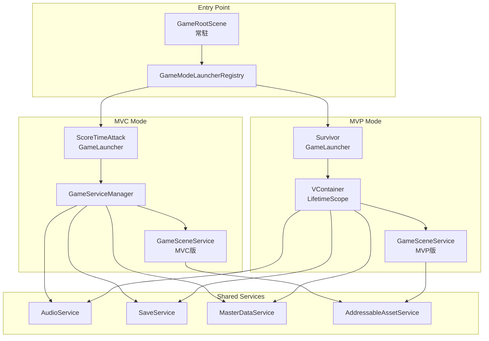
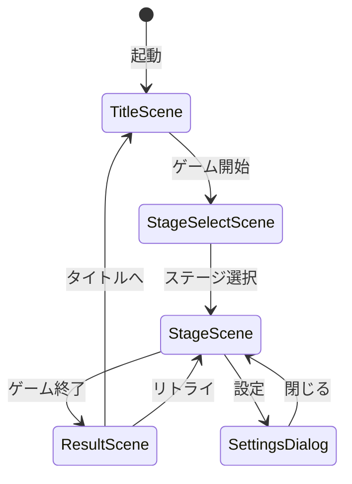
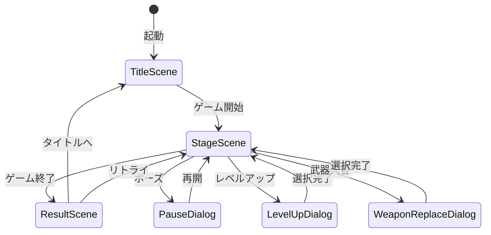

# Unity6Portfolio アーキテクチャ設計書

**バージョン**: 1.5
**最終更新**: 2026年2月13日

---

## 目次

1. [設計思想](#1-設計思想)
2. [システム全体図](#2-システム全体図)
3. [モノレポ構成](#3-モノレポ構成)
4. [アセンブリ構成](#4-アセンブリ構成)
5. [MVC vs MVP 比較](#5-mvc-vs-mvp-比較)
6. [シーン遷移設計](#6-シーン遷移設計)
7. [データフロー](#7-データフロー)
8. [クラス設計（UML）](#8-クラス設計uml)
9. [シーケンス図](#9-シーケンス図)
10. [CI/CD・品質管理](#10-cicd品質管理)
11. [設計判断の記録](#11-設計判断の記録)

---

## 1. 設計思想

### 1.1 アーキテクチャ選定の背景

本プロジェクトは**2つの異なるアーキテクチャパターン**（MVC/MVP）を意図的に採用しています。

| パターン | ゲームモード | 目的 |
|---------|-------------|------|
| **MVC** | ScoreTimeAttack | レガシー環境（uGUI中心）への適応スキル提示 |
| **MVP** | Survivor | モダン環境（VContainer + UIToolkit）への適応スキル提示 |

### 1.2 設計原則

```
┌─────────────────────────────────────────────────────────────┐
│  SOLID原則の適用                                            │
├─────────────────────────────────────────────────────────────┤
│  S: 単一責任 - Service/Scene/Componentの明確な役割分離      │
│  O: 開放閉鎖 - インターフェースによる拡張性確保             │
│  L: リスコフ - GameScene継承階層の置換可能性                │
│  I: インターフェース分離 - 細粒度のサービスインターフェース  │
│  D: 依存性逆転 - DIコンテナによる依存関係の制御             │
└─────────────────────────────────────────────────────────────┘
```

---

## 2. システム全体図

### 2.1 レイヤードアーキテクチャ

```
┌─────────────────────────────────────────────────────────────────────┐
│                        Application Layer                            │
│  ┌──────────────────────┐    ┌──────────────────────┐              │
│  │   GameRootScene      │    │  GameModeLauncher    │              │
│  │   (常駐シーン)        │───▶│  Registry            │              │
│  └──────────────────────┘    └──────────────────────┘              │
│              │                         │                            │
│              ▼                         ▼                            │
│  ┌──────────────────────┐    ┌──────────────────────┐              │
│  │  MVC GameLauncher    │    │  MVP GameLauncher    │              │
│  │  (ScoreTimeAttack)   │    │  (Survivor)          │              │
│  └──────────────────────┘    └──────────────────────┘              │
├─────────────────────────────────────────────────────────────────────┤
│                         Scene Layer                                 │
│  ┌──────────────────────┐    ┌──────────────────────┐              │
│  │  GameSceneService    │    │  GameSceneService    │              │
│  │  (MVC版)             │    │  (MVP版/VContainer)  │              │
│  └──────────────────────┘    └──────────────────────┘              │
│              │                         │                            │
│              ▼                         ▼                            │
│  ┌──────────────────────┐    ┌──────────────────────┐              │
│  │  GameScene           │    │  GameScene           │              │
│  │  (Prefab/Unity)      │    │  (Prefab + DI)       │              │
│  └──────────────────────┘    └──────────────────────┘              │
├─────────────────────────────────────────────────────────────────────┤
│                        Service Layer                                │
│  ┌────────────┐ ┌────────────┐ ┌────────────┐ ┌────────────┐       │
│  │ AudioSvc   │ │ SaveSvc    │ │ MasterData │ │ LockOnSvc  │       │
│  └────────────┘ └────────────┘ └────────────┘ └────────────┘       │
├─────────────────────────────────────────────────────────────────────┤
│                      Infrastructure Layer                           │
│  ┌────────────┐ ┌────────────┐ ┌────────────┐ ┌────────────┐       │
│  │Addressables│ │MasterMemory│ │ MemoryPack │ │ MessagePipe│       │
│  └────────────┘ └────────────┘ └────────────┘ └────────────┘       │
└─────────────────────────────────────────────────────────────────────┘
```

### 2.2 コンポーネント関係図


```mermaid
graph TB
    subgraph "Entry Point"
        GRS[GameRootScene<br/>常駐]
        GML[GameModeLauncherRegistry]
    end

    subgraph "MVC Mode"
        MVCL[ScoreTimeAttack<br/>GameLauncher]
        GSM[GameServiceManager]
        MVCS[GameSceneService<br/>MVC版]
    end

    subgraph "MVP Mode"
        MVPL[Survivor<br/>GameLauncher]
        VC[VContainer<br/>LifetimeScope]
        MVPS[GameSceneService<br/>MVP版]
    end

    subgraph "Shared Services"
        AS[AudioService]
        SS[SaveService]
        MDS[MasterDataService]
        AAS[AddressableAssetService]
    end

    GRS --> GML
    GML --> MVCL
    GML --> MVPL

    MVCL --> GSM
    GSM --> MVCS
    GSM --> AS
    GSM --> SS
    GSM --> MDS

    MVPL --> VC
    VC --> MVPS
    VC --> AS
    VC --> SS
    VC --> MDS

    MVCS --> AAS
    MVPS --> AAS
```

---

## 3. モノレポ構成

### 3.1 プロジェクト構成

本プロジェクトはモノレポ構成を採用し、クライアント・サーバー・共有ライブラリを1つのリポジトリで管理しています。

```
Unity6Portfolio/
├── src/
│   ├── Game.Client/        # Unity クライアント (Unity 6)
│   │   ├── Assets/
│   │   │   └── Programs/   # ゲームコード
│   │   └── Packages/
│   │
│   ├── Game.Server/        # ゲームサーバー (ASP.NET Core 9)
│   │   ├── Controllers/
│   │   ├── Services/
│   │   └── Program.cs
│   │
│   └── Game.Shared/        # 共有ライブラリ (.NET + Unity Package)
│       ├── Runtime/
│       │   └── Shared/
│       │       ├── Enums/        # AudioCategory等
│       │       └── MasterData/   # マスターデータ定義
│       ├── Game.Shared.csproj    # .NET プロジェクト
│       └── package.json          # Unity パッケージ定義
│
├── test/
│   └── Game.Server.Tests/  # サーバーテスト
│
├── docs/                   # ドキュメント
├── docker/
│   ├── unity-accelerator/  # Unity Accelerator キャッシュサーバー
│   ├── unity-ci/           # Unity CI Runner (Docker + GitHub Actions)
│   └── game-server/        # Game.Server (ASP.NET Core + PostgreSQL)
├── scripts/                # ビルド・フォーマットスクリプト
└── .github/
    └── workflows/          # GitHub Actions
```

### 3.2 Game.Shared の役割

マスターデータ定義を共有ライブラリとして分離し、以下のメリットを実現:

| メリット | 説明 |
|---------|------|
| クライアント・サーバー共有 | 同じDTOをUnityとASP.NET Coreで共有可能 |
| 依存関係の明確化 | 最下層に配置することで循環参照を防止 |
| ビルド時間短縮 | 変更頻度の低いコードを分離 |
| バージョン管理 | パッケージ単位でバージョン管理が可能 |

### 3.3 プロジェクト間依存関係

```
┌─────────────────────────────────────────────────────────────┐
│                     Unity6Portfolio                          │
│                      (モノレポ)                               │
└─────────────────────────────────────────────────────────────┘
        ↓                    ↓                    ↓
┌─────────────────┐  ┌─────────────────┐  ┌─────────────────┐
│   Game.Client   │  │   Game.Server   │  │   Game.Shared   │
│  (Unity 6)      │  │ (ASP.NET Core)  │  │ (.NET + Unity)  │
└─────────────────┘  └─────────────────┘  └─────────────────┘
        ↘                    ↓                    ↙
                    ┌─────────────────┐
                    │  共有DTO/IF     │
                    │  (Game.Shared)  │
                    └─────────────────┘
```

---

## 4. アセンブリ構成

### 4.1 アセンブリ依存関係図

```
                    ┌─────────────────┐
                    │    Game.App     │
                    │   (起動制御)     │
                    └────────┬────────┘
                             │
            ┌────────────────┼────────────────┐
            │                │                │
            ▼                ▼                ▼
┌───────────────────┐ ┌───────────────┐ ┌───────────────────┐
│Game.MVC.ScoreTime │ │ Game.MVP.Core │ │ Game.MVP.Survivor │
│      Attack       │ │  (VContainer) │ │    (ゲーム実装)    │
└─────────┬─────────┘ └───────┬───────┘ └─────────┬─────────┘
          │                   │                   │
          ▼                   │                   │
┌───────────────────┐         │                   │
│  Game.MVC.Core    │         │                   │
│  (MessagePipe)    │         │                   │
└─────────┬─────────┘         │                   │
          │                   │                   │
          └─────────┬─────────┴───────────────────┘
                    │
                    ▼
          ┌─────────────────┐
          │   Game.Shared   │
          │   (共通基盤)     │
          └─────────────────┘
                    │
                    ▼
          ┌─────────────────┐
          │  Unity6Library  │
          │ (MasterMemory等)│
          └─────────────────┘
```

### 4.2 アセンブリ詳細

#### ランタイムアセンブリ

| アセンブリ | 役割 | 主要な依存 |
|-----------|------|-----------|
| **Game.Shared** | 共通基盤・インターフェース定義 | UniTask, R3, MessagePipe, Addressables |
| **Game.MVC.Core** | MVCパターン基盤 | Game.Shared, MessagePipe.Unity |
| **Game.MVC.ScoreTimeAttack** | スコアアタックゲーム実装 | Game.MVC.Core, UnityChan |
| **Game.MVP.Core** | MVPパターン基盤 | Game.Shared, VContainer, MessagePipe.VContainer |
| **Game.MVP.Survivor** | サバイバーゲーム実装 | Game.MVP.Core, AI.Navigation, Cinemachine |
| **Game.App** | アプリケーション起動制御 | 全アセンブリ参照 |

#### テストアセンブリ

| アセンブリ | 役割 | テスト数 |
|-----------|------|---------|
| **Game.Tests.Shared** | Shared層ユニットテスト | 100+ |
| **Game.Tests.MVC** | MVC層ユニットテスト | 150+ |
| **Game.Tests.MVP** | MVP層ユニットテスト | 170+ |
| **Game.Tests.PlayMode** | 統合・PlayModeテスト | 63 |

**合計テスト数**: 485テスト（EditMode 422 + PlayMode 63）

#### サーバー・ツールアセンブリ（.NET 9）

| プロジェクト | 役割 | 主要な依存 |
|-------------|------|-----------|
| **Game.Server** | REST API サーバー | ASP.NET Core 9, Dapper, Npgsql, FluentMigrator, StackExchange.Redis |
| **Game.Tools** | CLIツール（マスターデータ管理等） | ConsoleAppFramework, Google.Protobuf, MasterMemory |
| **Game.Client.Linked** | クライアントMemoryTable参照ブリッジ | MasterMemory, MessagePack |
| **Game.Shared** | 共有ライブラリ（.NET版） | MasterMemory, MessagePack |

### 4.3 循環参照防止設計

```
【設計ルール】
1. Shared → 他アセンブリへの参照禁止
2. Core → 同レベルCoreへの参照禁止（MVC.Core ⇔ MVP.Core）
3. ゲーム実装 → 他ゲーム実装への参照禁止
4. App → 全体の結合点として例外的に全参照許可
```

---

## 5. MVC vs MVP 比較

### 5.1 アーキテクチャ比較表

| 観点 | MVC (ScoreTimeAttack) | MVP (Survivor) |
|-----|----------------------|----------------|
| **DI方式** | GameServiceManager（手動） | VContainer（自動） |
| **UI技術** | uGUI + TextMeshPro | UIToolkit + TextMeshPro |
| **状態管理** | StateMachine | StateMachine + R3 Reactive |
| **メッセージング** | MessagePipe（直接参照） | MessagePipe（DI注入） |
| **シーン読み込み** | Addressables直接呼び出し | IAddressableAssetService経由 |
| **衝突イベント** | IPlayerCollisionHandler（直接呼出） | MessagePipe経由 |
| **テスト容易性** | 中（サービスロケータ依存） | 高（完全DI） |

### 5.2 DI方式の違い

#### MVC: GameServiceManager（サービスロケータパターン）

```csharp
// サービス登録
GameServiceManager.Add<AudioService>();

// サービス取得
var audioService = GameServiceManager.Get<AudioService>();
```

#### MVP: VContainer（依存性注入パターン）

```csharp
// LifetimeScopeで登録
public class SurvivorLifetimeScope : LifetimeScope
{
    protected override void Configure(IContainerBuilder builder)
    {
        builder.Register<IAudioService, AudioService>(Lifetime.Singleton);
    }
}

// コンストラクタ注入
public class SurvivorStagePresenter
{
    private readonly IAudioService _audioService;

    [Inject]
    public SurvivorStagePresenter(IAudioService audioService)
    {
        _audioService = audioService;
    }
}
```

### 5.3 シーン管理の違い

```
【MVC】GamePrefabScene
┌─────────────────────────────────────────────┐
│ 1. AssetService.LoadAssetAsync<GameObject>  │
│ 2. Object.Instantiate(_asset)               │
│ 3. GetSceneComponent() で取得               │
│ ※ DIなし、直接参照                          │
└─────────────────────────────────────────────┘

【MVP】GamePrefabScene
┌─────────────────────────────────────────────┐
│ 1. AssetService.LoadAssetAsync<GameObject>  │
│ 2. Object.Instantiate(_asset)               │
│ 3. Resolver.InjectGameObject(_instance)     │  ← DI注入
│ 4. GetSceneComponent() + Resolver.Inject()  │  ← Component注入
└─────────────────────────────────────────────┘
```

---

## 6. シーン遷移設計

### 6.1 シーンライフサイクル

```
┌─────────────────────────────────────────────────────────────┐
│                    GameScene Lifecycle                      │
├─────────────────────────────────────────────────────────────┤
│                                                             │
│   PreInitialize()  ─▶  サーバー通信、モデル初期化          │
│         │                                                   │
│         ▼                                                   │
│   LoadAsset()      ─▶  Prefab/UnityScene読み込み           │
│         │                                                   │
│         ▼                                                   │
│   Startup()        ─▶  View初期化、イベント登録            │
│         │                                                   │
│         ▼                                                   │
│   Ready()          ─▶  開始演出、ゲーム開始                │
│         │                                                   │
│    ┌────┴────┐                                              │
│    ▼         ▼                                              │
│  Sleep()   Restart()  ─▶  ダイアログ表示時など             │
│    │         │                                              │
│    └────┬────┘                                              │
│         ▼                                                   │
│   Terminate()      ─▶  リソース解放、シーン破棄            │
│                                                             │
└─────────────────────────────────────────────────────────────┘
```

### 6.2 シーン遷移フロー図

#### MVC: ScoreTimeAttack


```mermaid
stateDiagram-v2
    [*] --> TitleScene: 起動
    TitleScene --> StageSelectScene: ゲーム開始
    StageSelectScene --> StageScene: ステージ選択
    StageScene --> ResultScene: ゲーム終了
    ResultScene --> TitleScene: タイトルへ
    ResultScene --> StageScene: リトライ

    StageScene --> SettingsDialog: 設定
    SettingsDialog --> StageScene: 閉じる
```

#### MVP: Survivor


```mermaid
stateDiagram-v2
    [*] --> TitleScene: 起動
    TitleScene --> StageScene: ゲーム開始
    StageScene --> ResultScene: ゲーム終了
    StageScene --> PauseDialog: ポーズ
    PauseDialog --> StageScene: 再開

    StageScene --> LevelUpDialog: レベルアップ
    LevelUpDialog --> StageScene: 選択完了

    StageScene --> WeaponReplaceDialog: 武器入替
    WeaponReplaceDialog --> StageScene: 選択完了

    ResultScene --> TitleScene: タイトルへ
    ResultScene --> StageScene: リトライ
```

### 6.3 シーン継承階層

```
IGameScene (interface)
    │
    ├── GameScene (abstract)
    │       │
    │       ├── GameScene<TScene, TComponent>
    │       │       │
    │       │       ├── GamePrefabScene<TScene, TComponent>
    │       │       │       └── ScoreTimeAttackTitleScene
    │       │       │       └── ScoreTimeAttackStageScene
    │       │       │       └── SurvivorTitleScene
    │       │       │       └── SurvivorStageScene
    │       │       │
    │       │       ├── GameUnityScene<TScene, TComponent>
    │       │       │       └── (ステージ背景用)
    │       │       │
    │       │       └── GameDialogScene<TScene, TComponent, TResult>
    │       │               └── SettingsDialog
    │       │               └── PauseDialog
    │       │               └── LevelUpDialog
    │       │
    │       └── GameUnityScene (コンポーネントなし)
    │               └── (環境シーン用)
```

---

## 7. データフロー

### 7.1 マスターデータフロー

本プロジェクトはProtobufスキーマ駆動のマスターデータ管理システムを採用し、クライアント・サーバー間でデータ定義を共有しながら、デプロイターゲットに応じたフィールドフィルタリングを実現しています。

#### 7.1.1 全体アーキテクチャ

```
┌─────────────────────────────────────────────────────────────────────────┐
│                    Master Data Update Flow                               │
├─────────────────────────────────────────────────────────────────────────┤
│                                                                         │
│  ① Schema定義                                                           │
│  ┌──────────────────────┐                                               │
│  │ masterdata/proto/    │  ← .proto ファイル（スキーマ定義）             │
│  │  ├── options/        │     デプロイターゲット指定                     │
│  │  ├── audio/          │     PRIMARY/SECONDARY キー指定                │
│  │  ├── score_time_attack/                                              │
│  │  └── survivor/       │                                               │
│  └──────────┬───────────┘                                               │
│             │                                                           │
│             ▼                                                           │
│  ② コード生成 (Game.Tools CLI)                                          │
│  ┌──────────────────────┐                                               │
│  │ masterdata codegen   │  protoc → FileDescriptorSet → C#生成          │
│  └──────────┬───────────┘                                               │
│             │                                                           │
│     ┌───────┴───────┐                                                   │
│     ▼               ▼                                                   │
│  ┌────────────┐  ┌────────────┐                                         │
│  │ Client     │  │ Server     │  ← MemoryTable C#クラス                 │
│  │*.Generated │  │*.Generated │    (フィールドフィルタリング適用)        │
│  └────────────┘  └────────────┘                                         │
│                                                                         │
│  ③ TSVデータ編集                                                        │
│  ┌──────────────────────┐                                               │
│  │ masterdata/raw/*.tsv │  ← スプレッドシート互換フォーマット            │
│  └──────────┬───────────┘                                               │
│             │                                                           │
│             ▼                                                           │
│  ④ バイナリビルド                                                       │
│  ┌─────────────────────────────────────────────────────────────┐       │
│  │   ┌─────────────────┐        ┌─────────────────────┐        │       │
│  │   │ Unity Editor   │        │ Game.Tools CLI      │        │       │
│  │   │ MasterDataWindow│        │ masterdata build    │        │       │
│  │   └────────┬────────┘        └──────────┬──────────┘        │       │
│  │            ▼                            ▼                   │       │
│  │   ┌─────────────────┐        ┌─────────────────────┐        │       │
│  │   │MasterDataBinary │        │ masterdata.bytes    │        │       │
│  │   │.bytes (Client)  │        │ (Server)            │        │       │
│  │   └─────────────────┘        └─────────────────────┘        │       │
│  └─────────────────────────────────────────────────────────────┘       │
│                                                                         │
│  ⑤ ランタイムロード                                                     │
│  ┌─────────────────────┐        ┌─────────────────────┐                │
│  │ Client (Unity)      │        │ Server (ASP.NET)    │                │
│  │ Addressables経由    │        │ FileSystem経由      │                │
│  │ → MemoryDatabase    │        │ → MemoryDatabase    │                │
│  └─────────────────────┘        └─────────────────────┘                │
│                                                                         │
└─────────────────────────────────────────────────────────────────────────┘
```

#### 7.1.2 デプロイターゲットシステム

ビットマスクによるフィールドフィルタリングで、同一スキーマから異なるバイナリを生成:

| ターゲット | ビット | 値 | 用途 |
|-----------|-------|---:|------|
| ALL | - | 0 | 全ターゲット共通（Id, Name等の基本フィールド） |
| CLIENT | 0 | 1 | Unityクライアントのみ（アセット名、UI用データ） |
| SERVER | 1 | 2 | REST APIサーバーのみ（報酬倍率、内部バランス値） |
| REALTIME | 2 | 4 | MagicOnionリアルタイムサーバーのみ |

**Protoファイルでの指定例:**
```protobuf
message SurvivorEnemyMaster {
  option (masterdata.options.table_target) = DEPLOY_TARGET_ALL;

  int32 id = 1 [(masterdata.options.index_type) = INDEX_PRIMARY];
  string name = 2;

  // クライアントのみ（UIアイコン）
  string icon_asset_name = 3
    [(masterdata.options.field_target) = DEPLOY_TARGET_CLIENT];

  // サーバーのみ（内部バランス係数）
  int32 difficulty_multiplier = 4
    [(masterdata.options.field_target) = DEPLOY_TARGET_SERVER];
}
```

#### 7.1.3 CLIツール（Game.Tools）

| コマンド | 用途 |
|---------|------|
| `masterdata codegen` | Proto → C# MemoryTableクラス生成 |
| `masterdata build` | TSV → MessagePackバイナリ変換 |
| `masterdata validate` | TSVスキーマ検証 |
| `masterdata scaffold` | C#クラス → Proto逆生成 |
| `masterdata export` | バイナリ → JSON/TSV出力 |
| `masterdata diff` | 2つのバイナリ比較 |

**ビルドコマンド例:**
```bash
# C#クラス生成
dotnet run --project src/Game.Tools -- masterdata codegen \
  --proto-dir masterdata/proto/ \
  --out-client src/Game.Client/Assets/Programs/Runtime/Shared/MasterData/ \
  --out-server src/Game.Server/MasterData/

# サーバー用バイナリビルド
dotnet run --project src/Game.Tools -- masterdata build \
  --tsv-dir masterdata/raw/ \
  --proto-dir masterdata/proto/ \
  --out-server src/Game.Server/MasterData/masterdata.bytes
```

#### 7.1.4 クライアント側ロードフロー

```csharp
// MasterDataServiceBase.cs
public async UniTask LoadMasterDataAsync()
{
    // Addressables経由でバイナリ読み込み
    var asset = await _assetService.LoadAssetAsync<TextAsset>("MasterDataBinary");

    // MessagePackリゾルバ設定
    var resolver = CompositeResolver.Create(
        MasterMemoryResolver.Instance,
        StandardResolver.Instance
    );

    // MemoryDatabase構築
    MemoryDatabase = new MemoryDatabase(asset.bytes, maxDegreeOfParallelism: Environment.ProcessorCount);
}

// 使用例
var enemy = _masterDataService.MemoryDatabase.SurvivorEnemyMasterTable.FindById(enemyId);
```

#### 7.1.5 サーバー側ロードフロー

```csharp
// MasterDataService.cs (Game.Server)
public class MasterDataService : IMasterDataService
{
    public MemoryDatabase MemoryDatabase { get; }

    public MasterDataService(IOptions<MasterDataSettings> settings)
    {
        var binaryPath = settings.Value.BinaryPath; // "MasterData/masterdata.bytes"
        var bytes = File.ReadAllBytes(binaryPath);

        MemoryDatabase = new MemoryDatabase(bytes, maxDegreeOfParallelism: Environment.ProcessorCount);
        _logger.LogInformation("MasterData loaded: {Path}", binaryPath);
    }
}

// Program.cs での登録
builder.Services.Configure<MasterDataSettings>(builder.Configuration.GetSection("MasterData"));
builder.Services.AddSingleton<IMasterDataService, MasterDataService>();
```

#### 7.1.6 Game.Client.Linked の役割

CLIツールがクライアント用MemoryTableの型情報にアクセスするためのブリッジプロジェクト:

```xml
<!-- Game.Client.Linked.csproj -->
<ItemGroup>
  <!-- クライアント生成ファイルをリンク参照 -->
  <Compile Include="..\Game.Client\Assets\...\MasterData\*.Generated.cs" LinkBase="Generated" />
</ItemGroup>
```

**依存関係:**
```
Game.Tools
    ├── Game.Server (サーバー用MemoryTable)
    └── Game.Client.Linked (クライアント用MemoryTable参照)
            └── Game.Client/*.Generated.cs をリンク
```

#### 7.1.7 ファイル配置

| 種類 | パス |
|-----|------|
| Protoスキーマ | `masterdata/proto/**/*.proto` |
| TSVデータ | `masterdata/raw/*.tsv` |
| Client生成コード | `src/Game.Client/.../Shared/MasterData/*.Generated.cs` |
| Clientバイナリ | `src/Game.Client/Assets/MasterData/MasterDataBinary.bytes` |
| Server生成コード | `src/Game.Server/MasterData/*.Generated.cs` |
| Serverバイナリ | `src/Game.Server/MasterData/masterdata.bytes` |

### 7.2 アセット配信フロー

GameEnvironment設定に応じてAddressablesのアセット配信元を切り替え:

```
┌─────────────────────────────────────────────────────────────────┐
│                    Asset Delivery Flow                           │
├─────────────────────────────────────────────────────────────────┤
│                                                                 │
│  GameEnvironment                                                │
│  ┌──────────────────┐                                           │
│  │ Local            │──▶ Local Assets (StreamingAssets)         │
│  │ Develop/Staging  │──▶ Remote Assets (Dev/Staging Server)     │
│  │ Release          │──▶ Remote Assets (CDN)                    │
│  └──────────────────┘                                           │
│                                                                 │
│  ┌──────────────────┐    ┌──────────────────┐                   │
│  │  Addressables    │    │  Environment     │                   │
│  │  Settings        │◀───│  Switcher        │                   │
│  └────────┬─────────┘    └──────────────────┘                   │
│           │                      ▲                              │
│           │              ┌───────┴────────┐                     │
│           │              │ GAME_ENVIRONMENT│                    │
│           │              │ 環境変数 or     │                    │
│           │              │ Editor メニュー │                    │
│           │              └────────────────┘                     │
│           ▼                                                     │
│  ┌──────────────────┐                                           │
│  │ Profile Variable │                                           │
│  │ - Local.BuildPath│                                           │
│  │ - Remote.LoadPath│                                           │
│  └────────┬─────────┘                                           │
│           │                                                     │
│           ▼                                                     │
│  ┌──────────────────┐    ┌──────────────────┐                   │
│  │ Local            │ or │ Remote           │                   │
│  │ StreamingAssets  │    │ CDN/Cloud Storage│                   │
│  └──────────────────┘    └──────────────────┘                   │
│                                                                 │
└─────────────────────────────────────────────────────────────────┘
```

**対応環境:**
| GameEnvironment | アセット配信元 | 用途 |
|-----------------|--------------|------|
| Local | Local (StreamingAssets) | 開発・デバッグ |
| Develop | Remote (開発サーバー) | 開発環境テスト |
| Staging | Remote (ステージング) | リリース前検証 |
| Release | Remote (CDN) | 本番配信 |

**切り替え方法:**
- **CI/CD**: 環境変数 `GAME_ENVIRONMENT` から自動設定
- **エディター**: メニュー `Build > Addressables > Switch Profile`

**CI/CD対応:**
- Unity Accelerator によるライブラリキャッシュ共有
- GitHub Actions でのアセットキャッシュ最適化
- 環境変数による自動プロファイル切り替え

### 7.2.1 Addressables エディタ同期システム

チーム開発において、CIでビルドされたAddressablesアセットをUnityエディタの`UseExistingBuild`モードで利用可能にするシステム:

```
┌─────────────────────────────────────────────────────────────────┐
│                  Addressables Sync Flow                           │
├─────────────────────────────────────────────────────────────────┤
│                                                                 │
│  CI Build (GitHub Actions)                                      │
│  ┌──────────────────────┐                                       │
│  │AddressablesR2Uploader│                                       │
│  │  BuildAddressablesCI │─────▶ ServerData/{Platform}/          │
│  └──────────────────────┘       ├── catalog_*.bin               │
│         │                       ├── catalog_*.hash              │
│         │                       └── *.bundle (リモートのみ)     │
│         │                                                       │
│         └─────▶ Library/com.unity.addressables/ (CIで収集)      │
│                 ├── index.json (ファイル一覧)                   │
│                 └── aa/{Platform}/ (ローカルバンドル)           │
│                                         │                       │
│                                         │ rclone sync           │
│                                         ▼                       │
│  Cloudflare R2                                                  │
│  ┌──────────────────────────────────────────────────────────┐  │
│  │ https://{env}.assets.rei-unity6-portfolio.com/{Platform}/ │  │
│  │   ├── catalog_*.bin, *.bundle (リモート)                  │  │
│  │   └── LocalBundles/index.json, aa/... (ローカル)          │  │
│  └──────────────────────────────────────────────────────────┘  │
│                                         │                       │
│                                         │ EditorAddressablesSync│
│                                         ▼                       │
│  Unity Editor (他の開発者)                                       │
│  ┌──────────────────────┐                                       │
│  │ ShouldAutoSync()     │  GameEnvironment != Local             │
│  │ + UseExistingBuild   │  の場合に自動同期                      │
│  └──────────┬───────────┘                                       │
│             │ index.json取得 → catalogHash比較 → ファイルDL     │
│             ▼                                                   │
│  Library/com.unity.addressables/                                │
│  ├── aa/{Platform}/catalog.bin, catalog.hash, settings.json    │
│  └── aa/{Platform}/{BuildTarget}/*.bundle                      │
│                                                                 │
└─────────────────────────────────────────────────────────────────┘
```

**関連クラス:**

| クラス | 役割 |
|-------|------|
| `AddressablesR2Uploader` | CIビルド、R2アップロード |
| `EditorAddressablesSync` | エディタ同期（index.json方式、Play開始前自動チェック） |
| `AddressablesBundleUtils` | ローカルバンドル判定の共通ユーティリティ（ランタイム用） |

**ローカルバンドル判定パターン:**
- `defaultlocalgroup` - Default Local Groupのバンドル
- `local_` / `_local_` - ローカル専用プレフィックス/インフィックス
- `monoscripts` - MonoScriptバンドル
- `unitybuiltinassets` - Unity Built-in Assetsバンドル

### 7.3 セーブデータフロー

```
┌─────────────────────────────────────────────────────────────────┐
│                    Save Data Flow                               │
├─────────────────────────────────────────────────────────────────┤
│                                                                 │
│  ┌──────────────┐                                               │
│  │  Game State  │  ←─ Score, Settings, Progress                │
│  └──────┬───────┘                                               │
│         │                                                       │
│         ▼                                                       │
│  ┌──────────────┐                                               │
│  │ SaveService  │                                               │
│  │   Base       │                                               │
│  └──────┬───────┘                                               │
│         │                                                       │
│         ▼                                                       │
│  ┌──────────────┐    ┌──────────────┐                          │
│  │  MemoryPack  │───▶│  Binary Data │                          │
│  │ Serializer   │    │  (高速)      │                          │
│  └──────────────┘    └──────┬───────┘                          │
│                             │                                   │
│                             ▼                                   │
│                    ┌──────────────┐                             │
│                    │PlayerPrefs/  │                             │
│                    │ File System  │                             │
│                    └──────────────┘                             │
│                                                                 │
└─────────────────────────────────────────────────────────────────┘
```

### 7.4 認証・セッション管理フロー

サーバー連携によるユーザー認証とセッション管理:

```
┌─────────────────────────────────────────────────────────────────┐
│                 Authentication Flow                              │
├─────────────────────────────────────────────────────────────────┤
│                                                                 │
│  ① アプリ起動時                                                  │
│  ┌──────────────┐    ┌──────────────┐    ┌──────────────┐      │
│  │SessionService│───▶│ローカル保存  │───▶│トークン復元  │      │
│  │RestoreSession│    │データ読み込み│    │認証状態復帰  │      │
│  └──────────────┘    └──────────────┘    └──────────────┘      │
│                                                                 │
│  ② 新規ユーザー（ゲストログイン）                                 │
│  ┌──────────────┐    ┌──────────────┐    ┌──────────────┐      │
│  │デバイス      │───▶│AuthApiService│───▶│ユーザーID    │      │
│  │フィンガー    │    │GuestLogin    │    │トークン発行  │      │
│  │プリント生成  │    └──────────────┘    └──────────────┘      │
│  └──────────────┘                                               │
│                                                                 │
│  ③ アカウント連携                                                │
│  ┌──────────────┐    ┌──────────────┐    ┌──────────────┐      │
│  │メール/PW入力 │───▶│AuthApiService│───▶│連携完了      │      │
│  │Account Link  │    │LinkEmail     │    │authType更新  │      │
│  │Dialog        │    └──────────────┘    └──────────────┘      │
│  └──────────────┘                                               │
│                                                                 │
│  ④ 引き継ぎパスワード                                            │
│  ┌──────────────┐    ┌──────────────┐    ┌──────────────┐      │
│  │パスワード発行│───▶│12桁パスワード│───▶│ローカル保存  │      │
│  │IssueTransfer │    │サーバー生成  │    │表示・コピー  │      │
│  │Password      │    └──────────────┘    └──────────────┘      │
│  └──────────────┘                                               │
│                                                                 │
│  ⑤ データ移行（別端末）                                          │
│  ┌──────────────┐    ┌──────────────┐    ┌──────────────┐      │
│  │ユーザーID    │───▶│AuthApiService│───▶│セッション    │      │
│  │引き継ぎPW    │    │UserIdLogin   │    │復元・継続    │      │
│  │入力          │    └──────────────┘    └──────────────┘      │
│  └──────────────┘                                               │
│                                                                 │
└─────────────────────────────────────────────────────────────────┘
```

#### 認証タイプ

| タイプ | 説明 | 連携方法 |
|-------|------|---------|
| guest | ゲストユーザー（初期状態） | デバイスフィンガープリント自動生成 |
| email | メール連携済み | メール/パスワードでログイン可能 |
| transfer | 引き継ぎ対応 | ユーザーID + 引き継ぎパスワード |

#### 関連クラス

| クラス | 役割 |
|-------|------|
| `IAuthApiService` | 認証APIエンドポイント通信 |
| `AuthApiService` | 認証API実装（REST通信） |
| `ISessionService` | セッション状態管理インターフェース |
| `SessionService` | トークン保存/復元/クリア実装 |
| `SessionSaveData` | セッション永続化データ |
| `AuthDto` | 認証リクエスト/レスポンスDTO |

### 7.5 ランキングシステムフロー

サーバー側Valkeyキャッシュを活用したランキングシステム:

```
┌─────────────────────────────────────────────────────────────────┐
│                    Ranking System Architecture                    │
├─────────────────────────────────────────────────────────────────┤
│                                                                 │
│  ┌─────────────────────────────────────────────────────────┐   │
│  │                     Unity Client                         │   │
│  │  ┌──────────────────┐  ┌──────────────────────────────┐ │   │
│  │  │ SurvivorResult   │  │ ISurvivorScoreApiService     │ │   │
│  │  │ Scene            │──│ - SubmitScoreAsync()         │ │   │
│  │  │ (スコア送信)      │  │ - GetRankingAsync()          │ │   │
│  │  └──────────────────┘  │ - GetMyRankAsync()           │ │   │
│  │                        └─────────────┬────────────────┘ │   │
│  └──────────────────────────────────────│──────────────────┘   │
│                                         │ HTTPS                 │
│                                         ▼                       │
│  ┌─────────────────────────────────────────────────────────┐   │
│  │                   Game.Server (Cloud Run)                │   │
│  │                                                         │   │
│  │  ┌──────────────────────┐  ┌──────────────────────┐    │   │
│  │  │ SurvivorScores       │  │ Rankings             │    │   │
│  │  │ Controller           │  │ Controller           │    │   │
│  │  │ POST /api/survivor/  │  │ GET /api/survivor/   │    │   │
│  │  │      scores          │  │     rankings/{id}    │    │   │
│  │  └──────────┬───────────┘  └──────────┬───────────┘    │   │
│  │             │                         │                 │   │
│  │             ▼                         ▼                 │   │
│  │  ┌─────────────────────────────────────────────────┐   │   │
│  │  │              RankingService                      │   │   │
│  │  │  - SaveScoreAsync()                              │   │   │
│  │  │  - GetRankingAsync()                             │   │   │
│  │  │  - GetPlayerRankAsync()                          │   │   │
│  │  └──────────────────────┬──────────────────────────┘   │   │
│  │                         │                               │   │
│  │         ┌───────────────┼───────────────┐               │   │
│  │         ▼               ▼               ▼               │   │
│  │  ┌────────────┐  ┌────────────┐  ┌────────────┐        │   │
│  │  │ Valkey     │  │ PostgreSQL │  │ キャッシュ  │        │   │
│  │  │ Cache      │  │ (永続化)   │  │ 戦略       │        │   │
│  │  │ (5分TTL)   │  │            │  │            │        │   │
│  │  └────────────┘  └────────────┘  └────────────┘        │   │
│  │                                                         │   │
│  └─────────────────────────────────────────────────────────┘   │
│                                                                 │
│  ┌─────────────────────────────────────────────────────────┐   │
│  │                Memorystore for Valkey                    │   │
│  │  ┌──────────────────────────────────────────────────┐   │   │
│  │  │              Sorted Set Structure                 │   │   │
│  │  │  Key: ranking:survivor:{stageId}                  │   │   │
│  │  │  Score: ゲームスコア（降順ソート）                  │   │   │
│  │  │  Member: userId                                   │   │   │
│  │  │  TTL: 5分                                         │   │   │
│  │  └──────────────────────────────────────────────────┘   │   │
│  └─────────────────────────────────────────────────────────┘   │
│                                                                 │
└─────────────────────────────────────────────────────────────────┘
```

#### キャッシュ戦略

| 操作 | キャッシュ動作 |
|-----|--------------|
| ランキング取得 | キャッシュ優先 → ミス時DB取得 → キャッシュ保存 |
| スコア送信 | DB保存 → キャッシュ無効化（次回取得時に再構築） |
| 自分の順位 | Sorted SetのZRANK操作でO(log N)取得 |

#### サーバー側クラス

| クラス | 役割 |
|-------|------|
| `SurvivorScoresController` | スコア送信エンドポイント |
| `RankingsController` | ランキング取得エンドポイント |
| `IRankingService` | ランキングサービスインターフェース |
| `RankingService` | ランキングビジネスロジック |
| `ISurvivorRankingCacheService` | キャッシュサービスインターフェース |
| `ValkeySurvivorRankingCacheService` | Valkey Sorted Set キャッシュ実装 |

#### 本番インフラ構成

```
Google Cloud Platform
├── Cloud Run (game-server)
│   └── ASP.NET Core 9 コンテナ
├── Cloud SQL (PostgreSQL)
│   └── ユーザーデータ・スコア永続化
├── Memorystore for Valkey
│   └── ランキングキャッシュ
└── VPC Connector
    └── Cloud Run → Memorystore 接続
```

### 7.6 イベントフロー（MessagePipe）

```
┌─────────────────────────────────────────────────────────────────┐
│                 Event Flow (MessagePipe)                        │
├─────────────────────────────────────────────────────────────────┤
│                                                                 │
│  Publisher                    Broker                Subscriber  │
│  ─────────                    ──────                ──────────  │
│                                                                 │
│  ┌─────────┐                ┌──────────┐         ┌───────────┐ │
│  │ Player  │──OnDamage────▶│MessagePipe│────────▶│ HUD       │ │
│  │Controller│               │ Service  │         │ (HP表示)   │ │
│  └─────────┘                └──────────┘         └───────────┘ │
│                                  │                              │
│  ┌─────────┐                     │               ┌───────────┐ │
│  │ Enemy   │──OnDeath─────▶     │    ────────▶│ Score     │ │
│  │ Manager │                     │               │ Manager   │ │
│  └─────────┘                     │               └───────────┘ │
│                                  │                              │
│  ┌─────────┐                     │               ┌───────────┐ │
│  │ Item    │──OnPickup────▶     │    ────────▶│ Inventory │ │
│  │ System  │                     │               │ System    │ │
│  └─────────┘                     ▼               └───────────┘ │
│                                                                 │
│  【MVC側の改善】OnTriggerEnter/OnCollisionEnterでの高頻度       │
│  イベントはIPlayerCollisionHandlerによる直接呼び出しに変更済み  │
│                                                                 │
└─────────────────────────────────────────────────────────────────┘
```

---

## 8. クラス設計（UML）

### 8.1 サービス層クラス図

```
┌─────────────────────────────────────────────────────────────────┐
│                     Service Layer UML                           │
├─────────────────────────────────────────────────────────────────┤
│                                                                 │
│  <<interface>>              <<interface>>                       │
│  ┌───────────────┐          ┌───────────────────┐              │
│  │IGameService   │          │IGameSceneService   │              │
│  ├───────────────┤          ├───────────────────┤              │
│  │+Startup()     │          │+TransitionAsync() │              │
│  │+Shutdown()    │          │+TransitionPrevAsync()│           │
│  └───────┬───────┘          │+TerminateAsync()  │              │
│          │                  └─────────┬─────────┘              │
│          │                            │                         │
│          ▼                            ▼                         │
│  ┌───────────────┐          ┌───────────────────┐              │
│  │AudioService   │          │GameSceneService   │              │
│  ├───────────────┤          ├───────────────────┤              │
│  │-_bgmSource    │          │-_currentScenes    │              │
│  │-_sfxSources[] │          │-_history          │              │
│  ├───────────────┤          ├───────────────────┤              │
│  │+PlayBgmAsync()│          │+TransitionAsync() │              │
│  │+PlaySfxAsync()│          │+IsProcessing()    │              │
│  │+SetVolume()   │          │+TerminateAsync()  │              │
│  └───────────────┘          └───────────────────┘              │
│                                                                 │
│  <<interface>>              <<abstract>>                        │
│  ┌───────────────────┐      ┌───────────────────┐              │
│  │IMasterDataService │      │SaveServiceBase    │              │
│  ├───────────────────┤      ├───────────────────┤              │
│  │+MemoryDatabase    │      │#_storage          │              │
│  │+LoadMasterData()  │      │#_autoSaveInterval │              │
│  └───────────────────┘      ├───────────────────┤              │
│                             │+LoadAsync()       │              │
│                             │+SaveAsync()       │              │
│                             │#Serialize()       │              │
│                             │#Deserialize()     │              │
│                             └───────────────────┘              │
│                                                                 │
└─────────────────────────────────────────────────────────────────┘
```

### 8.2 武器システムクラス図（MVP Survivor）

```
┌─────────────────────────────────────────────────────────────────┐
│                    Weapon System UML                            │
├─────────────────────────────────────────────────────────────────┤
│                                                                 │
│  ┌─────────────────────┐                                        │
│  │ SurvivorWeaponManager│ ◆────────────────┐                   │
│  ├─────────────────────┤                   │                    │
│  │-_weapons: List      │                   │ 1..*               │
│  │-_factory            │                   ▼                    │
│  ├─────────────────────┤       ┌─────────────────────┐         │
│  │+AddWeapon()         │       │<<abstract>>         │         │
│  │+RemoveWeapon()      │       │SurvivorWeaponBase   │         │
│  │+UpdateWeapons()     │       ├─────────────────────┤         │
│  └─────────────────────┘       │#_weaponMaster       │         │
│           │                    │#_levelMasters       │         │
│           │                    │#_damage, _cooldown  │         │
│           ▼                    ├─────────────────────┤         │
│  ┌─────────────────────┐       │+InitializeAsync()   │         │
│  │SurvivorWeaponFactory│       │+UpdateWeapon()      │         │
│  ├─────────────────────┤       │+LevelUp()           │         │
│  │-_resolver           │       │#TryAttack()*       │         │
│  ├─────────────────────┤       └──────────┬──────────┘         │
│  │+Create(masterId)    │                  │                    │
│  └─────────────────────┘                  │                    │
│                               ┌───────────┴───────────┐        │
│                               ▼                       ▼        │
│                   ┌─────────────────┐     ┌─────────────────┐  │
│                   │SurvivorAutoFire │     │SurvivorGround   │  │
│                   │    Weapon       │     │    Weapon       │  │
│                   ├─────────────────┤     ├─────────────────┤  │
│                   │-_pool           │     │-_pool           │  │
│                   │-_projectilePrefab│    │-_effectPrefab   │  │
│                   ├─────────────────┤     ├─────────────────┤  │
│                   │#TryAttack()     │     │#TryAttack()     │  │
│                   │-SpawnProjectile()│    │-SpawnEffect()   │  │
│                   └─────────────────┘     └─────────────────┘  │
│                           │                       │            │
│                           ▼                       ▼            │
│                   ┌─────────────────────────────────┐          │
│                   │     WeaponObjectPool<T>         │          │
│                   ├─────────────────────────────────┤          │
│                   │-_pool: Stack<T>                 │          │
│                   │-_activeCount                    │          │
│                   ├─────────────────────────────────┤          │
│                   │+Get(): T                        │          │
│                   │+Return(item: T)                 │          │
│                   └─────────────────────────────────┘          │
│                                                                 │
└─────────────────────────────────────────────────────────────────┘
```

### 8.3 ステートマシンクラス図

```
┌─────────────────────────────────────────────────────────────────┐
│                   StateMachine UML                              │
├─────────────────────────────────────────────────────────────────┤
│                                                                 │
│  <<interface>>                                                  │
│  ┌─────────────────────┐                                        │
│  │IStateMachineContext │                                        │
│  │    <TContext>       │                                        │
│  ├─────────────────────┤                                        │
│  │+Context: TContext   │                                        │
│  └─────────────────────┘                                        │
│            △                                                    │
│            │                                                    │
│  ┌─────────┴───────────────────────────────────────────┐       │
│  │                                                     │       │
│  │  ┌───────────────────────────────┐                  │       │
│  │  │StateMachine<TContext, TEvent> │                  │       │
│  │  ├───────────────────────────────┤                  │       │
│  │  │-_states: Dictionary           │                  │       │
│  │  │-_transitionTable: Dictionary  │  O(1)遷移       │       │
│  │  │-_currentState: IState         │                  │       │
│  │  │-_nextState: IState            │                  │       │
│  │  ├───────────────────────────────┤                  │       │
│  │  │+AddTransition<TFrom,TTo>()    │                  │       │
│  │  │+SetInitState<T>()             │                  │       │
│  │  │+Transition(event): Result     │                  │       │
│  │  │+Update()                      │                  │       │
│  │  │+IsCurrentState<T>(): bool     │                  │       │
│  │  └───────────────────────────────┘                  │       │
│  │                 ◆                                   │       │
│  │                 │ 1..*                              │       │
│  │                 ▼                                   │       │
│  │  ┌───────────────────────────────┐                  │       │
│  │  │<<abstract>>                   │                  │       │
│  │  │State<TContext, TEvent>        │                  │       │
│  │  ├───────────────────────────────┤                  │       │
│  │  │#StateMachine                  │                  │       │
│  │  │+Context: TContext             │                  │       │
│  │  ├───────────────────────────────┤                  │       │
│  │  │+Enter()                       │                  │       │
│  │  │+Update()                      │                  │       │
│  │  │+FixedUpdate()                 │                  │       │
│  │  │+LateUpdate()                  │                  │       │
│  │  │+Exit()                        │                  │       │
│  │  └───────────────────────────────┘                  │       │
│  │                                                     │       │
│  └─────────────────────────────────────────────────────┘       │
│                                                                 │
│  【特徴】                                                        │
│  • 遷移テーブルによるO(1)状態遷移                                │
│  • ジェネリックによる型安全なコンテキスト共有                      │
│  • Enter/Exit/Update分離による明確なライフサイクル                 │
│                                                                 │
└─────────────────────────────────────────────────────────────────┘
```

### 8.4 コンバットシステムインターフェース

```
┌─────────────────────────────────────────────────────────────────┐
│                Combat System Interfaces                         │
├─────────────────────────────────────────────────────────────────┤
│                                                                 │
│  <<interface>>           <<interface>>                          │
│  ┌───────────────┐       ┌─────────────────┐                   │
│  │ ITargetable   │       │ ICombatTarget   │                   │
│  ├───────────────┤       ├─────────────────┤                   │
│  │+TargetPoint   │       │+IsAlive         │                   │
│  │+IsTargetable  │       │+CurrentHealth   │                   │
│  │+TargetPriority│       │+MaxHealth       │                   │
│  └───────┬───────┘       │+Team            │                   │
│          │               └────────┬────────┘                   │
│          │                        │                             │
│          └────────┬───────────────┘                             │
│                   │                                             │
│                   ▼                                             │
│          <<interface>>                                          │
│          ┌─────────────────┐                                    │
│          │  IDamageable    │                                    │
│          ├─────────────────┤                                    │
│          │+TakeDamage()    │                                    │
│          │+OnDeath         │                                    │
│          └────────┬────────┘                                    │
│                   │                                             │
│                   ▼                                             │
│          <<interface>>                                          │
│          ┌─────────────────┐                                    │
│          │ IKnockbackable  │                                    │
│          ├─────────────────┤                                    │
│          │+ApplyKnockback()│                                    │
│          │+KnockbackResist │                                    │
│          └─────────────────┘                                    │
│                                                                 │
│  【実装例】                                                      │
│  Enemy : MonoBehaviour, IDamageable, IKnockbackable             │
│  Player : MonoBehaviour, IDamageable, ICombatTarget             │
│                                                                 │
└─────────────────────────────────────────────────────────────────┘
```

---

## 9. シーケンス図

### 9.1 ゲーム起動シーケンス

```
┌─────────────────────────────────────────────────────────────────┐
│                  Game Startup Sequence                          │
├─────────────────────────────────────────────────────────────────┤
│                                                                 │
│  User    GameRoot   Registry   Launcher   Services   Scene      │
│   │         │          │          │          │         │        │
│   │ Start   │          │          │          │         │        │
│   │────────▶│          │          │          │         │        │
│   │         │ GetMode  │          │          │         │        │
│   │         │─────────▶│          │          │         │        │
│   │         │          │ Create   │          │         │        │
│   │         │          │─────────▶│          │         │        │
│   │         │          │          │ Startup  │         │        │
│   │         │          │          │─────────▶│         │        │
│   │         │          │          │          │         │        │
│   │         │          │          │    ┌─────┴─────┐   │        │
│   │         │          │          │    │Initialize │   │        │
│   │         │          │          │    │ Services  │   │        │
│   │         │          │          │    └─────┬─────┘   │        │
│   │         │          │          │          │         │        │
│   │         │          │          │ LoadMasterData     │        │
│   │         │          │          │─────────▶│         │        │
│   │         │          │          │          │         │        │
│   │         │          │          │ Transition│        │        │
│   │         │          │          │──────────────────▶│        │
│   │         │          │          │          │         │        │
│   │         │          │          │          │  ┌──────┴──────┐ │
│   │         │          │          │          │  │PreInit      │ │
│   │         │          │          │          │  │LoadAsset    │ │
│   │         │          │          │          │  │Startup      │ │
│   │         │          │          │          │  │Ready        │ │
│   │         │          │          │          │  └──────┬──────┘ │
│   │         │          │          │          │         │        │
│   │◀────────────────────────────────────────────────────│        │
│   │         │          │          │          │         │        │
│                                                                 │
└─────────────────────────────────────────────────────────────────┘
```

### 9.2 シーン遷移シーケンス

```
┌─────────────────────────────────────────────────────────────────┐
│               Scene Transition Sequence                         │
├─────────────────────────────────────────────────────────────────┤
│                                                                 │
│  Caller   SceneService   CurrentScene   NewScene   AssetService │
│    │          │              │             │            │       │
│    │Transition│              │             │            │       │
│    │─────────▶│              │             │            │       │
│    │          │              │             │            │       │
│    │          │ Terminate    │             │            │       │
│    │          │─────────────▶│             │            │       │
│    │          │              │             │            │       │
│    │          │   ┌──────────┴──────────┐  │            │       │
│    │          │   │ Cleanup Resources   │  │            │       │
│    │          │   │ Unload Assets       │  │            │       │
│    │          │   └──────────┬──────────┘  │            │       │
│    │          │              │             │            │       │
│    │          │ new()        │             │            │       │
│    │          │─────────────────────────▶│            │       │
│    │          │              │             │            │       │
│    │          │ PreInitialize│             │            │       │
│    │          │─────────────────────────▶│            │       │
│    │          │              │             │            │       │
│    │          │ LoadAsset    │             │            │       │
│    │          │─────────────────────────▶│            │       │
│    │          │              │             │ LoadAsync  │       │
│    │          │              │             │───────────▶│       │
│    │          │              │             │◀───────────│       │
│    │          │              │             │            │       │
│    │          │ Startup      │             │            │       │
│    │          │─────────────────────────▶│            │       │
│    │          │              │             │            │       │
│    │          │ Ready        │             │            │       │
│    │          │─────────────────────────▶│            │       │
│    │          │              │             │            │       │
│    │◀─────────│              │             │            │       │
│    │          │              │             │            │       │
│                                                                 │
└─────────────────────────────────────────────────────────────────┘
```

### 9.3 ダメージ処理シーケンス（Survivor）

```
┌─────────────────────────────────────────────────────────────────┐
│                  Damage Processing Sequence                     │
├─────────────────────────────────────────────────────────────────┤
│                                                                 │
│  Weapon   Projectile   Enemy    VFXSpawner   HUD   StageModel   │
│    │          │          │          │         │         │       │
│    │ Spawn    │          │          │         │         │       │
│    │─────────▶│          │          │         │         │       │
│    │          │          │          │         │         │       │
│    │          │OnTrigger │          │         │         │       │
│    │          │─────────▶│          │         │         │       │
│    │          │          │          │         │         │       │
│    │          │          │ ┌────────┴────────┐│         │       │
│    │          │          │ │TakeDamage()     ││         │       │
│    │          │          │ │- Calculate      ││         │       │
│    │          │          │ │- Apply Knockback││         │       │
│    │          │          │ └────────┬────────┘│         │       │
│    │          │          │          │         │         │       │
│    │          │          │ SpawnHitEffect    │         │       │
│    │          │          │─────────▶│         │         │       │
│    │          │          │          │         │         │       │
│    │          │          │ ShowDamageNumber  │         │       │
│    │          │          │─────────────────▶│         │       │
│    │          │          │          │         │         │       │
│    │          │          │          │         │         │       │
│    │          │          │ [if Dead]│         │         │       │
│    │          │          │──────────────────────────────▶│       │
│    │          │          │          │         │AddScore │       │
│    │          │          │          │         │AddExp   │       │
│    │          │          │          │         │         │       │
│    │          │ Return   │          │         │         │       │
│    │◀─────────│          │          │         │         │       │
│    │          │          │          │         │         │       │
│                                                                 │
└─────────────────────────────────────────────────────────────────┘
```

---

## 10. CI/CD・品質管理

### 10.1 CI/CD パイプライン

GitHub Actions を使用した自動化パイプラインを構築しています。

```
┌─────────────────────────────────────────────────────────────────┐
│                     CI/CD Pipeline                               │
├─────────────────────────────────────────────────────────────────┤
│                                                                  │
│  Push/PR                                                         │
│    │                                                             │
│    ▼                                                             │
│  ┌──────────────┐    ┌──────────────┐    ┌──────────────┐       │
│  │ Code Quality │───▶│  Unit Tests  │───▶│ Integration  │       │
│  │    Check     │    │  (EditMode)  │    │   Tests      │       │
│  └──────────────┘    └──────────────┘    │ (PlayMode)   │       │
│    - .editorconfig      - 422 tests      └──────────────┘       │
│    - Roslyn Analyzer                       - 63 tests           │
│    - Format Check                                                │
│                                                                  │
│  ┌──────────────────────────────────────────────────────────┐   │
│  │                    実行環境                               │   │
│  │  - Docker コンテナ (game-ci/unity-editor)                 │   │
│  │  - Self-hosted Runner (Windows/Linux)                    │   │
│  │  - GitHub App 認証                                       │   │
│  │  - Unity Accelerator (ライブラリキャッシュ)               │   │
│  └──────────────────────────────────────────────────────────┘   │
│                                                                  │
│  ┌──────────────────────────────────────────────────────────┐   │
│  │                  キャッシュ最適化                          │   │
│  │  - Unity Accelerator: Library フォルダキャッシュ          │   │
│  │  - GitHub Actions: Addressables アセットキャッシュ        │   │
│  │  - Docker: イメージレイヤーキャッシュ                     │   │
│  └──────────────────────────────────────────────────────────┘   │
│                                                                  │
└─────────────────────────────────────────────────────────────────┘
```

### 10.2 ワークフロー構成

| ワークフロー | トリガー | 内容 |
|-------------|---------|------|
| `unity-ci-docker.yml` | push/PR | メインCI（Docker/Linux） |
| `unity-test.yml` | PR | PR用テスト |
| `code-quality.yml` | push/PR (*.cs) | フォーマット・静的解析 |
| `pr-review.yml` | PR | 自動レビューコメント |

### 10.3 コード品質管理

#### .editorconfig 階層

```
Unity6Portfolio/
├── .editorconfig              # ルート（共通設定）
└── src/Game.Client/
    └── .editorconfig          # Unity固有設定（UNT*ルール）
```

#### Roslyn Analyzer

| Analyzer | 用途 |
|----------|------|
| Microsoft.Unity.Analyzers | Unity固有の問題検出（UNT*） |
| StyleCop.Analyzers | コーディングスタイル（オプション） |

### 10.4 テストカバレッジ

| カテゴリ | テスト数 | 内容 |
|---------|---------|------|
| EditMode | 422 | ユニットテスト（Service, Model, Extension） |
| PlayMode | 63 | 統合テスト（Scene, Input, UI） |
| **合計** | **485** | |

---

## 11. 設計判断の記録

### 11.1 ADR (Architecture Decision Records)

#### ADR-001: MVC/MVP両方の採用

| 項目 | 内容 |
|-----|------|
| **決定** | 1プロジェクト内にMVCとMVPの両アーキテクチャを実装 |
| **背景** | 転職ポートフォリオとして、異なる開発環境への適応力を示す必要があった |
| **選択肢** | A) MVCのみ B) MVPのみ C) 両方 |
| **判断理由** | 多くの現場がまだuGUI/レガシー構成であり、同時にモダン開発スキルも求められる |
| **影響** | コードベースの複雑化、学習コストの増加 |
| **状態** | 採用済み |

#### ADR-002: VContainer選定

| 項目 | 内容 |
|-----|------|
| **決定** | MVP側のDIコンテナにVContainerを採用 |
| **背景** | Unity向け軽量DIコンテナが必要 |
| **選択肢** | A) Zenject B) VContainer C) 手動DI |
| **判断理由** | Zenjectより軽量、ソースジェネレータ対応、日本コミュニティ活発 |
| **影響** | IL2CPP対応良好、起動時間短縮 |
| **状態** | 採用済み |

#### ADR-003: StateMachine自作

| 項目 | 内容 |
|-----|------|
| **決定** | 汎用StateMachineを自作実装 |
| **背景** | 軽量かつ型安全なステートマシンが必要 |
| **選択肢** | A) Unity標準Animator B) 外部ライブラリ C) 自作 |
| **判断理由** | O(1)遷移、ジェネリック対応、Animator依存排除 |
| **影響** | 柔軟性向上、学習曲線あり |
| **状態** | 採用済み |

#### ADR-004: MessagePipe選定

| 項目 | 内容 |
|-----|------|
| **決定** | Pub/SubメッセージングにMessagePipeを採用 |
| **背景** | コンポーネント間の疎結合な通信が必要 |
| **選択肢** | A) UniRx MessageBroker B) MessagePipe C) イベント直接登録 |
| **判断理由** | VContainer統合、型安全、フィルタリング機能 |
| **影響** | 高頻度イベント（衝突等）は直接呼び出しに変更済み |
| **状態** | 採用済み・改善完了 |

### 11.2 既知の技術的負債

| 項目 | 内容 | 優先度 | 状態 |
|-----|------|-------|------|
| ~~MessageBroker過剰使用~~ | ~~OnTriggerEnter等でのPublish~~ | ~~中~~ | ✅ 改善完了 |
| ~~テストカバレッジ~~ | ~~現状約20%~~ | ~~高~~ | ✅ 485テスト達成 |
| ~~XMLドキュメント~~ | ~~一部未記載~~ | ~~低~~ | ✅ 主要IF完了 |
| ~~アセット配信~~ | ~~ローカルのみ対応~~ | ~~中~~ | ✅ ローカル/リモート自動切替 |
| ~~ネットワーク機能~~ | ~~サーバー通信未実装~~ | ~~高~~ | ✅ ランキング・認証完了 |
| P3機能追加 | ローカライズ、課金システム等 | 低 | 未着手（オプション） |

**改善完了項目**:
- MessageBroker: IPlayerCollisionHandlerによる直接呼び出しに変更
- テスト: EditMode 422 + PlayMode 63 = 485テスト
- XMLドキュメント: 主要インターフェース・拡張メソッドに追加完了
- Profilerマーカー: 27マーカー追加
- カスタム例外: 7クラス追加
- アセット配信: Addressablesローカル/リモート自動切替（2026/02）
- CI/CD: Unity Acceleratorキャッシュ、アセットキャッシュ最適化（2026/02）
- ランキングシステム: Valkeyキャッシュ、Cloud Run本番デプロイ（2026/02）
- Addressables同期: チーム開発向けエディタ自動同期システム（2026/02）

---

## 付録

### A. 用語集

| 用語 | 説明 |
|-----|------|
| **GameScene** | 論理的なシーン単位（Prefab/UnityScene） |
| **SceneComponent** | GameSceneに紐づくMonoBehaviour |
| **LifetimeScope** | VContainerのDIコンテナスコープ |
| **MasterData** | 読み取り専用のゲーム設定データ |

### B. 関連ドキュメント

**プロジェクト概要**:
- [README.md](./README.md) - プロジェクト概要

---

*本ドキュメントはプロジェクトの設計を記録したものであり、実装の変更に応じて更新されます。*
