# Unity6Portfolio

A game development portfolio project using Unity 6 (Monorepo Structure)

## Project Structure

```
Unity6Portfolio/
├── src/
│   ├── Game.Client/        # Unity Client (Unity 6)
│   ├── Game.Server/        # Game Server (ASP.NET Core 9)
│   └── Game.Shared/        # Shared Library (.NET + Unity Package)
└── test/
    └── Game.Server.Tests/  # Server Tests
```

---

## TL;DR

* This project is designed as a starter kit for individual or small-scale Unity game development
* Built with emphasis on code reusability, ease of implementation, readability, and maintainability
* Both in-game and out-game systems are driven by master data (data-driven design)
* **Modular design with assembly separation** allows MVC/MVP pattern game modes to coexist
* **Master data definitions separated into Game.Shared** for reusability between client and server
* Different architecture game modes can be selected and launched from the title screen at startup

---

[日本語版はこちら](README.md)

---

## Setup

### Requirements

| Item | Version |
|------|---------|
| Unity | 6000.3.2f1 or later |
| .NET SDK | 9.0 or later |
| OS | Windows 10/11 |

### Setup Steps

#### Client (Unity)

1. Clone the repository
   ```bash
   git clone https://github.com/your-username/Unity6Portfolio.git
   ```
2. Open the `src/Game.Client/` folder in Unity Hub
3. Package restoration may take a few minutes on first launch
4. Open `Assets/ProjectAssets/UnityScenes/GameRootScene.unity` and press Play

#### Server

```bash
cd src/Game.Server
dotnet restore
dotnet run
```

#### Running Tests

```bash
# Server tests
dotnet test

# Unity tests (in Unity Editor)
# Window > General > Test Runner
```

### Notes
* Some packages are installed via NuGetForUnity, so if errors occur on the first build, try building again
* If Addressables build is required, run build from `Window > Asset Management > Addressables > Groups`

---

## Screenshots

### MVC: ScoreTimeAttack (Time Attack Game)
| Title | Gameplay | Result |
|-------|----------|--------|
| 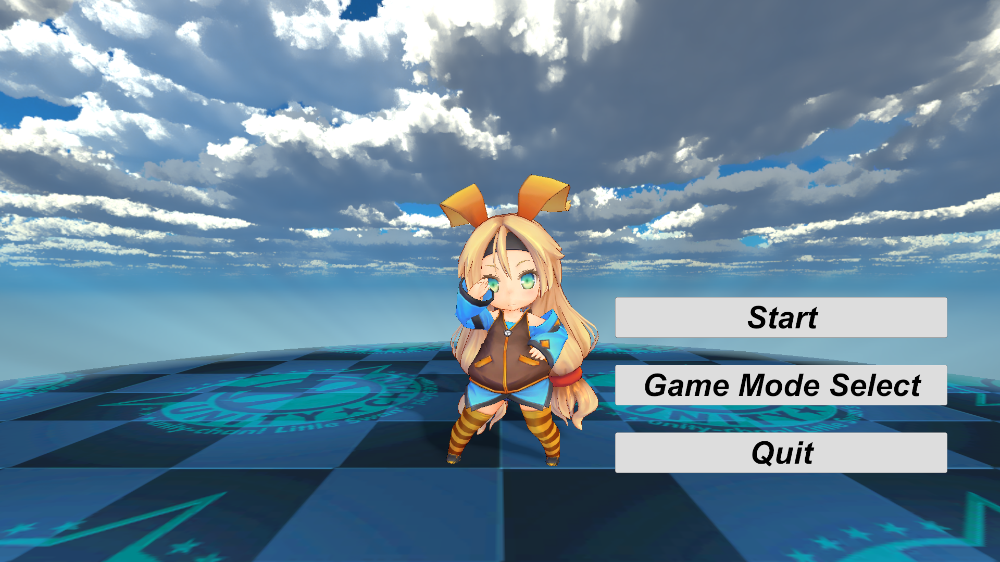 | 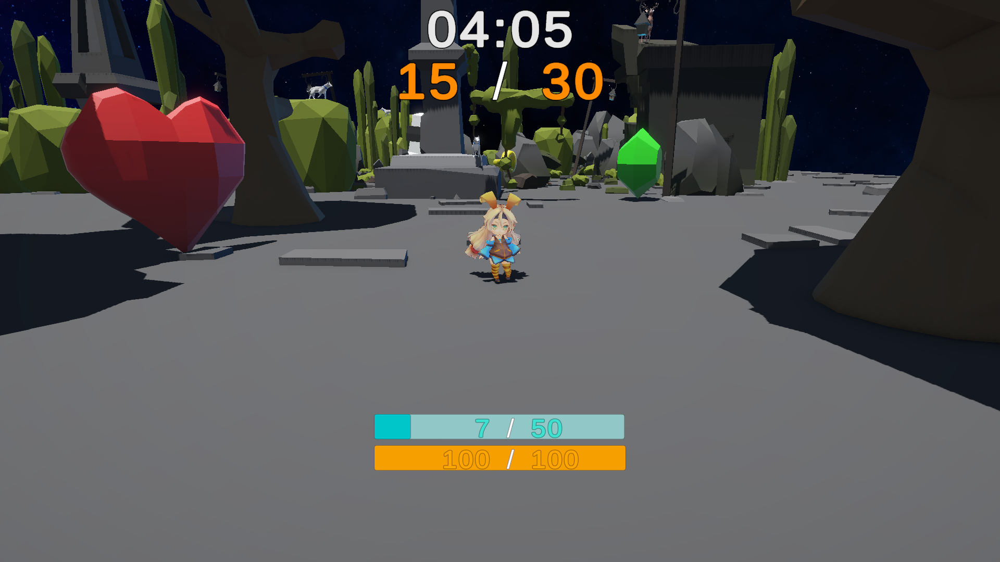 | 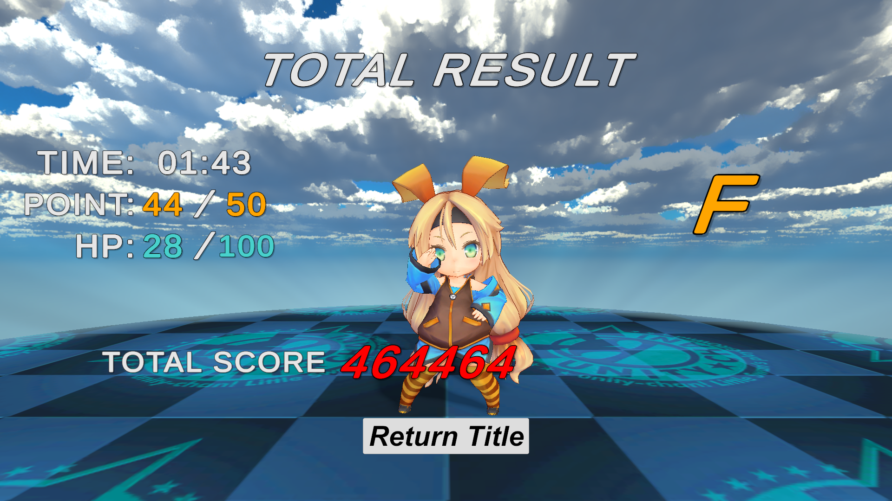 |

### MVP: Survivor (Survivor Game)
| Title | Gameplay | Level Up |
|-------|----------|----------|
| 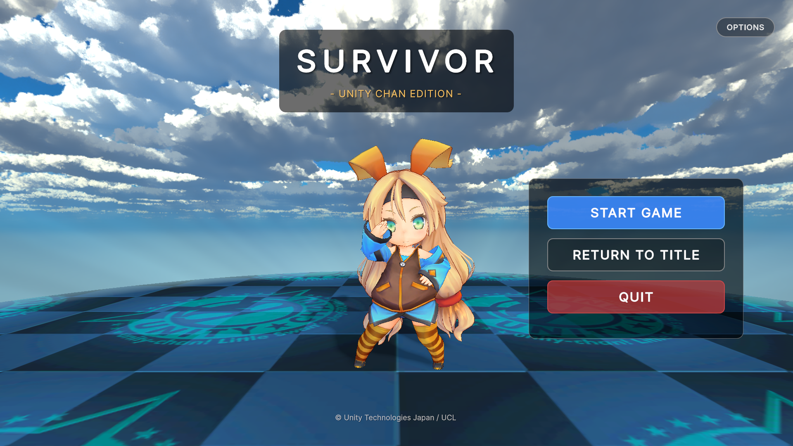 | 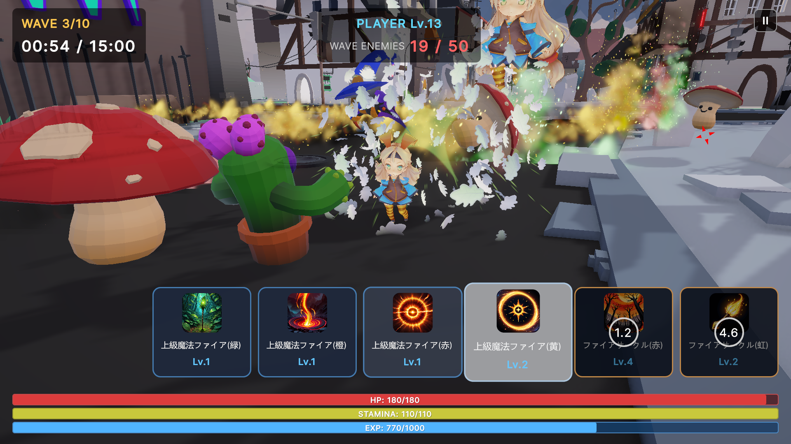 | 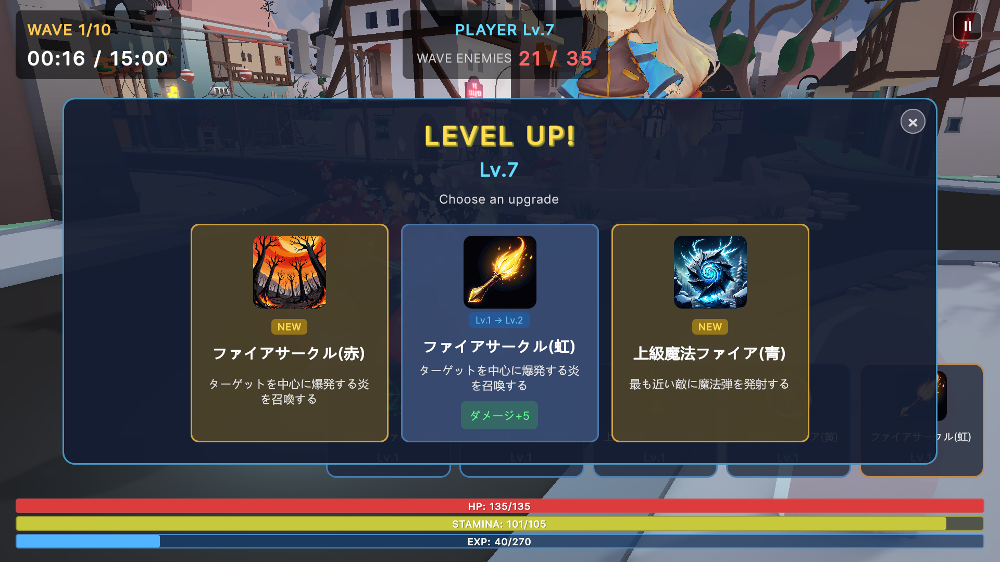 |

### Shaders & Effects
| Toon Shader | Dissolve Effect |
|-------------|-----------------|
| 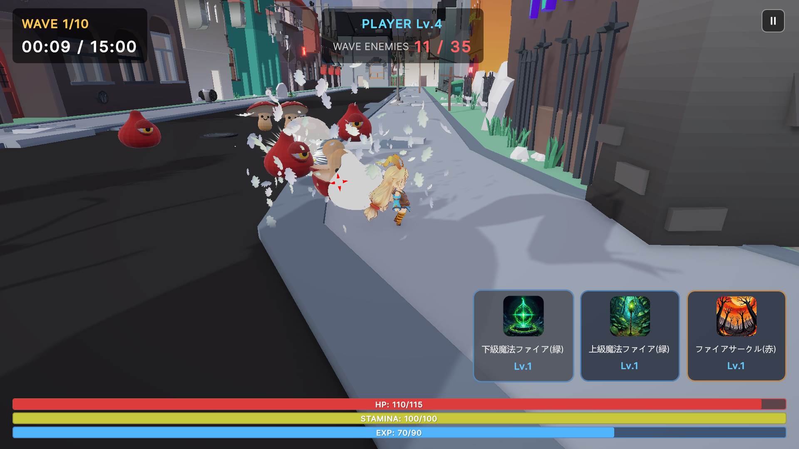 | 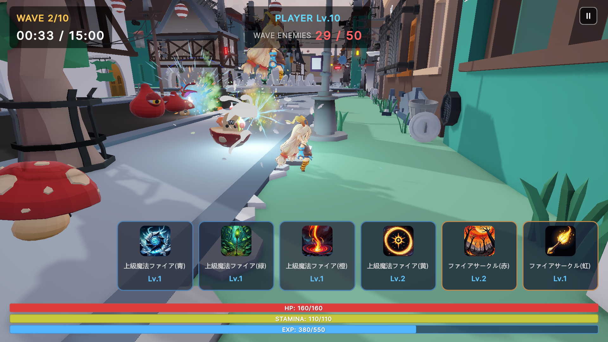 |

### Editor Extensions
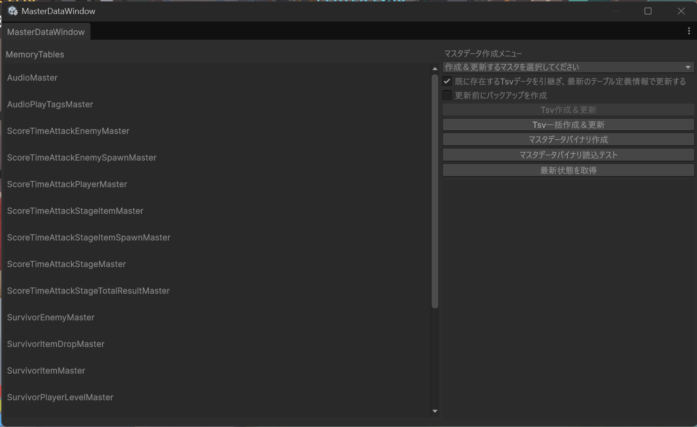

---

## Gameplay Videos

### MVC: ScoreTimeAttack


### MVP: Survivor


### Scene Transitions & Effects
| Scene Transition | Effects Showcase |
|-----------------|------------------|
| 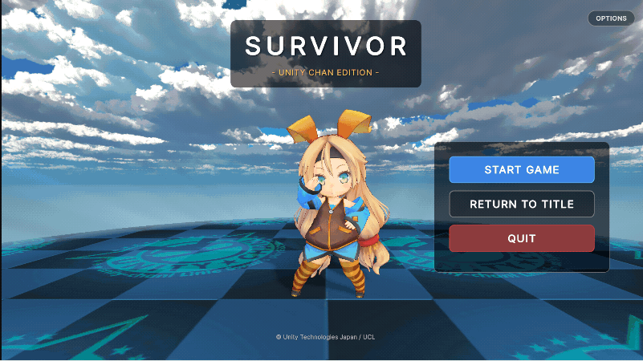 |  |

### Editor Tools
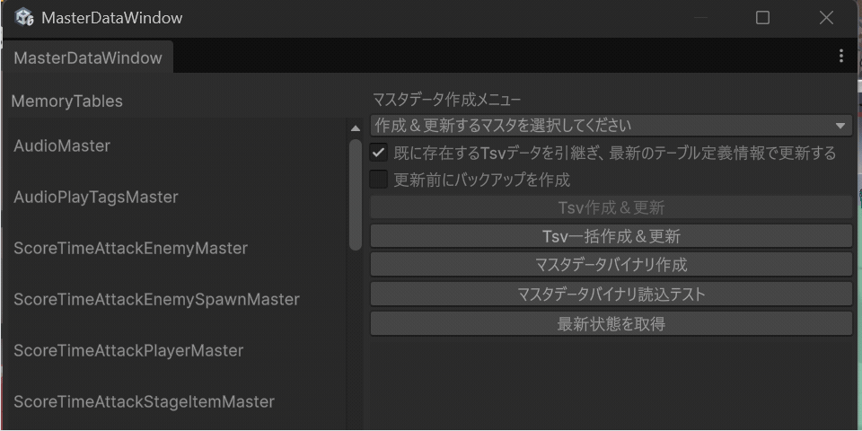

---

## Architecture Overview

### Monorepo Structure
```
┌─────────────────────────────────────────────────────────────┐
│                     Unity6Portfolio                          │
│                       (Monorepo)                             │
└─────────────────────────────────────────────────────────────┘
        ↓                    ↓                    ↓
┌─────────────────┐  ┌─────────────────┐  ┌─────────────────┐
│   Game.Client   │  │   Game.Server   │  │   Game.Shared   │
│  (Unity 6)      │  │ (ASP.NET Core)  │  │ (.NET + Unity)  │
└─────────────────┘  └─────────────────┘  └─────────────────┘
        ↘                    ↓                    ↙
                    ┌─────────────────┐
                    │  Shared DTO/IF  │
                    │  (Game.Shared)  │
                    └─────────────────┘
```

### Client Architecture
```
┌─────────────────────────────────────────────────────────────┐
│                        Game.App                              │
│              (Entry Point / Game Mode Selection)             │
└─────────────────────────────────────────────────────────────┘
                    ↓                    ↓
┌─────────────────────────────┐  ┌─────────────────────────────┐
│      Game.MVC.Core          │  │      Game.MVP.Core          │
│   (MVC Pattern Foundation)  │  │   (MVP Pattern Foundation)  │
│   GameServiceManager        │  │   VContainer/DI             │
└─────────────────────────────┘  └─────────────────────────────┘
            ↓                                ↓
┌─────────────────────────────┐  ┌─────────────────────────────┐
│  Game.MVC.ScoreTimeAttack   │  │    Game.MVP.Survivor        │
│    (Time Attack Game)       │  │   (Survivor Game)           │
└─────────────────────────────┘  └─────────────────────────────┘
            ↖                                ↗
               └──────────────┬──────────────┘
                              ↓
              ┌─────────────────────────────┐
              │         Game.Shared         │
              │  (Common Utilities / DTO)   │
              └─────────────────────────────┘
```

---

## Features
* **Game Mode Selection System**: Select different architecture game modes from the title screen at startup
* **Assembly Separation Design**: Manage MVC/MVP patterns in independent assemblies to prevent circular references
* **Client-Server Sharing**: Share master data definitions between client and server via Game.Shared
* **Prefab Scene/Dialog Transition**: Asynchronous scene transitions using async/await
* **State Machine Implementation**: Generic context support with transition table-based state management
* **Master Data Management**: Protobuf schema-driven, CLI tools for client/server binary generation
* **Various Game Services**: Common features like audio, scene transitions, messaging
* **DI Container Support**: Dependency injection via VContainer (for MVP pattern)
* **Combat System**: Unified combat interfaces with ICombatTarget/IDamageable/IKnockbackable
* **Weapon System**: Auto-fire and ground-based weapons with generic object pool (WeaponObjectPool<T>)
* **Enemy AI System**: State machine driven (Idle/Chase/Attack/HitStun/Death) with wave spawning
* **Item System**: Drop lottery, attraction feature, object pooling
* **Lock-On System**: Automatic target tracking, range management
* **Save Data System**: Binary serialization with MemoryPack, auto-save functionality

---

## Feature Details
<details><summary>Game Mode Selection System</summary>

1. Display Game.App title screen at application startup
2. Launch corresponding launcher based on selected game mode
3. Each game mode is implemented in independent assemblies without mutual interference
4. Launcher can be shut down and return to title screen when game ends
5. Loosely coupled event notification via ApplicationEvents (lower → upper assemblies)
</details>

<details><summary>Assembly Separation Design</summary>

| Assembly | Role | Dependencies |
|----------|------|--------------|
| Game.Shared | Common utilities, interfaces, DTOs | None (bottom layer) |
| Game.App | Entry point, game mode selection | Shared, MVC.*, MVP.* |
| Game.MVC.Core | MVC pattern foundation, GameServiceManager | Shared |
| Game.MVC.ScoreTimeAttack | Time attack game implementation | Shared, MVC.Core |
| Game.MVP.Core | MVP pattern foundation, VContainer | Shared |
| Game.MVP.Survivor | Survivor game implementation | Shared, MVP.Core |
| **Game.Server** | ASP.NET Core API Server | Shared |

</details>

<details><summary>Game.Shared (Shared Library)</summary>

Master data definition files are separated into a shared library, providing these benefits:

1. **Client-Server Sharing**: Share the same DTOs between Unity and ASP.NET Core
2. **Clear Dependencies**: Prevent circular references by placing at the bottom layer
3. **Reduced Build Time**: Efficient incremental builds by separating infrequently changed code
4. **Version Control**: Package-level version management

**Contents:**
- MasterMemory master data definition classes (AudioMaster, ScoreTimeAttackStageMaster, etc.)
- Common enum definitions (AudioCategory, AudioPlayTag, etc.)
- Shared interfaces, DTOs

**Survivor Master Data (11 types):**
- `SurvivorStageMaster`: Stage definitions (time limit, initial weapons, etc.)
- `SurvivorStageWaveMaster`: Wave definitions (spawn timing, enemy count)
- `SurvivorStageWaveEnemyMaster`: Enemy composition per wave
- `SurvivorEnemyMaster`: Enemy stats (HP, attack power, movement speed, etc.)
- `SurvivorPlayerMaster`: Player base stats
- `SurvivorPlayerLevelMaster`: Level-based stats (attraction range, etc.)
- `SurvivorWeaponMaster`: Weapon definitions (type, damage, cooldown, etc.)
- `SurvivorWeaponLevelMaster`: Weapon level-based stats
- `SurvivorItemMaster`: Item definitions (effect value, rarity, etc.)
- `SurvivorItemDropMaster`: Drop lottery table

</details>

<details><summary>Master Data Update System</summary>

Schema-driven master data management system supporting both client and server:

**Architecture Overview:**
```
┌─────────────────┐     ┌─────────────────┐     ┌─────────────────┐
│ Proto Schema    │────▶│ Game.Tools CLI  │────▶│ C# MemoryTable  │
│ (masterdata/)   │     │ codegen/build   │     │ Class Generation│
└─────────────────┘     └─────────────────┘     └─────────────────┘
         │                      │                        │
         │              ┌───────┴───────┐                │
         ▼              ▼               ▼                ▼
┌─────────────────┐  ┌────────┐  ┌────────────┐  ┌─────────────┐
│ TSV Data        │  │Client  │  │Server      │  │MemoryDatabase│
│ (raw/*.tsv)     │  │.bytes  │  │.bytes      │  │ (Runtime)    │
└─────────────────┘  └────────┘  └────────────┘  └─────────────┘
```

**Deploy Targets (Bitmask):**
| Target | Value | Usage |
|--------|------:|-------|
| ALL | 0 | All targets (Id, Name, etc.) |
| CLIENT | 1 | Unity client only (asset names, etc.) |
| SERVER | 2 | API server only (internal balance values) |
| REALTIME | 4 | Realtime server only |

**Update Methods (3 options):**

1. **Batch Files (Recommended)** - Double-click to execute
```
scripts/masterdata/
├── build-all.bat/.sh      # Build both Client + Server
├── build-client.bat/.sh   # Build Client only
├── build-server.bat/.sh   # Build Server only
├── codegen.bat/.sh        # Generate C# classes
├── validate.bat/.sh       # Validate TSV files
└── export-json.bat/.sh    # Export to JSON
```

2. **Unity Editor** - MasterDataWindow (Project > MasterMemory > MasterDataWindow)
   - Internally calls Game.Tools CLI
   - Code generation, binary build, TSV validation available from GUI

3. **Direct CLI Commands**
```bash
# Generate C# classes (Proto → MemoryTable)
dotnet run --project src/Game.Tools -- masterdata codegen

# Build binary (TSV → .bytes)
dotnet run --project src/Game.Tools -- masterdata build --out-client ... --out-server ...

# Validate schema
dotnet run --project src/Game.Tools -- masterdata validate
```

**Client Side Loading:**
- Load `MasterDataBinary.bytes` via Addressables
- Build `MemoryDatabase` through `MasterDataServiceBase`

**Server Side Loading:**
- Synchronous load `masterdata.bytes` from filesystem at startup
- Inject `IMasterDataService` via DI container

</details>

<details><summary>Database Management System</summary>

PostgreSQL database migration and seed data management system:

**Migration:**
```
scripts/migrate/
├── migrate-up.bat/.sh      # Apply pending migrations
├── migrate-down.bat/.sh    # Rollback migrations
├── migrate-status.bat/.sh  # Check status
└── migrate-reset.bat/.sh   # Reset (drop + recreate)
```

**Seed Data:**
```
scripts/seeddata/
├── seed.bat/.sh     # TSV → DB seed
├── dump.bat/.sh     # DB → TSV dump
└── diff.bat/.sh     # Compare TSVs
```

**Unity Editor:**
- DatabaseWindow (Project > Database > DatabaseWindow)
  - Migration operations (Up/Down/Status/Reset)
  - Seed data operations (Seed/Dump/Diff)
  - Schema selection (master/user/all)

**CLI Commands:**
```bash
# Migration
dotnet run --project src/Game.Tools -- migrate up
dotnet run --project src/Game.Tools -- migrate down --steps 1
dotnet run --project src/Game.Tools -- migrate status
dotnet run --project src/Game.Tools -- migrate reset --force --seed

# Seed Data
dotnet run --project src/Game.Tools -- seeddata seed --tsv-dir masterdata/raw/
dotnet run --project src/Game.Tools -- seeddata dump --out-dir masterdata/dump/
dotnet run --project src/Game.Tools -- seeddata diff --source-dir masterdata/raw/ --target-dir masterdata/dump/
```

</details>

<details><summary>Scene/Dialog Transition</summary>

1. Implemented with asynchronous processing (async/await)
2. Can re-transition from history even if previous scene was destroyed
3. Can transition to next scene while keeping current scene asleep, and resume from sleep state when returning
4. Scene implementations can insert additional processing at various timings: pre-startup, loading, initialization, sleep, resume, termination, etc.
5. Scenes can optionally have arguments and return values
6. Even scenes with arguments can restore state from history and pass arguments again for transition
7. Multiple dialogs (overlays) can be opened simultaneously, and all are destroyed on scene transition to prevent invalid behavior
</details>

<details><summary>State Machine</summary>

1. Has generic context, allowing any type to be specified
2. Each state can reference context for state management
3. Transition table can be built at initialization, setting rules for which states can transition from which
4. Special states can be set as transition targets from any state
5. Generic event key type can be specified, managing transition event names with enums
6. Supports MonoBehaviour.FixedUpdate/LateUpdate in addition to regular Update
</details>

<details><summary>Survivor Game System (MVP)</summary>

**Combat System**
- `ICombatTarget`: Unified combat interface integrating damage, knockback, and targeting
- `IDamageable`, `IKnockbackable`, `ITargetable`: Individual feature interfaces
- Enables shared combat logic between enemies and players

**Weapon System**
- `SurvivorWeaponBase`: Weapon base class (damage calculation, critical, proc rate)
- `SurvivorAutoFireWeapon`: Auto-fire type (fires projectiles at nearest enemy)
- `SurvivorGroundWeapon`: Ground-based type (creates damage areas in circular pattern)
- `WeaponObjectPool<T>`: Generic object pool (shared for projectiles and areas)
- Master data driven (supports per-level stats and asset changes)

**Enemy AI System**
- `SurvivorEnemyController`: State machine driven enemy AI
- State transitions: Idle → Chase → Attack → HitStun → Death
- `SurvivorEnemySpawner`: Wave management and spawn control
- NavMeshAgent pathfinding

**Item System**
- `SurvivorItemSpawner`: Drop management on enemy defeat
- Drop group lottery (item determination via probability table)
- Magnet attraction feature (automatic collection of items in range)

**Player System**
- `SurvivorPlayerController`: Movement, HP, stamina, invincibility management
- State machine: Normal → Invincible → Dead
- Item attraction range linked to level

**Save Data System**
- `SurvivorSaveService`: Save/load processing
- High-speed binary serialization with MemoryPack
- Auto-save (30-second intervals, on background transition)
- Immediate save on Victory/GameOver confirmation

</details>

<details><summary>Others</summary>

* Common features like scene transitions and audio playback are primarily separated as game services
* Master data editor extension easily creates binaries from TSV, allowing immediate testing after TSV updates
* In-game scenes consist of Prefab scenes + Unity scenes, with stage Unity scenes separated from logic
* Out-game scenes all use Prefab scenes to ensure customizability of transition behavior
</details>

---

## Folder Structure
```
Unity6Portfolio/
├── src/
│   ├── Game.Client/                    # Unity Client
│   │   ├── Assets/
│   │   │   ├── MasterData/             Master data (TSV, binary)
│   │   │   └── Programs/
│   │   │       ├── Editor/             Editor extensions
│   │   │       │   └── Tests/          Unit tests
│   │   │       └── Runtime/
│   │   │           ├── Shared/         Common utilities
│   │   │           ├── App/            Entry point
│   │   │           ├── MVC/            MVC pattern implementation
│   │   │           │   ├── Core/       Foundation (Services, Scenes)
│   │   │           │   └── ScoreTimeAttack/
│   │   │           └── MVP/            MVP pattern implementation
│   │   │               ├── Core/       Foundation (VContainer)
│   │   │               └── Survivor/   Survivor game
│   │   ├── Packages/
│   │   ├── ProjectSettings/
│   │   └── Documentation/              Screenshots, GIFs
│   │
│   ├── Game.Client.Linked/             # MasterData Bridge (.NET SDK format)
│   │
│   ├── Game.Server/                    # ASP.NET Core 9 Server
│   │   ├── Controllers/
│   │   ├── Services/
│   │   └── Program.cs
│   │
│   ├── Game.Shared/                    # Shared Library
│   │   ├── Game.Shared.csproj          .NET Project
│   │   ├── package.json                Unity Package Definition
│   │   └── Runtime/
│   │       └── Shared/
│   │           ├── Enums/              AudioCategory, etc.
│   │           └── MasterData/         Master data definitions
│   │
│   └── Game.Tools/                     # CLI Tools (.NET 9)
│
├── masterdata/                         # Protobuf Schemas + TSV Data
│
├── docker/                             # Docker Configuration
│   ├── unity-ci/                       # Unity CI Runner
│   └── game-server/                    # Game.Server
│
├── docs/                               # Technical Documentation
│
├── scripts/                            # Build/Format Scripts
│
└── test/
    └── Game.Server.Tests/              # Server Tests
```

---

## Performance Improvement Samples
<details><summary>Scene Transition</summary>

* GameSceneService
  - Verified performance improvements by changing scene transition functions from Task to UniTask
  - Iterations: 10,000
  - ~40% reduction in CPU execution time, zero allocation, 100% reduction in memory usage

</details>

<details><summary>State Machine</summary>

* Improvements
  - Changed state management from HashSet to Dictionary, improving state lookup from O(n) to O(1)
  - Reduced Dictionary lookups during transitions, improved LINQ usage to reduce allocations
  - Reduced overhead through method inlining

* State Transition Throughput Improvement
  - Iterations: 30,000
  - Average 15% reduction in transition time, average 15% improvement in throughput

  | Item | Old StateMachine | New StateMachine | Improvement |
  |:-----|---------------:|---------------:|-------:|
  | Total Execution Time (ms) | 44.848 | 35.295 | 1.27x |
  | Avg Transition Time (μs) | 0.300 | 0.146 | 2.05x |
  | Throughput (ops/s) | 668,934 | 849,991 | 1.27x |

* State Transition Memory Allocation Improvement
  - Iterations: 10,000

  | Item | Old StateMachine | New StateMachine | Improvement |
  |:-----|---------------:|---------------:|-------:|
  | Memory (bytes) | 2,760,704 | 1,290,240 | 2.14x |

</details>

---

## Languages/Libraries/Tools

| Language/Framework | Version |
|-------------------|---------|
| Unity | 6000.3.2f1 |
| .NET SDK | 9.0 |
| C# | 9.0 |
| cysharp/MessagePipe | 1.8.1 |
| cysharp/R3 | 1.3.0 |
| cysharp/UniTask | 2.5.10 |
| cysharp/MasterMemory | 3.0.4 |
| cysharp/MessagePack | 3.1.3 |
| cysharp/MemoryPack | 1.21.3 |
| hadashiA/VContainer | 1.17.0 |
| NSubstitute | 5.3.0 |
| xUnit | 2.x |
| DOTween | 1.2.790 |
| HotReload | 1.13.13 |
| JetBrains Rider | 2025.3.0.2 |
| Claude Code | - |

---

## Library/Tool Selection Rationale
* **VContainer**: DI (Dependency Injection) container for MVP pattern
* **MessagePipe**: Loosely coupled messaging (Pub/Sub) for UI events and game events
* **R3**: Complex async event processing, improves maintainability/reusability
* **UniTask**: Unity-optimized async processing
* **MasterMemory**: Separates game logic from data, streamlining development cycles
* **MemoryPack**: High-speed binary serialization for save data
* **xUnit**: Server-side test framework

---

## Assets
* Primarily from Unity Asset Store, no self-made assets included
* Unity-chan: https://unity-chan.com/ (© Unity Technologies Japan/UCL)

---

## Development Period
* Approximately 4 weeks (as of 2026/1/24)

---

## Future Plans
* Network functionality (client-server communication)
* Survivor game mode additional features (skill system, boss battles, etc.)
* PlayerLoop intervention sample
* List sort/filter functionality sample
* Multi-resolution support

---

## About the Demo Game
### Time Attack (MVC)
* A time attack game where you collect a specified number of items placed across 3 stages within the time limit
* Platform: PC / Mouse & Keyboard
* Controls: Move (WASD), Jump (Space), Run (LShift+Move), Camera (Mouse Drag)

### Survivor (MVP)
* Implemented using MVP pattern with VContainer
* A survivor game where you defeat waves of enemies while staying alive
* Platform: PC / Mouse & Keyboard
* Controls: Move (WASD), Dash (LShift+Move)
* Key Features:
  - Auto-attack weapon system (master data driven)
  - Wave management (staged enemy spawning)
  - Item drops and attraction
  - Stage clear and record saving

### Download
* Executable: [Demo Game Download Link](https://drive.google.com/file/d/1_9vWOvT8leUjd2jB5uTzziSyA5goPmJx/view?usp=drive_link) *If extraction fails, 7Zip is recommended

---

## Documentation
- [Architecture Details](ARCHITECTURE.md)

---

## License
[LICENSE](LICENSE)
