# Unity6Portfolio

A game development portfolio built with Unity 6 + ASP.NET Core 9 + MagicOnion gRPC + Photon Fusion 2 (Monorepo)

## Highlights

* **Unity × Server × Infrastructure in a single monorepo** — Unity 6 client / ASP.NET Core 9 + MagicOnion gRPC / PostgreSQL + Valkey / GitHub Actions CI/CD
* **Photon Fusion 2 server authority model + Dedicated Server operations** — Dead Reckoning interpolation, enemy batch sync (NetworkArray<512>), Linux headless build with self-registration + HMAC auth + Docker deployment
* **LiveOps delivery pipeline** — GitHub Actions self-hosted runners + Unity Accelerator + Cloudflare R2 CDN, Addressables with 4-environment switching, index.json differential sync, editor auto-sync
* **Protobuf schema-driven master data** — custom CLI tool (6 subcommands), deploy-target-filtered binary generation from a single schema for Client/Server/Realtime
* **8-assembly modular design** — MVC/MVP coexistence with structurally enforced circular reference prevention
* **1,148 automated tests** (EditMode 746 + PlayMode 63 + Server 339 with Testcontainers) across 7 CI/CD workflows

> **Architecture Details**: [ARCHITECTURE.md](ARCHITECTURE.md) (11 chapters, 15 ADRs)

---

[日本語版はこちら](README.md)

---

## Screenshots

### MVC: ScoreTimeAttack (Time Attack Game)
| Title | Gameplay | Result |
|-------|----------|--------|
| 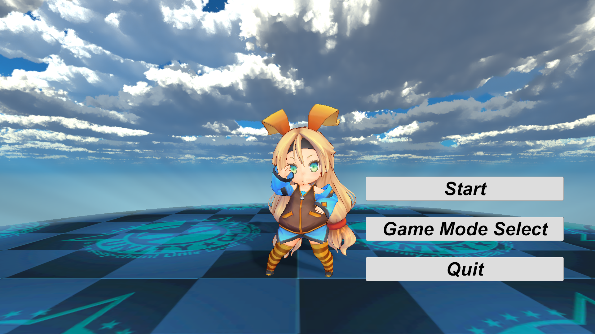 | 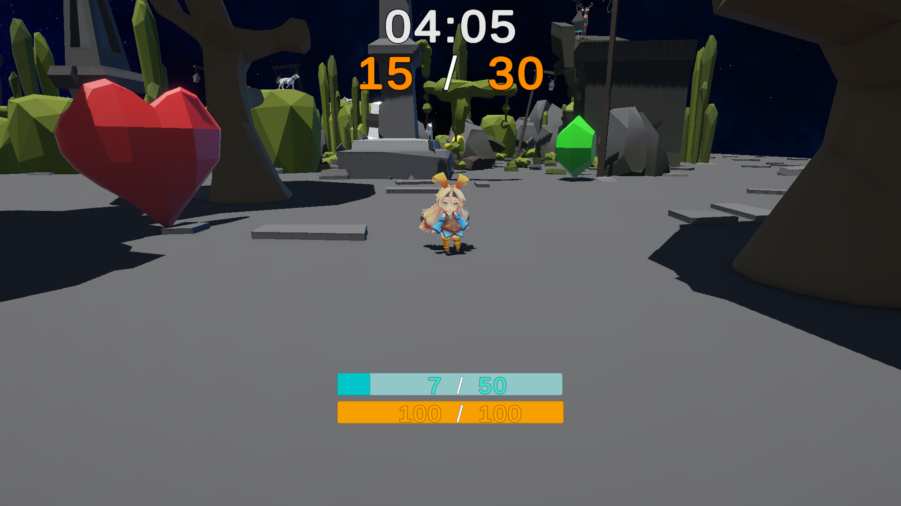 | 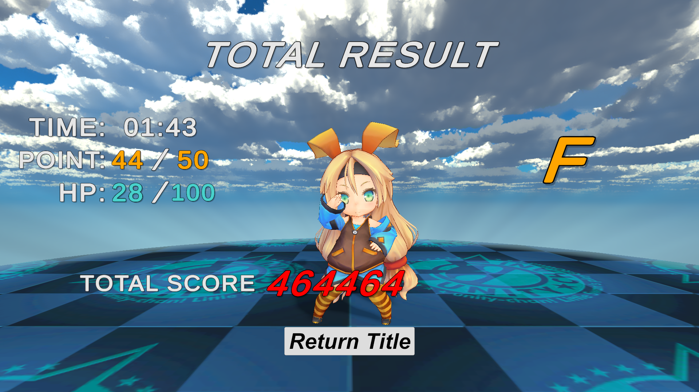 |

### MVP: Survivor (Survivor Game)
| Title | Gameplay | Level Up |
|-------|----------|----------|
| 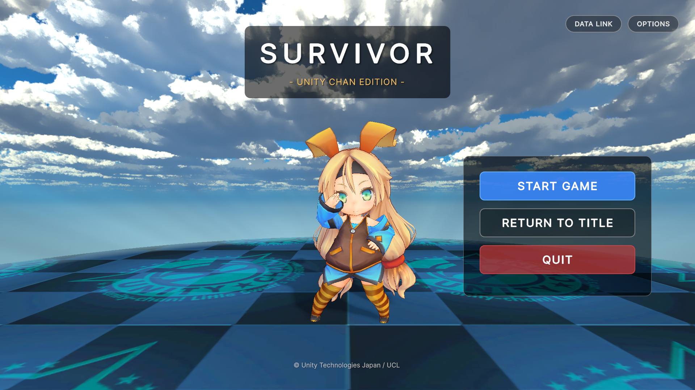 | 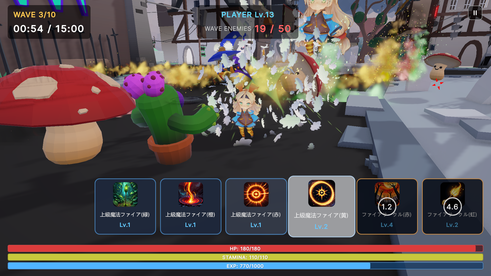 | 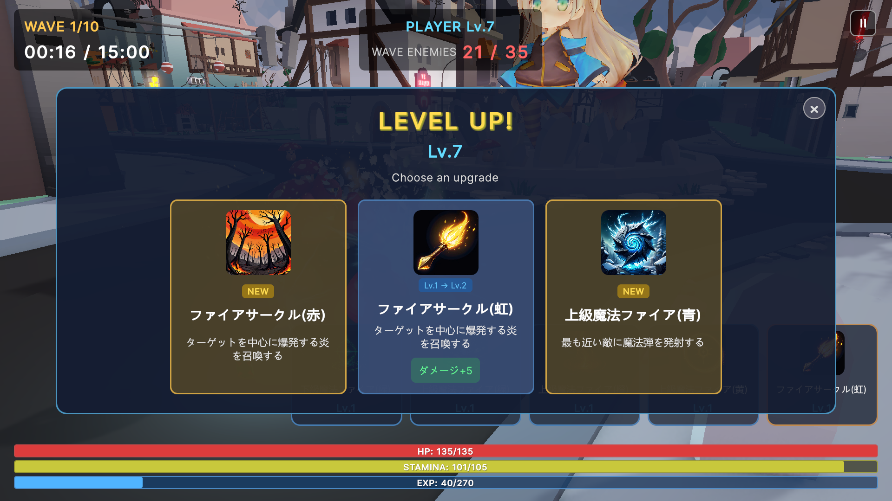 |

### Shaders & Effects
| Toon Shader | Dissolve Effect |
|-------------|-----------------|
| 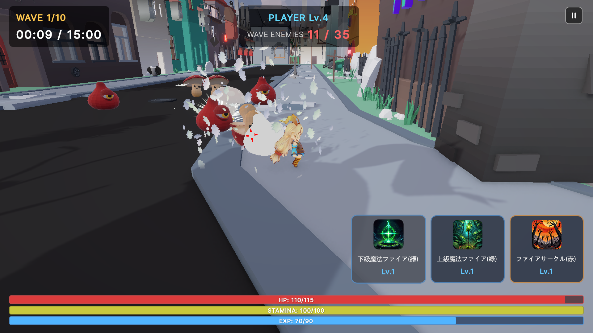 | 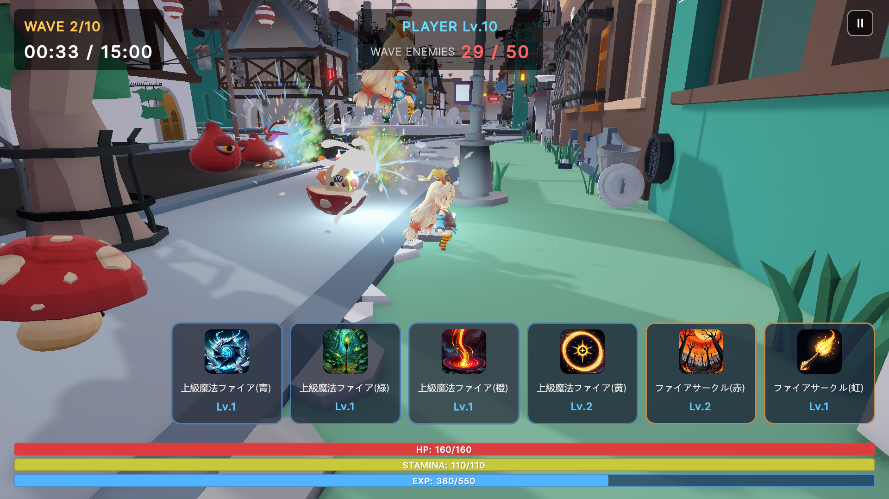 |

### Editor Extensions
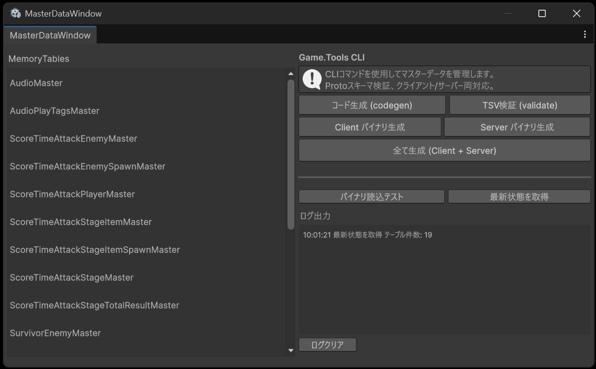

| Database Management | Game Environment Settings |
|---------------------|---------------------------|
| 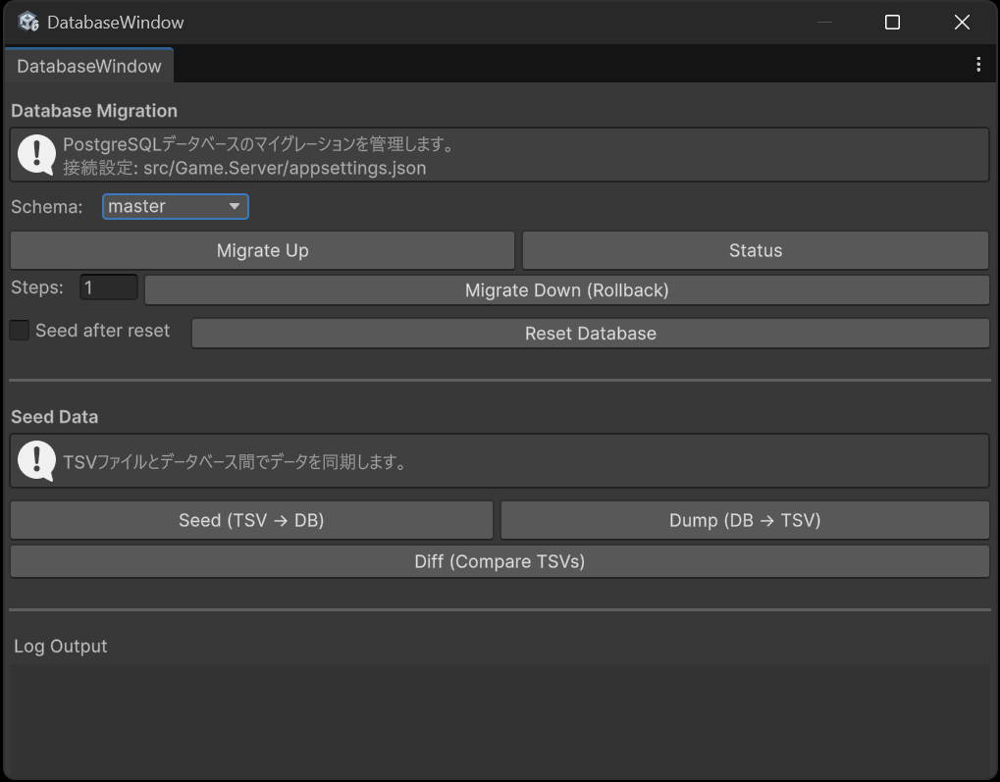 | 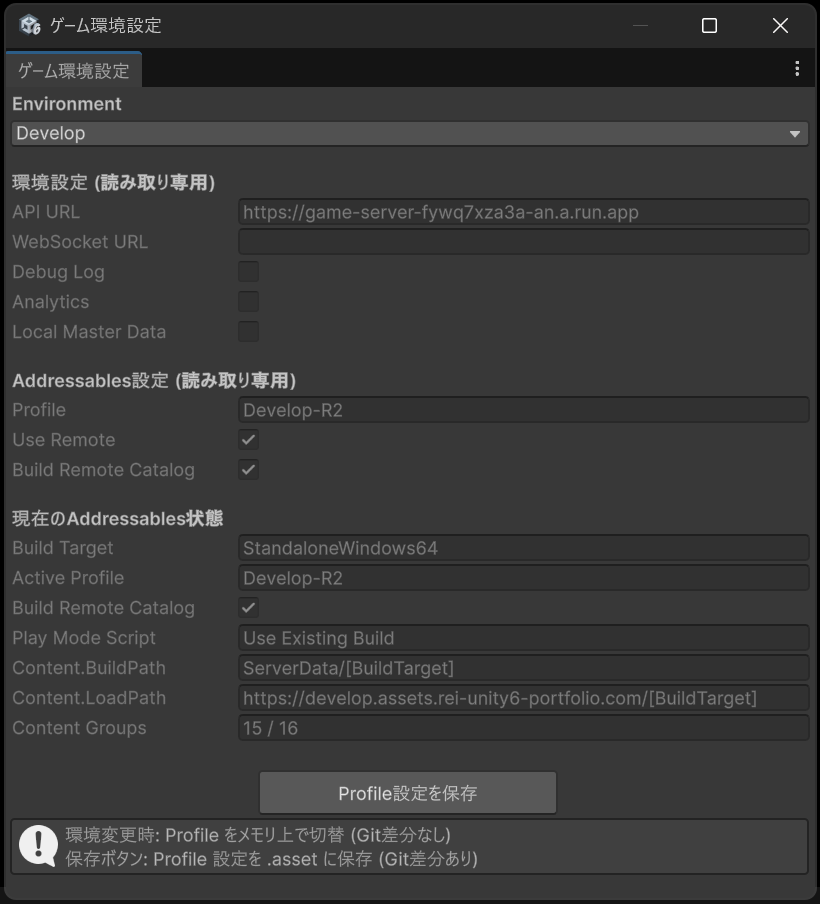 |

---

## Gameplay Videos

### MVC: ScoreTimeAttack


### MVP: Survivor


### Scene Transitions & Effects
| Scene Transition | Effects Showcase |
|-----------------|------------------|
| 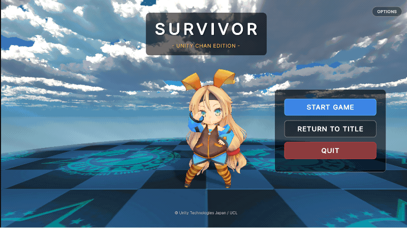 |  |

### Editor Tools
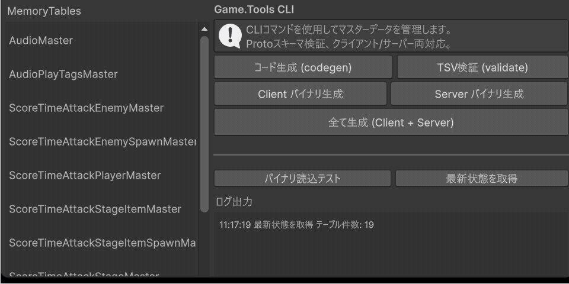

<details><summary>Setup</summary>

### Requirements

| Item | Version |
|------|---------|
| Unity | 6000.3.8f1 or later |
| .NET SDK | 9.0 or later |
| OS | Windows 10/11 |

### Setup Steps

#### Client (Unity)

1. Clone the repository
   ```bash
   git clone https://github.com/reigithub/unity6-portfolio.git
   ```
2. Open the `src/Game.Client/` folder in Unity Hub
3. Package restoration may take a few minutes on first launch
4. Open `Assets/ProjectAssets/UnityScenes/GameRootScene.unity` and press Play

#### Server

```bash
cd src/Game.Server
dotnet restore
dotnet run
```

#### Running Tests

```bash
# Server tests
dotnet test

# Unity tests (in Unity Editor)
# Window > General > Test Runner
```

### Notes
* Some packages are installed via NuGetForUnity, so if errors occur on the first build, try building again
* If Addressables build is required, run build from `Window > Asset Management > Addressables > Groups`

</details>

---

## Architecture Overview

### Monorepo Structure
```
┌─────────────────────────────────────────────────────────────┐
│                     Unity6Portfolio                          │
│                       (Monorepo)                             │
└─────────────────────────────────────────────────────────────┘
        ↓              ↓              ↓              ↓
┌────────────┐  ┌────────────┐  ┌────────────┐  ┌────────────┐
│Game.Client │  │Game.Server │  │Game.Realtime│  │ Game.Shared│
│ (Unity 6)  │  │ (REST API) │  │(gRPC/Hub)  │  │(.NET+Unity)│
└────────────┘  └────────────┘  └────────────┘  └────────────┘
        ↘              ↓              ↓              ↙
               ┌─────────────────────────────┐
               │   Shared DTO/IF (Game.Shared) │
               │  Unary RPC / Hub Interfaces   │
               └─────────────────────────────┘
```

### Client Architecture
```
┌─────────────────────────────────────────────────────────────┐
│                        Game.App                              │
│              (Entry Point / Game Mode Selection)             │
└─────────────────────────────────────────────────────────────┘
                    ↓                    ↓
┌─────────────────────────────┐  ┌─────────────────────────────┐
│      Game.MVC.Core          │  │      Game.MVP.Core          │
│   (MVC Pattern Foundation)  │  │   (MVP Pattern Foundation)  │
│   GameServiceManager        │  │   VContainer/DI             │
└─────────────────────────────┘  └─────────────────────────────┘
            ↓                                ↓
┌─────────────────────────────┐  ┌─────────────────────────────┐
│  Game.MVC.ScoreTimeAttack   │  │    Game.MVP.Survivor        │
│    (Time Attack Game)       │  │   (Survivor Game)           │
└─────────────────────────────┘  └─────────────────────────────┘
            ↖                                ↗
               └──────────────┬──────────────┘
                              ↓
              ┌─────────────────────────────┐
              │         Game.Shared         │
              │  (Common Utilities / DTO)   │
              └──────────────┬──────────────┘
                             ↓
              ┌─────────────────────────────┐
              │     Game.Library.Shared     │
              │     (MasterMemory etc)      │
              └─────────────────────────────┘
```

---

## Features

### Client Architecture
* **Assembly Separation**: 8 independent assemblies for MVC/MVP patterns with structurally enforced circular reference prevention
* **Game Mode Selection**: Select different architecture game modes from the title screen
* **DI / Event-Driven**: VContainer (MVP) + GameServiceManager (MVC), MessagePipe Pub/Sub, R3 reactive (DistinctUntilChanged / Merge / ThrottleFirst operator composition)
* **Scene Transitions**: Async (UniTask) transitions with sleep/resume, arguments/return values, dialog stack
* **State Machine**: Generic context, transition table, O(1) state lookup. Fusion FSM for network-synced states

### Gameplay
* **Combat System**: Unified interfaces (ICombatTarget/IDamageable/IKnockbackable) for enemies and players
* **Weapon System**: Auto-fire and ground-based weapons with generic object pool (WeaponObjectPool&lt;T&gt;, ProfilerMarker instrumented)
* **Enemy AI**: State machine driven (Idle/Chase/Attack/HitStun/Death), wave spawning, NavMesh pathfinding
* **Item System**: Drop group lottery (probability tables), magnet attraction, object pooling
* **Save Data**: MemoryPack binary serialization, auto-save (30s intervals, background transition)

### Performance Optimization
* **Enemy LOD System**: Distance-based 3-tier LOD (Near 20m/Mid 40m/Far), frame-distributed reclassification for spike prevention
* **Custom Shaders (URP/HLSL)**: ToonLit (Ramp Diffuse + Rim Light + Outline Pass), CharacterLit/Unlit (Hit Flash + Dissolve), LOD Far lightweight unlit. All shaders GPU Instancing enabled
* **Rendering**: URP with PC high-quality (SSAO, 2048 shadow map) / Mobile lightweight (RenderScale 0.8, no SSAO) dual profiles
* **Canvas Optimization**: Dynamic/static Canvas separation (fade, lock-on), CanvasGroup.alpha control to avoid unnecessary rebuilds

### Network & Server Integration
* **HTTP Communication Layer**: Exponential backoff retry (RetryPolicy), circuit breaker (auto-recovery), cache fallback (expired cache response)
* **Authentication & Account**: Guest login, email linking, transfer password, session auto-restore, background token refresh (deduplication)
* **Ranking System**: Score submission/retrieval, Valkey Sorted Set caching (5-min TTL)
* **Lobby System**: Real-time lobby via MagicOnion StreamingHub (create/join/leave/ready/start), Valkey persistence
* **Matchmaking**: Queue-based, Redis Pub/Sub real-time notifications, session token issuance
* **Real-time Chat**: Room-based messaging via SignalR WebSocket + MagicOnion
* **Request Signing Policy**: Declarative endpoint security (3 signing attributes), fail-fast startup validation

### Realtime Online Gameplay (Photon Fusion 2)
* **Server Authority Model**: Server/Client mode, [Networked] properties, Fusion FSM player state sync
* **Enemy Batch Sync**: Server-controlled enemy AI, 10Hz batch sync (NetworkArray<512>), client Dead Reckoning interpolation
* **Dedicated Server Orchestration**: Linux headless build, self-registration + heartbeat to Game.Server, HMAC auth, Docker deploy
* **MPPM Support**: In-editor multiplayer testing, per-clone data path isolation

### Development Infrastructure
* **Master Data**: Protobuf schema-driven, custom CLI tool (codegen/build/validate/scaffold/export/diff), deploy-target-filtered binary generation
* **Asset Delivery**: Addressables with 4-environment Local/Remote switching, Cloudflare R2 CDN deploy, index.json differential sync, editor auto-sync
* **CI/CD**: 7 GitHub Actions workflows + Docker Self-hosted Runner + Unity Accelerator, Addressables deploy automation
* **Testing**: 1,148 tests (EditMode 746 + PlayMode 63 + Server 339), XPlat Code Coverage
* **Editor Extensions**: 12 EditorWindows (MasterData, Database, environment settings, texture optimization, etc.)
* **Code Quality**: StyleCop + Roslyn Analyzer + hierarchical .editorconfig, automated format checking

---

## Feature Details
<details><summary>Game Mode Selection System</summary>

1. Display Game.App title screen at application startup
2. Launch corresponding launcher based on selected game mode
3. Each game mode is implemented in independent assemblies without mutual interference
4. Launcher can be shut down and return to title screen when game ends
5. Loosely coupled event notification via ApplicationEvents (lower → upper assemblies)
</details>

<details><summary>Assembly Separation Design</summary>

| Assembly | Role | Dependencies |
|----------|------|--------------|
| Game.Library.Shared | Shared library (Unity/server) | MasterMemory, MessagePack |
| Game.Shared | Common utilities, interfaces, DTOs | Game.Library.Shared |
| Game.App | Entry point, game mode selection | Shared, MVC.Core, MVC.ScoreTimeAttack, MVP.Core |
| Game.MVC.Core | MVC pattern foundation, GameServiceManager | Shared |
| Game.MVC.ScoreTimeAttack | Time attack game implementation | MVC.Core, Game.Client.MasterData |
| Game.MVP.Core | MVP pattern foundation, VContainer | Shared |
| Game.MVP.Survivor | Survivor game implementation | MVP.Core, VContainer |
| Game.Client.Realtime | Realtime client (MagicOnion) | Shared |
| **Game.Server** | REST API Server (ASP.NET Core 9) | Shared, Server.Shared |
| **Game.Realtime** | Realtime Server (MagicOnion gRPC) | Shared, Server.Shared |
| **Game.Server.Shared** | Server shared infrastructure (JWT, Valkey, Health) | - |

</details>

<details><summary>Game.Shared (Shared Library)</summary>

Master data definition files are separated into a shared library, providing these benefits:

1. **Client-Server Sharing**: Share the same DTOs between Unity and ASP.NET Core
2. **Clear Dependencies**: Prevent circular references by placing at the bottom layer
3. **Reduced Build Time**: Efficient incremental builds by separating infrequently changed code
4. **Version Control**: Package-level version management

**Contents:**
- MasterMemory master data definition classes (AudioMaster, ScoreTimeAttackStageMaster, etc.)
- Common enum definitions (AudioCategory, AudioPlayTag, etc.)
- Shared interfaces, DTOs

**Survivor Master Data (11 types):**
- `SurvivorStageMaster`: Stage definitions (time limit, initial weapons, etc.)
- `SurvivorStageWaveMaster`: Wave definitions (spawn timing, enemy count)
- `SurvivorStageWaveEnemyMaster`: Enemy composition per wave
- `SurvivorEnemyMaster`: Enemy stats (HP, attack power, movement speed, etc.)
- `SurvivorPlayerMaster`: Player base stats
- `SurvivorPlayerLevelMaster`: Level-based stats (attraction range, etc.)
- `SurvivorWeaponMaster`: Weapon definitions (type, damage, cooldown, etc.)
- `SurvivorWeaponLevelMaster`: Weapon level-based stats
- `SurvivorItemMaster`: Item definitions (effect value, rarity, etc.)
- `SurvivorItemDropMaster`: Drop lottery table

</details>

<details><summary>Master Data Update System</summary>

Schema-driven master data management system supporting both client and server:

**Architecture Overview:**
```
┌─────────────────┐     ┌─────────────────┐     ┌─────────────────┐
│ Proto Schema    │────▶│ Game.Tools CLI  │────▶│ C# MemoryTable  │
│ (masterdata/)   │     │ codegen/build   │     │ Class Generation│
└─────────────────┘     └─────────────────┘     └─────────────────┘
         │                      │                        │
         │              ┌───────┴───────┐                │
         ▼              ▼               ▼                ▼
┌─────────────────┐  ┌────────┐  ┌────────────┐  ┌─────────────┐
│ TSV Data        │  │Client  │  │Server      │  │MemoryDatabase│
│ (raw/*.tsv)     │  │.bytes  │  │.bytes      │  │ (Runtime)    │
└─────────────────┘  └────────┘  └────────────┘  └─────────────┘
```

**Deploy Targets (Bitmask):**
| Target | Value | Usage |
|--------|------:|-------|
| ALL | 0 | All targets (Id, Name, etc.) |
| CLIENT | 1 | Unity client only (asset names, etc.) |
| SERVER | 2 | API server only (internal balance values) |
| REALTIME | 4 | Realtime server only |

**Update Methods (3 options):**

1. **Batch Files (Recommended)** - Double-click to execute
```
scripts/masterdata/
├── build-all.bat/.sh      # Build both Client + Server
├── build-client.bat/.sh   # Build Client only
├── build-server.bat/.sh   # Build Server only
├── codegen.bat/.sh        # Generate C# classes
├── validate.bat/.sh       # Validate TSV files
└── export-json.bat/.sh    # Export to JSON
```

2. **Unity Editor** - MasterDataWindow (Project > MasterMemory > MasterDataWindow)
   - Internally calls Game.Tools CLI
   - Code generation, binary build, TSV validation available from GUI

3. **Direct CLI Commands**
```bash
# Generate C# classes (Proto → MemoryTable)
dotnet run --project src/Game.Tools -- masterdata codegen

# Build binary (TSV → .bytes)
dotnet run --project src/Game.Tools -- masterdata build --out-client ... --out-server ...

# Validate schema
dotnet run --project src/Game.Tools -- masterdata validate
```

**Client Side Loading:**
- Load `MasterDataBinary.bytes` via Addressables
- Build `MemoryDatabase` through `MasterDataServiceBase`

**Server Side Loading:**
- Synchronous load `masterdata.bytes` from filesystem at startup
- Inject `IMasterDataService` via DI container

</details>

<details><summary>Database Management System</summary>

PostgreSQL database migration and seed data management system:

**Migration:**
```
scripts/migrate/
├── migrate-up.bat/.sh      # Apply pending migrations
├── migrate-down.bat/.sh    # Rollback migrations
├── migrate-status.bat/.sh  # Check status
└── migrate-reset.bat/.sh   # Reset (drop + recreate)
```

**Seed Data:**
```
scripts/seeddata/
├── seed.bat/.sh     # TSV → DB seed
├── dump.bat/.sh     # DB → TSV dump
└── diff.bat/.sh     # Compare TSVs
```

**Unity Editor:**
- DatabaseWindow (Project > Database > DatabaseWindow)
  - Migration operations (Up/Down/Status/Reset)
  - Seed data operations (Seed/Dump/Diff)
  - Schema selection (master/user/all)

**CLI Commands:**
```bash
# Migration
dotnet run --project src/Game.Tools -- migrate up
dotnet run --project src/Game.Tools -- migrate down --steps 1
dotnet run --project src/Game.Tools -- migrate status
dotnet run --project src/Game.Tools -- migrate reset --force --seed

# Seed Data
dotnet run --project src/Game.Tools -- seeddata seed --tsv-dir masterdata/raw/
dotnet run --project src/Game.Tools -- seeddata dump --out-dir masterdata/dump/
dotnet run --project src/Game.Tools -- seeddata diff --source-dir masterdata/raw/ --target-dir masterdata/dump/
```

</details>

<details><summary>Scene/Dialog Transition</summary>

1. Implemented with asynchronous processing (async/await)
2. Can re-transition from history even if previous scene was destroyed
3. Can transition to next scene while keeping current scene asleep, and resume from sleep state when returning
4. Scene implementations can insert additional processing at various timings: pre-startup, loading, initialization, sleep, resume, termination, etc.
5. Scenes can optionally have arguments and return values
6. Even scenes with arguments can restore state from history and pass arguments again for transition
7. Multiple dialogs (overlays) can be opened simultaneously, and all are destroyed on scene transition to prevent invalid behavior
</details>

<details><summary>State Machine</summary>

1. Has generic context, allowing any type to be specified
2. Each state can reference context for state management
3. Transition table can be built at initialization, setting rules for which states can transition from which
4. Special states can be set as transition targets from any state
5. Generic event key type can be specified, managing transition event names with enums
6. Supports MonoBehaviour.FixedUpdate/LateUpdate in addition to regular Update
</details>

<details><summary>Survivor Game System (MVP)</summary>

**Combat System**
- `ICombatTarget`: Unified combat interface integrating damage, knockback, and targeting
- `IDamageable`, `IKnockbackable`, `ITargetable`: Individual feature interfaces
- Enables shared combat logic between enemies and players

**Weapon System**
- `SurvivorWeaponBase`: Weapon base class (damage calculation, critical, proc rate)
- `SurvivorAutoFireWeapon`: Auto-fire type (fires projectiles at nearest enemy)
- `SurvivorGroundWeapon`: Ground-based type (creates damage areas in circular pattern)
- `WeaponObjectPool<T>`: Generic object pool (shared for projectiles and areas)
- Master data driven (supports per-level stats and asset changes)

**Enemy AI System**
- `SurvivorEnemyController`: State machine driven enemy AI
- State transitions: Idle → Chase → Attack → HitStun → Death
- `SurvivorEnemySpawner`: Wave management and spawn control
- NavMeshAgent pathfinding

**Item System**
- `SurvivorItemSpawner`: Drop management on enemy defeat
- Drop group lottery (item determination via probability table)
- Magnet attraction feature (automatic collection of items in range)

**Player System**
- `SurvivorPlayerController`: Movement, HP, stamina, invincibility management
- State machine: Normal → Invincible → Dead
- Item attraction range linked to level

**Save Data System**
- `SurvivorSaveService`: Save/load processing
- High-speed binary serialization with MemoryPack
- Auto-save (30-second intervals, on background transition)
- Immediate save on Victory/GameOver confirmation

**Ranking System**
- Score submission: Automatic submission on stage clear
- Ranking retrieval: Top 100 display per stage
- My rank: Real-time rank confirmation
- Valkey cache: Fast ranking retrieval with Sorted Set (5-minute TTL)
- Production: Cloud Run + Cloud SQL + Memorystore for Valkey

</details>

<details><summary>Multiplayer System</summary>

Real-time multiplayer infrastructure using MagicOnion (gRPC StreamingHub) + Valkey:

**Communication Protocols:**
```
┌─────────────┐    REST (HTTP/1.1)     ┌─────────────┐
│ Game.Client │◄──────────────────────►│ Game.Server │
│   (Unity)   │    gRPC (HTTP/2)       │ (REST API)  │
│             │◄──────────────────────►├─────────────┤
│             │   StreamingHub         │Game.Realtime│
│             │◄══════════════════════►│(gRPC/Hub)   │
└─────────────┘                        └──────┬──────┘
                                              │
                                       ┌──────┴──────┐
                                       │   Valkey    │
                                       │  (Redis)    │
                                       └─────────────┘
```

**Lobby System:**
- Unary RPC: Lobby creation, join, leave, search, info retrieval
- StreamingHub: Real-time events (player join/leave, chat, ready state, game start)
- Valkey persistence: Lobby info, player list, ready state via Hash/String
- Auto-rejoin: Automatic lobby reconnection after game completion

**Matchmaking System:**
- Real-time queue status notifications via Redis Pub/Sub
- Background matching processor
- Session token issuance (match authentication)

**MPPM (Multiplayer Play Mode) Support:**
- Launch multiple clone instances within the editor for multiplayer testing
- Per-clone data path isolation (save data, session, audio settings)
- Auto-detection and path switching at GameBootstrap startup

</details>

<details><summary>Server Authority Model (Photon Fusion 2)</summary>

Server-authoritative gameplay for Survivor multiplayer using Server/Client mode:

**Player State Management:**
- `[Networked]` properties (HP/Stamina/Speed/IsInvincible) for server-authoritative state
- Fusion FSM addon (StateBehaviour + StateMachineController) for state synchronization (Normal/Invincible/Dead)
- KCC (Kinematic Character Controller) for movement prediction/interpolation

**Damage Processing Flow:**
- Enemy → `TakeDamage()` → `RequestDamage()` → Fusion FSM NormalState consumes → HP reduction
- Server broadcasts `NotifyPlayerDamaged` RPC to all clients → MessagePipe → UI update

**Enemy Synchronization:**
- Server spawns/controls enemies (NavMeshAgent), batch sync at 10Hz (NetworkArray<512>)
- Client displays with Dead Reckoning + exponential correction decay
- Spawn/Death integrated into periodic sync (`_spawnedNetworkIds` / `_pendingDeaths`)
- Unreachable enemies silently removed without kill count increment (Silent Removal)

**View/Presenter Separation:**
- View: Proxy management, Dead Reckoning, sync reception (SurvivorEnemyView / ItemView)
- Presenter: Animator / VFX control (SurvivorEnemyPresenter / PlayerPresenter)
- Controller: Game logic (server-side execution only)

</details>

<details><summary>Dedicated Server Orchestration</summary>

Auto-registration, session management, and health check infrastructure for Unity Dedicated Server:

**Server Startup Flow:**
```
UnityServerBootstrap (IAsyncStartable)
  ├── UnityServerConfigFactory builds config
  │     ├── CLI args (--port, --health-port)
  │     ├── Environment variables (UNITY_SERVER_PORT, GAME_SERVER_URL, etc.)
  │     └── GCE metadata (auto-detect external IP, 2-second timeout)
  ├── UnityServerHttpListener starts (TCP)
  │     ├── GET /health (Docker HEALTHCHECK)
  │     └── POST /session/start (session start request)
  ├── Self-registration to Game.Server (HMAC-signed)
  └── UnityServerHeartbeatLoop starts (30-second interval)
```

**Authentication Flow:**
- DS → Game.Server: HMAC-SHA256 signature (shared secret key)
- Client → DS: Fusion ConnectionToken (MessagePack + HMAC-SHA256 binary)
- Session tokens stored in Valkey with 5-minute TTL

**Docker Configuration:**
- Ports: 7777/udp (Fusion) + 7778/tcp (health check)
- Runs as non-root user (gameserver)
- Production deployment in `docker/unity-server/prod/`

**Key Classes:**

| Class | Role |
|-------|------|
| `UnityServerBootstrap` | DS startup orchestration (IAsyncStartable) |
| `UnityServerConfigFactory` | Config from CLI/env vars/GCE |
| `UnityServerAuthProvider` | Fusion ConnectionToken HMAC validation |
| `UnityServerRegistryApiClient` | Game.Server register/heartbeat/deregister API |
| `UnityServerHeartbeatLoop` | Background thread 30-second heartbeat |
| `UnityServerHttpListener` | TCP health check + session management |
| `DedicatedServerEditorMenu` | Editor DS build & launch |

</details>

<details><summary>Request Signing Policy System</summary>

Declarative security policy for all REST API endpoints:

**3 Signing Attributes:**

| Attribute | Usage | Examples |
|-----------|-------|---------|
| `[SkipRequestSigning]` | No signing required (anonymous auth, refresh) | `/api/auth/login`, `/api/auth/refresh` |
| `[RequireUserSignature]` | User HMAC signature (JWT userId derived key) | `/api/survivor/scores`, `/api/chat/rooms/*` |
| `[UnityServerSignature]` | DS shared secret HMAC signature | `/api/unity-server/register`, `/heartbeat` |

**Fail-fast Validation:**
- `RequestSigningPolicyValidator` scans all endpoints at startup
- Detects undeclared or conflicting policy attributes, throws `InvalidOperationException`
- Structurally prevents missing signing policies on new endpoints

</details>

<details><summary>Enemy LOD System</summary>

Distance-based 3-tier LOD for rendering quality optimization:

**LOD Tiers:**

| Tier | Distance | Update Rate | Content |
|------|----------|-------------|---------|
| Near | < 20m | Every frame | Full quality (animation, shadows, effects) |
| Mid | 20–40m | Every 2 frames | Medium quality (simplified shadows) |
| Far | > 40m | Every 5 frames | Low quality (simplified animation, no shadows) |

**Frame-Distributed Reclassification:**
- LOD tier recalculation distributed across frames via frame offset
- `(FrameCount % interval) == FrameOffset` prevents compute spikes
- Minimizes frame rate impact even with 512 simultaneous entities

**CharacterUnlit Shader:**
- Lightweight unlit shader for LOD Far tier
- Supports hit flash and dissolve effects
- GPU instancing support

</details>

<details><summary>HTTP Communication Layer</summary>

Robust HTTP communication design built around UnityApiClient:

**Retry Policy (RetryPolicy):**
- Exponential backoff (initial 1s × 2.0 multiplier, max 30s)
- Status code filtering (408/429/500/502/503/504)
- Presets: Default (3 retries) / Aggressive (5 retries, 500ms initial) / None

**Circuit Breaker (CircuitBreakerPolicy):**
- Automatic Closed → Open → HalfOpen state transitions
- Opens after consecutive failure threshold (default: 5)
- Auto-recovers from Open to HalfOpen after 30s, returns to Closed on success
- Presets: Default / Sensitive (3 failures/60s) / Tolerant (10 failures/15s)

**Cache Fallback:**
- Serves expired cache responses when circuit is open (`FallbackToCache`)
- TTL-based response caching

**RequestOptions:**
- Timeout control (default 15s), cache settings, additional headers
- Builder pattern: `RequestOptions.WithCache(TimeSpan)` / `.WithTimeout(seconds)`

</details>

<details><summary>Custom Shaders (URP / HLSL)</summary>

Custom HLSL shaders for URP pipeline:

| Shader | LOD | Key Features | Passes |
|--------|-----|-------------|--------|
| ToonLit + ToonLighting.hlsl | 300 | Ramp texture cel-shading, Fresnel rim light, normal-offset outline | 5 |
| CharacterLit | 300 | Hit flash, directional noise dissolve, PBR lighting | 4 |
| CharacterUnlit | 100 | Lightweight LOD Far variant, hit flash + dissolve support | 2 |
| Dissolve | 100 | Death effect dissolve | 3 |
| HitFlash | 100 | Damage flash effect | 3 |

**Common specs:**
- All shaders support `#pragma multi_compile_instancing` (GPU Instancing)
- Main light + additional lights support (ToonLit)
- LOD Far (CharacterUnlit) skips shadow/lighting calculations for reduced draw cost

</details>

<details><summary>Authentication & Account Management System</summary>

Server-integrated authentication and session management system:

**Authentication Features (AuthApiService):**
- Guest login (device fingerprint)
- Email/password login
- User ID/password login
- Password forgot/reset
- Token refresh (automatic renewal)

**Account Linking Features:**
- Email address linking/unlinking
- Transfer password issuance (12 digits)
- Data migration to another device

**Session Management (AuthSessionService):**
- Encrypted token storage (local)
- Automatic session restoration (on app startup)
- Device fingerprint generation

**Auto Token Refresh (AuthSessionRefresher):**
- Background 5-minute interval check (JWT 60-min expiry, proactive refresh at 50-min threshold)
- Reactive triggers: network recovery, app focus regain, explicit scene/dialog calls
- Concurrent call deduplication (shared UniTaskCompletionSource)
- Signal notification of refresh results via MessagePipe

**UI Implementation:**
- `SurvivorAccountLinkDialog`: Email linking and transfer password UI
- Profile display (user ID, level, auth type)

</details>

<details><summary>Asset Delivery System</summary>

Switches Addressables asset delivery source based on GameEnvironment setting:

**Supported Environments:**
| GameEnvironment | Asset Source | Usage |
|-----------------|--------------|-------|
| Local | Local (StreamingAssets) | Development/Debug |
| Develop | Remote (Dev Server) | Development testing |
| Staging | Remote (Staging) | Pre-release verification |
| Release | Remote (CDN) | Production |

**Switching Methods:**
- **CI/CD**: Auto-configured from `GAME_ENVIRONMENT` environment variable
- **Editor**: Manual switch via menu `Build > Addressables > Switch Profile`

**Key Features:**
- Addressables profile switch for automatic Local/Remote selection
- API endpoint switching via environment variables
- Library cache sharing via Unity Accelerator
- Asset cache optimization in GitHub Actions

**Editor Sync Feature (UseExistingBuild mode support):**
- After CI build, other developers can play with UseExistingBuild mode
- Catalog existence check before Play starts, prompts automatic download if missing
- Version management and differential sync via `index.json` (catalogHash + file list)
- Editor extension: Check catalog version / download assets from `Window > Game Environment Settings`, delete asset catalog / downloaded assets

</details>

<details><summary>CI/CD System</summary>

Automated pipeline with GitHub Actions + Docker:

**Test Automation:**

| Category | Test Count | Content |
|----------|------------|---------|
| Client EditMode | 746 | Unit tests (Service, Model, Extension) |
| Client PlayMode | 63 | Integration tests (Scene, Input, UI) |
| Server Tests (Game.Server) | 222 | Controller, Service, Validation, Integration tests |
| Realtime Server Tests (Game.Realtime) | 117 | Hub, Service, Filter, Validation tests |
| **Total** | **1,148** | All passing |

**Workflows:**
| Workflow | Trigger | Purpose |
|----------|---------|---------|
| unity-test.yml | PR | Unity tests (Docker/Linux) |
| unity-build.yml | manual | Multi-platform build (WebGL GitHub Pages deploy) |
| unity-server-build.yml | push/PR | Dedicated Server build (Linux) |
| server-test.yml | push/PR, manual | Server tests + coverage |
| code-quality.yml | push/PR | Formatting/static analysis |
| pr-review.yml | PR | Automated review comments |
| addressables-deploy.yml | manual | Addressables build & Cloudflare R2 deploy |

**Cache Optimization:**
- Library cache via Unity Accelerator
- Asset cache sharing in GitHub Actions
- Docker image layer caching

</details>

<details><summary>Others</summary>

* Common features like scene transitions and audio playback are primarily separated as game services
* Master data editor extension easily creates binaries from TSV, allowing immediate testing after TSV updates
* In-game scenes consist of Prefab scenes + Unity scenes, with stage Unity scenes separated from logic
* Out-game scenes all use Prefab scenes to ensure customizability of transition behavior
</details>

---

## Project Structure

> For detailed assembly dependencies and design rules, see [ARCHITECTURE.md](ARCHITECTURE.md) §3-4

<details><summary>Folder Structure</summary>

```
Unity6Portfolio/
├── src/
│   ├── Game.Client/                    # Unity Client
│   │   ├── Assets/
│   │   │   ├── MasterData/             Master data (TSV, binary)
│   │   │   └── Programs/
│   │   │       ├── Editor/             Editor extensions
│   │   │       │   └── Tests/          Unit tests
│   │   │       └── Runtime/
│   │   │           ├── Shared/         Common utilities
│   │   │           │   ├── Network/    Fusion, MagicOnion communication
│   │   │           │   ├── Services/   Auth, token refresh
│   │   │           │   ├── Unity/Server/ DS auth, config, registry
│   │   │           │   └── Environment/ Env var & CLI helpers
│   │   │           ├── App/            Entry point
│   │   │           ├── MVC/            MVC pattern implementation
│   │   │           │   ├── Core/       Foundation (Services, Scenes)
│   │   │           │   └── ScoreTimeAttack/
│   │   │           └── MVP/            MVP pattern implementation
│   │   │               ├── Core/       Foundation (VContainer)
│   │   │               └── Survivor/   Survivor game
│   │   ├── Packages/
│   │   ├── ProjectSettings/
│   │   └── Documentation/              Screenshots, GIFs
│   │
│   ├── Game.Client.Linked/             # MasterData Bridge (.NET SDK format)
│   │
│   ├── Game.Server/                    # REST API Server (ASP.NET Core 9)
│   │   ├── Controllers/                API endpoints
│   │   ├── Services/                   Business logic
│   │   ├── Repositories/              Data access (Dapper)
│   │   ├── Hubs/                       SignalR Hub (chat)
│   │   ├── Middleware/                 Request signing validation, policy check
│   │   ├── Attributes/                Signing policy attributes (3 types)
│   │   └── Program.cs
│   │
│   ├── Game.Realtime/                  # Realtime Server (MagicOnion gRPC)
│   │   ├── Hubs/                       StreamingHub (lobby, matchmaking)
│   │   ├── Services/                   Lobby data, matching logic
│   │   ├── Filters/                    JWT auth, validation
│   │   └── Program.cs
│   │
│   ├── Game.Server.Shared/             # Server Shared Library
│   │   ├── Extensions/                 JWT validation, user ID extraction
│   │   ├── Health/                     Health check infrastructure
│   │   └── Valkey/                     Redis/Valkey operations
│   │
│   ├── Game.Shared/                    # Shared Library (.NET + Unity Package)
│   │   ├── Game.Shared.csproj          .NET Project
│   │   ├── package.json                Unity Package Definition
│   │   └── Runtime/
│   │       └── Shared/
│   │           ├── Dto/                Shared DTOs
│   │           ├── Enums/              AudioCategory, etc.
│   │           ├── MasterData/         Master data definitions
│   │           └── Realtime/           Hub/Service interfaces
│   │               ├── Hubs/           ILobbyHub, IMatchmakingHub
│   │               └── Services/       ILobbyService, IMatchmakingService
│   │
│   └── Game.Tools/                     # CLI Tools (.NET 9)
│
├── masterdata/                         # Protobuf Schemas + TSV Data
│
├── docker/                             # Docker Configuration
│   ├── game-server/                    # Game.Server + PostgreSQL + Valkey
│   ├── game-realtime/                  # Game.Realtime (gRPC)
│   ├── observability/                  # OpenTelemetry / Aspire Dashboard
│   ├── migrate/                        # DB migration
│   ├── unity-accelerator/              # Unity Accelerator Cache Server
│   ├── unity-ci/                       # Unity CI Runner (for GitHub Actions)
│   └── unity-server/                   # Dedicated Server (Linux Headless)
│
├── docs/                               # Technical Documentation
│
├── scripts/                            # Build/Format Scripts
│
└── test/
    ├── Game.Server.Tests/              # Server Tests
    └── Game.Realtime.Tests/            # Realtime Server Tests
```

</details>

---

## Performance Improvement Samples

Given the survivor-style gameplay's large-scale enemy state management and high-frequency projectile / VFX / damage events, GC.Alloc elimination from hot paths is enforced across all layers.

| Target | Approach | Result |
|--------|----------|--------|
| Scene Transition | Task → UniTask migration | 40% CPU reduction, zero allocation (EditMode benchmark measured) |
| State Machine | HashSet → Dictionary, LINQ elimination, `[MethodImpl(AggressiveInlining)]` | 2.05x transition speed, 2.14x memory (EditMode benchmark measured) |
| Dead Reckoning Interpolation | `struct EnemyProxyInterpolation` + Vector3 value-type-only operations | per-entity 0.065-0.069μs, ~35μs/frame at N=500 scale, 0B alloc (EditMode benchmark measured) |
| Network Sync | Pre-allocated `SurvivorNetworkEnemyStateSnapshot[512]` buffer eliminates `new[]` in 10Hz sync | **99.9% GC Alloc reduction** on server-side enemy state sync (EditMode benchmark measured) |
| Enemy LOD | Distance-based 3-tier LOD (Near / Mid / Far) + frame-distributed reclassification | **60% `EnemyView.Update` Self Time reduction** at N=500 scale (PlayMode integration test measured) |
| Projectile / VFX / Enemy / Item Spawn | `WeaponObjectPool<T>` generic pool + per-type `Dictionary<int, Queue<T>>` pools | `Instantiate`/`Destroy` spike elimination, stable GC even at 100+ concurrent projectiles |
| Physics Queries | `OverlapSphere` / `SphereCast` NonAlloc API + `readonly Collider[]` / `RaycastHit[]` buffer reuse (10 locations) | Weapon targeting, projectile collision, lock-on, etc. all alloc-free per frame |
| Shader / Animator Parameters | `Shader.PropertyToID` (27) + `Animator.StringToHash` (10) cached as `static readonly int` | String-to-hash lookup alloc eliminated on every `SetFloat`/`SetTrigger` call |
| Distance Comparison | `sqrMagnitude < threshold * threshold` to avoid sqrt (21 locations) | Accelerates weapon nearest-enemy search, LOD classification, and interpolation correction checks |
| Event Distribution | MessagePipe (`IPublisher` / `ISubscriber`) + R3 `Observable<T>` / `Subject<T>` + 16 `readonly struct` signals | Zero heap alloc on publish, unified Pub/Sub across 30+ locations |
| Async Processing | UniTask throughout (zero `async void`), no coroutines (zero `new WaitForSeconds`) | Eliminates state machine alloc from Task/Coroutine |
| GetComponent Caching | `TryGetComponent(out _field)` + `GetComponentsInChildren` cached as fields at Initialize | Zero hierarchy traversal in Update |

**Instrumentation:** 19 custom `ProfilerMarker`s across Enemy / Weapon / Pool / VFX / Player systems for Unity Profiler Timeline visualization. Quantitative verification via a two-tier test suite: EditMode micro-benchmarks (805 tests) and PlayMode integration tests (88 tests).

<details><summary>Scene Transition</summary>

* GameSceneService
  - Verified performance improvements by changing scene transition functions from Task to UniTask
  - Iterations: 10,000
  - ~40% reduction in CPU execution time, zero allocation, 100% reduction in memory usage

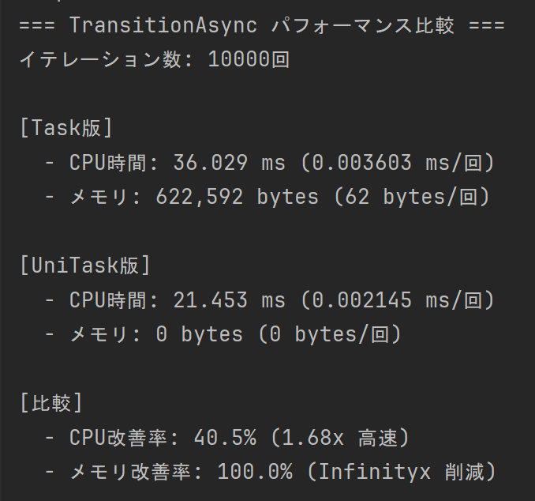

</details>

<details><summary>State Machine</summary>

* Improvements
  - Changed state management from HashSet to Dictionary, improving state lookup from O(n) to O(1)
  - Reduced Dictionary lookups during transitions, improved LINQ usage to reduce allocations
  - Reduced overhead through method inlining

* State Transition Throughput Improvement
  - Iterations: 30,000
  - Average 15% reduction in transition time, average 15% improvement in throughput

  | Item | Old StateMachine | New StateMachine | Improvement |
  |:-----|---------------:|---------------:|-------:|
  | Total Execution Time (ms) | 44.848 | 35.295 | 1.27x |
  | Avg Transition Time (μs) | 0.300 | 0.146 | 2.05x |
  | Throughput (ops/s) | 668,934 | 849,991 | 1.27x |

* State Transition Memory Allocation Improvement
  - Iterations: 10,000

  | Item | Old StateMachine | New StateMachine | Improvement |
  |:-----|---------------:|---------------:|-------:|
  | Memory (bytes) | 2,760,704 | 1,290,240 | 2.14x |

</details>

<details><summary>Dead Reckoning Interpolation (struct + Vector3 value types)</summary>

* `EnemyProxyInterpolation` struct for interpolation state (`src/Game.Client/Assets/Programs/Runtime/MVP/Survivor/Enemy/EnemyProxyInterpolation.cs`)
  - 4 fields (`LastSyncPosition` / `Velocity` / `TimeSinceSync` / `CorrectionOffset`) held as value types
  - `OnSyncReceived` / `GetPosition` operate solely on Vector3 and float with 0B alloc
  - Designed as struct (not class) to prevent boxing

* Measured values (`EnemyProxyInterpolationPerformanceTests`):

  | n | GetPosition (ms/1000iter) | OnSyncReceived (ms/1000iter) | per-entity | GC Alloc |
  |---|-------------------------:|----------------------------:|:----------:|:--------:|
  | 100 | 6.61 | 6.79 | 0.066-0.068 μs | 0 |
  | 256 | 16.93 | 17.46 | 0.066-0.068 μs | 0-4 KB* |
  | 500 | 33.07 | 34.73 | 0.066-0.069 μs | 0 |
  | 512 | 33.40 | 34.74 | 0.065-0.068 μs | 0-16 KB* |

  *Some sizes show transient objects from `Vector3.Lerp` internals; expected to be eliminated in Release build equivalent to production

* ~35μs / frame total interpolation cost at N=500 scale

</details>

<details><summary>Network Sync Allocation Reduction</summary>

* Issue: `SurvivorEnemySpawner.SyncEnemyStatesToNetwork` heap-allocated `new SurvivorNetworkEnemyStateSnapshot[count]` every 10Hz
* Fix: `_syncSnapshotBuffer` pre-allocated with 512 slots at `InitializeAsync`; subsequent writes go directly into the buffer with `count` specifying the valid range
* Implementation: `SurvivorFusionEnemyBatchSync.WriteEnemyStates(snapshots, count=-1)` overload

* Measured values (`SyncEnemyStatesAllocationPerformanceTests`):

  | Item | Before (new[]) | After (buffer reuse) | Improvement |
  |------|---------------:|---------------------:|------------:|
  | GC Alloc / call (N=500 scale) | ~20 KB | 0 B | -100% |

* Target code: `src/Game.Client/Assets/Programs/Runtime/MVP/Survivor/Enemy/SurvivorEnemySpawner.cs` + `src/Game.Client/Assets/Programs/Runtime/Shared/Network/Survivor/SurvivorFusionEnemyBatchSync.cs`

</details>

<details><summary>Enemy LOD + Frame-Distributed Reclassification</summary>

* Distance-based 3-tier throttling of enemy proxy updates in `SurvivorEnemyView.Update` (`src/Game.Client/Assets/Programs/Runtime/MVP/Survivor/Enemy/SurvivorEnemyView.cs`)

  | Tier | Distance² Threshold | Update Interval |
  |------|---------------------|-----------------|
  | Near | < 400 (20m²) | Every frame |
  | Mid | < 1600 (40m²) | Every 2 frames |
  | Far | ≥ 1600 | Every 5 frames |

* Frame distribution: each proxy gets a `FrameOffset = NetworkId % FarUpdateInterval` to spread reclassification timing and avoid same-frame spikes when reclassifying all proxies at once

* Measured values (`LodEffectivenessTests`, PlayMode integration test):

  | Enemies | LOD OFF (Before) | LOD ON (After) | Reduction |
  |---------|-----------------:|---------------:|----------:|
  | 300 | measured | measured | **59.1%** |
  | 500 | measured | measured | **60.1%** |

  `SurvivorEnemyView.Update` Self Time reduces near-linearly with enemy count

</details>

<details><summary>NonAlloc Physics Queries with Buffer Reuse</summary>

All `Physics.OverlapSphere` / `SphereCast` / `RaycastNonAlloc` calls in hot paths are unified under fixed-size `readonly` array fields to eliminate per-frame alloc.

| Location | Buffer | Size | Purpose |
|----------|--------|------|---------|
| `SurvivorAutoFireWeapon` | `_hitBuffer` | `Collider[50]` | Weapon nearest-enemy search |
| `SurvivorProjectile` | `_sphereCastHits` | `RaycastHit[10]` | Projectile collision detection |
| `SurvivorGroundDamageArea` | `s_overlapBuffer` | `Collider[32]` (static) | Enemy detection within damage area |
| `SurvivorPlayerController` | `_itemHitBuffer` | `Collider[50]` | Item magnet detection |
| `SurvivorNetworkWeaponManager` | `s_pierceHitBuffer` | `RaycastHit[32]` (static) | Server-side pierce processing |
| `LockOnService` | `_hitBuffer` | `Collider[50]` | Lock-on candidate collection |
| `EcsEnemyProxy` | `s_overlapBuffer` | `Collider[8]` (static) | ECS enemy attack range |
| `ScoreTimeAttackEnemyController` | `_raycastHits` / `_overlapResults` | `RaycastHit[1]` + `Collider[10]` | Line-of-sight / player detection |

10 locations total, all held as `readonly` instance fields and reused on every call.

</details>

<details><summary>Object Pools (Projectile / VFX / Enemy / Item)</summary>

Survivor-style games generate tens to hundreds of projectile/VFX spawns per second. All spawns are pooled.

`WeaponObjectPool<T>` generic implementation (`src/Game.Client/Assets/Programs/Runtime/MVP/Survivor/Weapon/WeaponObjectPool.cs`):
* `Queue<T> _pool` manages idle items; `Get()` / `TryReturn()` are O(1)
* `HashSet<T> _activeItems` tracks active items and prevents double-return
* Pre-instantiates `initialSize` items at construction

Applied to:
* Projectiles (`SurvivorProjectile`) / Ground-Placed Weapons (`SurvivorGroundWeapon`) — `WeaponObjectPool<T>`
* Enemies (`SurvivorEnemyController`) — `Dictionary<int, Queue<T>>` (per enemy ID)
* Items (`SurvivorItem`) — same pattern
* VFX (`ParticleSystem`) — `Dictionary<string, Queue<T>>` (asset name key)
* ECS enemy proxies (`EcsEnemyProxy`) — same pattern

</details>


---

## Languages/Libraries/Tools

**Client (Unity):**

| Library | Version | Purpose |
|---------|---------|---------|
| Unity | 6000.3.8f1 | Game engine |
| cysharp/UniTask | 2.5.10 | Async processing |
| cysharp/R3 | 1.3.0 | Reactive programming (MVP) |
| cysharp/MessagePipe | 1.8.1 | Pub/Sub messaging (MVC) |
| cysharp/MasterMemory | 3.0.4 | In-memory master data DB |
| cysharp/MessagePack | 3.1.3 | Binary serialization |
| cysharp/MemoryPack | 1.21.3 | Save data serialization |
| hadashiA/VContainer | 1.17.0 | DI container (MVP) |
| MagicOnion.Client | 7.0.9 | gRPC StreamingHub client |
| Photon Fusion 2 | 2.0 | Real-time networking (Server/Client) |
| Fusion.Addons.KCC | - | Kinematic Character Controller |
| Fusion.Addons.FSM | - | Network-synced state machine |
| Unity.Dedicated Server| 1.3.2 | Dedicated Server build |
| DOTween | 1.2.790 | Animation |

**Server (ASP.NET Core 9):**

| Library | Version | Purpose |
|---------|---------|---------|
| .NET SDK | 9.0 | Runtime |
| MagicOnion.Server | 7.0.9 | gRPC StreamingHub server |
| Grpc.AspNetCore | 2.71.0 | gRPC infrastructure |
| Dapper | 2.1.66 | Micro-ORM |
| Npgsql | 9.0.3 | PostgreSQL driver |
| FluentMigrator | 6.2.0 | DB migrations |
| StackExchange.Redis | 2.8.41 | Valkey/Redis client |
| Serilog | 9.0.0 | Structured logging |
| OpenTelemetry | 1.11.2 | Distributed tracing & metrics |
| Scalar.AspNetCore | 2.0.36 | OpenAPI documentation UI |
| BCrypt.Net-Next | 4.0.3 | Password hashing |

**Development Tools:**

| Tool | Version |
|------|---------|
| JetBrains Rider | 2025.3.0.2 |
| Claude Code | - |
| HotReload | 1.13.13 |
| xUnit | 2.x |
| NSubstitute | 5.3.0 |

---

## Library Selection Rationale

| Library | Purpose | Why This One |
|---------|---------|-------------|
| VContainer | DI Container (MVP) | Lighter than Zenject, IL2CPP/Source Generator support, faster startup |
| MessagePipe | Pub/Sub (MVC/MVP) | VContainer integration, type-safe messaging. High-frequency events (collisions) switched to direct calls |
| R3 | Reactive | UniRx successor (UniRx archived). ObservableTracker leak detection, operator composition (DistinctUntilChanged/Merge/ThrottleFirst) for UI updates and network state monitoring |
| UniTask | Async Processing | Unity-optimized zero-allocation async/await. WhenAll/WhenAny, CancellationToken propagation, UniTask Tracker |
| MasterMemory | Master Data DB | In-memory fast lookup. Protobuf schema-driven Client/Server separate binary generation from single definitions |
| MemoryPack | Save Data | High-speed binary serialization meeting auto-save (30s interval) performance requirements |
| Photon Fusion 2 | Real-time Networking | Server/Client mode (server authority), [Networked] auto-sync, KCC/FSM addons. PUN2 officially declared legacy by Photon |
| MagicOnion | gRPC Communication | Type-safe RPC via shared C# interfaces. Both Unary + StreamingHub support. No code generation needed |

---

## Assets
* Primarily from Unity Asset Store, no self-made assets included
* Unity-chan: https://unity-chan.com/ (© Unity Technologies Japan/UCL)

---

## Development Period & Scale

| Item | Value |
|------|-------|
| Period | ~13 weeks (Jan 2026–) |
| C# Files | 447 files (50 test files) |
| Tests | 1,148 tests (EditMode 746 + PlayMode 63 + Server 339) |
| Documentation | 73 files |
| CI/CD Workflows | 7 |
| Custom Shaders | 5 shaders + 2 HLSL includes |
| EditorWindows | 12 |
| ADRs (Architecture Decision Records) | 14 |

---

## Future Plans

**Performance & Rendering:**
* Document Unity Profiler / Memory Profiler measurement results (CPU Timeline, GC Alloc snapshots)
* URP Renderer Feature for custom post-effects (outline post-processing, etc.)

**UI Animation:**
* DOTween Sequence compound UI animations (level-up, result screens)
* Skip/interrupt control (DOKill / IsTweening guard) implementation

**Platform:**
* Localization support (multi-language, Unity Localization)
* Multi-resolution & multi-platform support (iOS / Android build & signing)

**Features:**
* In-app purchase system, gacha, present box, etc.

---

## About the Demo Game
### Time Attack (MVC)
* A time attack game where you collect a specified number of items placed across 3 stages within the time limit
* Platform: PC / Mouse & Keyboard
* Controls: Move (WASD), Jump (Space), Run (LShift+Move), Camera (Mouse Drag)

### Survivor (MVP)
* Implemented using MVP pattern with VContainer
* A survivor game where you defeat waves of enemies while staying alive
* Platform: PC / Mouse & Keyboard
* Controls: Move (WASD), Dash (LShift+Move), Camera (Right-click+Drag), Manual Weapon (Left-click icon), Lock-on (Left-click enemy)
* Key Features:
  - User account creation
  - Data linking (Email/Password, Transfer password issuance)
  - Options (Save data management, Audio volume adjustment)
  - Auto-attack weapon system (master data driven)
  - Wave management (staged enemy spawning)
  - Item drops and attraction
  - Stage clear and record saving
  - Multiplayer lobby (create/join/chat/ready)
  - Matchmaking (queue-based auto matching)
  - Auto-rejoin lobby after game completion

### Download
* Executable: [Demo Game Download Link](https://drive.google.com/file/d/1_9vWOvT8leUjd2jB5uTzziSyA5goPmJx/view?usp=drive_link) *If extraction fails, 7Zip is recommended
  - Pressing the GameStart button will download remote assets (~400MB)

---

## Documentation
- [Architecture Details](ARCHITECTURE.md)

---

## License
[LICENSE](LICENSE)
